# 📊 Executive Summary: mindwell-ai

> **Domain:** Healthcare | **Generated:** 2025-12-10 23:45:38 | **Expert Grade:** B+

---

## 🎯 Quick Metrics

| Metric | Value |
|--------|-------|
| **Total MVPs** | 3 |
| **Total Timeline** | 26 weeks |
| **Artifacts Generated** | 15 |
| **Specs Generated** | 3 |
| **Average MAS Score** | 89.3 |
| **Expert Grade** | **B+** |
| **Production Ready** | ✅ Yes |
| **Execution Time** | 458.6s |

---

## 📅 Product Roadmap Timeline


---

## 📦 MVP Breakdown

| MVP | Name | Duration | Deliverables | Artifacts | Avg Score | Grade |
|-----|------|----------|--------------|-----------|-----------|-------|
| **MVP1** | Core Care Coordination | 6 weeks | 5 | 5 | 90.5 | A- |
| **MVP2** | Intelligent Health Insights | 8 weeks | 5 | 5 | 89.0 | B+ |
| **MVP3** | Healthcare Ecosystem | 12 weeks | 5 | 5 | 88.4 | B+ |

### MVP1: Core Care Coordination

**Description:** Foundation for patient-provider coordination. I want to build a mental health therapy platform called MindWell AI that provides personalized cognitive behavioral therapy sessions, mood tracking, and connects users with licensed therapists for vir

**Duration:** 6 weeks

**Key Deliverables:**
- Personalized Cognitive Behavioral Therapy Sessions
- Mood Tracking Tool
- User Profile Creation for Therapy Matching
- Virtual Consultation Scheduler with Therapists
- Feedback System for Session Ratings

**Generated Artifacts:**

| Artifact Type | MAS Score | Status |
|---------------|-----------|--------|
| User Journey | 77.0 | ⚠️ |
| Swimlane | 94.1 | ✅ |
| Decision Tree | 97.1 | ✅ |
| Value Stream | 90.9 | ✅ |
| Business Process | 93.2 | ✅ |


**Spec Location:** `mindwell-ai/mindwell-ai-mvp1`


### MVP2: Intelligent Health Insights

**Description:** AI-powered analytics and predictions. I want to build a mental health therapy platform called MindWell AI that provides personalized cognitive behavioral therapy sessions, mood tracking, and connects users with licensed therapists for vir

**Duration:** 8 weeks

**Key Deliverables:**
- AI-Driven Mood Prediction USING MVP1 mood tracking data
- Personalized Therapy Session Optimization BUILDING ON MVP1 feedback system
- Automated Session Summary Generation USING MVP1 user profile data
- Insights Generation for Users USING MVP1 mood tracking and feedback data
- Therapist Recommendation Engine BUILDING ON MVP1 profile creation

**Generated Artifacts:**

| Artifact Type | MAS Score | Status |
|---------------|-----------|--------|
| User Journey | 77.0 | ⚠️ |
| Swimlane | 90.5 | ✅ |
| Decision Tree | 94.2 | ✅ |
| Value Stream | 89.7 | ✅ |
| Business Process | 93.5 | ✅ |


**Spec Location:** `mindwell-ai/mindwell-ai-mvp2`


### MVP3: Healthcare Ecosystem

**Description:** Integration with EHR, telehealth, and partners. I want to build a mental health therapy platform called MindWell AI that provides personalized cognitive behavioral therapy sessions, mood tracking, and connects users with licensed therapists for vir

**Duration:** 12 weeks

**Key Deliverables:**
- Integration with Telehealth Platforms ENRICHING MVP2 therapist recommendations
- Partnerships with Mental Health Apps USING MVP1 mood tracking and MVP2 insights generation
- Collaborative Care Tools USING MVP1 virtual consultation scheduler and MVP2 automated session summaries
- Resource Library API USING MVP1 personalized sessions and MVP2 session optimization
- Community Support Forums USING MVP1 user profiles and MVP2 AI-driven mood predictions

**Generated Artifacts:**

| Artifact Type | MAS Score | Status |
|---------------|-----------|--------|
| User Journey | 77.0 | ⚠️ |
| Swimlane | 94.1 | ✅ |
| Decision Tree | 92.5 | ✅ |
| Value Stream | 89.7 | ✅ |
| Business Process | 88.5 | ✅ |


**Spec Location:** `mindwell-ai/mindwell-ai-mvp3`


---

## 🔗 Cross-MVP Dependencies


| From | To | Type | Criticality | Description |
|------|-----|------|-------------|-------------|
| MVP1 | MVP2 | Data | CRITICAL | Data models and schemas from Core Care Coordination required by Intelligent Health Insights |
| MVP1 | MVP2 | Feature | HIGH | Core features from Core Care Coordination enable Intelligent Health Insights capabilities |
| MVP2 | MVP3 | Data | CRITICAL | Data models and schemas from Intelligent Health Insights required by Healthcare Ecosystem |
| MVP2 | MVP3 | Feature | HIGH | Core features from Intelligent Health Insights enable Healthcare Ecosystem capabilities |

```mermaid
graph TB
    %% Start Event
    Start((●))
    Start --> task_1

    subgraph MVP1["🎯 MVP1 - Core Care Coordination - Foundation for patient-provider coordination."]
        task_1["🏗️ Establish patient-provider coordination framework<br/>SLA: 1m"]
        task_2["🏗️ Provide data for analytics<br/>SLA: 1m"]
        task_7["🔗 Establish API for data exchange<br/>SLA: 1m"]
    end

    subgraph MVP2["🎯 MVP2 - Intelligent Health Insights - AI-powered analytics and predictions."]
        task_3["🧠 Develop AI-powered analytics features<br/>SLA: 2m"]
        task_4["🧠 Integrate data from MVP1<br/>SLA: 2m"]
        task_8["🔗 Create service dependencies for MVP2 and MVP3<br/>SLA: 1m"]
    end

    subgraph MVP3["🎯 MVP3 - Healthcare Ecosystem - Integration with EHR, telehealth, and partners."]
        task_5["🌐 Build integration with EHR systems<br/>SLA: 3m"]
        task_6["🌐 Integrate telehealth services<br/>SLA: 3m"]
    end



    task_1 -->|Provides foundation| task_3
    task_2 -->|Data flow| task_4
    task_1 -->|Enables integration| task_5
    task_1 -->|Enables integration| task_6
    task_3 -->|Builds on| task_5
    task_4 -->|Integrates with| task_7
    task_5 -->|Integrates with| task_6

    %% End Event
    task_6 --> End((◎))
    task_7 --> End((◎))
    task_8 --> End((◎))

```





---

## 🎓 Expert Assessment

### Overall Evaluation

| Dimension | Score | Status |
|-----------|-------|--------|
| **Overall Grade** | **B+** | ✅ |
| Semantic Preservation | 89.3% | ⚠️ |
| Cross-MVP Coherence | 95.0% | ✅ |
| Domain Accuracy | 84.8% | ⚠️ |
| Completeness | 100.0% | ✅ |
| Confidence Level | 0.89 | ⚠️ |

### Per-MVP Grades

| MVP | Grade | Status |
|-----|-------|--------|
| MVP1 | A- | ✅ |
| MVP2 | B+ | ✅ |
| MVP3 | B+ | ✅ |


### ✅ Strengths

- Excellent semantic and structural across all diagrams
- Strong artifact quality with minor improvements possible
- Clear cross-MVP dependency mapping
- Complete artifact coverage for all MVPs


### 📝 Recommendations

1. Focus on improving pragmatic (current: 45.3/100) across all artifacts


---

## 📁 Generated Specification Files

### 1. mindwell-ai-mvp1

```
mindwell-ai/mindwell-ai-mvp1/
├── requirements.md
├── design.md
├── tasks.md
├── knowledge.md
└── glossary.md
```

### 2. mindwell-ai-mvp2

```
mindwell-ai/mindwell-ai-mvp2/
├── requirements.md
├── design.md
├── tasks.md
├── knowledge.md
└── glossary.md
```

### 3. mindwell-ai-mvp3

```
mindwell-ai/mindwell-ai-mvp3/
├── requirements.md
├── design.md
├── tasks.md
├── knowledge.md
└── glossary.md
```

---

## ⚠️ Issues & Warnings


*No errors encountered.*


### ⚠️ Warnings (1)

- Vision market research disabled


---

## 📊 Execution Metrics

| Metric | Value |
|--------|-------|
| Target Duration | 300s |
| Actual Duration | 458.6s |
| Performance | 65.4% of target |
| Artifacts/Minute | 2.0 |

---

*Generated by MAS Premium Roadmap Workflow v1.0 on 2025-12-10 23:45:38*