# 📊 Executive Summary: contentgenius

> **Domain:** Saas | **Generated:** 2025-12-11 11:40:45 | **Expert Grade:** A-

---

## 🎯 Quick Metrics

| Metric | Value |
|--------|-------|
| **Total MVPs** | 3 |
| **Total Timeline** | 26 weeks |
| **Artifacts Generated** | 15 |
| **Specs Generated** | 3 |
| **Average MAS Score** | 90.6 |
| **Expert Grade** | **A-** |
| **Production Ready** | ✅ Yes |
| **Execution Time** | 318.1s |

---

## 📅 Product Roadmap Timeline


---

## 📦 MVP Breakdown

| MVP | Name | Duration | Deliverables | Artifacts | Avg Score | Grade |
|-----|------|----------|--------------|-----------|-----------|-------|
| **MVP1** | Core Platform Features | 6 weeks | 5 | 5 | 90.9 | A- |
| **MVP2** | Advanced Analytics | 8 weeks | 5 | 5 | 91.0 | A- |
| **MVP3** | Enterprise Platform | 12 weeks | 5 | 5 | 89.9 | B+ |

### MVP1: Core Platform Features

**Description:** Essential functionality and user management. I want to build an AI content creation platform called ContentGenius for marketing teams that generates blog posts, social media content, email campaigns, and ad copy while maintaining brand voice con

**Duration:** 6 weeks

**Key Deliverables:**
- Content generation editor
- Brand voice settings configuration
- Template library for marketing content
- Content scheduling calendar
- User role and permission management

**Generated Artifacts:**

| Artifact Type | MAS Score | Status |
|---------------|-----------|--------|
| User Journey | 81.3 | ⚠️ |
| Swimlane | 92.1 | ✅ |
| Decision Tree | 96.6 | ✅ |
| Value Stream | 92.7 | ✅ |
| Business Process | 92.0 | ✅ |


**Spec Location:** `contentgenius/contentgenius-mvp1`


### MVP2: Advanced Analytics

**Description:** AI-powered insights and automation. I want to build an AI content creation platform called ContentGenius for marketing teams that generates blog posts, social media content, email campaigns, and ad copy while maintaining brand voice con

**Duration:** 8 weeks

**Key Deliverables:**
- AI content optimization USING MVP1 content generation editor
- Brand voice analysis USING MVP1 brand voice settings
- Sentiment analysis on generated content USING MVP1 template library
- Performance tracking on scheduled posts BUILDING ON MVP1 content scheduling calendar
- Auto-suggestion of improvements USING MVP1 user role feedback

**Generated Artifacts:**

| Artifact Type | MAS Score | Status |
|---------------|-----------|--------|
| User Journey | 81.0 | ⚠️ |
| Swimlane | 90.9 | ✅ |
| Decision Tree | 96.9 | ✅ |
| Value Stream | 90.1 | ✅ |
| Business Process | 95.9 | ✅ |


**Spec Location:** `contentgenius/contentgenius-mvp2`


### MVP3: Enterprise Platform

**Description:** Integrations, marketplace, and scaling. I want to build an AI content creation platform called ContentGenius for marketing teams that generates blog posts, social media content, email campaigns, and ad copy while maintaining brand voice con

**Duration:** 12 weeks

**Key Deliverables:**
- Integration with social media platforms USING MVP1+MVP2 content scheduling and optimization
- Collaboration tools ENHANCING MVP2 performance tracking
- Email campaign integration USING MVP1 email templates and MVP2 auto-suggestions
- Analytics dashboard that aggregates data FROM MVP1+MVP2 features
- API access for third-party apps USING MVP1 core data and MVP2 AI insights

**Generated Artifacts:**

| Artifact Type | MAS Score | Status |
|---------------|-----------|--------|
| User Journey | 79.1 | ⚠️ |
| Swimlane | 86.8 | ✅ |
| Decision Tree | 96.6 | ✅ |
| Value Stream | 92.1 | ✅ |
| Business Process | 95.1 | ✅ |


**Spec Location:** `contentgenius/contentgenius-mvp3`


---

## 🔗 Cross-MVP Dependencies


| From | To | Type | Criticality | Description |
|------|-----|------|-------------|-------------|
| MVP1 | MVP2 | Data | CRITICAL | Data models and schemas from Core Platform Features required by Advanced Analytics |
| MVP1 | MVP2 | Feature | HIGH | Core features from Core Platform Features enable Advanced Analytics capabilities |
| MVP2 | MVP3 | Data | CRITICAL | Data models and schemas from Advanced Analytics required by Enterprise Platform |
| MVP2 | MVP3 | Feature | HIGH | Core features from Advanced Analytics enable Enterprise Platform capabilities |

```mermaid
graph TB
    %% Start Event
    Start((●))
    Start --> task_1

    subgraph MVP1["🎯 MVP1 - Core Platform Features - Essential functionality and user management."]
        task_1["🏗️ Build core platform features<br/>SLA: 3m"]
        task_2["🏗️ User management implementation<br/>SLA: 2m"]
        task_7["🔗 Provide infrastructure for MVP1<br/>SLA: 2m"]
    end

    subgraph MVP2["🎯 MVP2 - Advanced Analytics - AI-powered insights and automation."]
        task_3["📊 Develop AI-powered analytics features<br/>SLA: 3m"]
        task_4["📊 Integrate with MVP1 features<br/>SLA: 1m"]
        task_8["🔗 Integrate with MVP2 and MVP3<br/>SLA: 1m"]
    end

    subgraph MVP3["🎯 MVP3 - Enterprise Platform - Integrations, marketplace, and scaling."]
        task_5["🌐 Build integrations and marketplace<br/>SLA: 4m"]
        task_6["🌐 Scale platform capabilities<br/>SLA: 3m"]
    end



    task_1 -->|provides data to| task_3
    task_1 -->|provides data to| task_5
    task_4 -->|depends on features from| task_1
    task_4 -->|enabled by| task_1
    task_6 -->|enabled by| task_1
    task_7 -->|provides infrastructure to| task_8
    task_8 -->|integrates with| task_4
    task_8 -->|integrates with| task_6

    %% End Event
    task_2 --> End((◎))
    task_3 --> End((◎))
    task_5 --> End((◎))

```





---

## 🎓 Expert Assessment

### Overall Evaluation

| Dimension | Score | Status |
|-----------|-------|--------|
| **Overall Grade** | **A-** | ✅ |
| Semantic Preservation | 90.6% | ✅ |
| Cross-MVP Coherence | 95.0% | ✅ |
| Domain Accuracy | 86.1% | ⚠️ |
| Completeness | 100.0% | ✅ |
| Confidence Level | 0.91 | ✅ |

### Per-MVP Grades

| MVP | Grade | Status |
|-----|-------|--------|
| MVP1 | A- | ✅ |
| MVP2 | A- | ✅ |
| MVP3 | B+ | ✅ |


### ✅ Strengths

- Excellent semantic and structural and cognitive across all diagrams
- Strong artifact quality with minor improvements possible
- Clear cross-MVP dependency mapping
- Complete artifact coverage for all MVPs


### 📝 Recommendations

1. Focus on improving pragmatic (current: 53.0/100) across all artifacts
2. Address completeness issues: {'severity': 'medium', 'type': 'sub_metric', 'metric': 'RelationshipMetric', 'score': 0.0, 'threshold': 20.0, 'gap': 20.0, 'message': 'RelationshipMetric below threshold', 'reason': "Found 0/4 relationships (0.0%) (FAILED, threshold: 20%) Missing: ['Content Generation Editor->Brand Voice Settings Configuration', 'Brand Voice Settings Configuration->Template Library for Marketing Content', 'Template Library for Marketing Content->Content Scheduling Calendar', '...+1 more']"}


---

## 📁 Generated Specification Files

### 1. contentgenius-mvp1

```
contentgenius/contentgenius-mvp1/
├── requirements.md
├── design.md
├── tasks.md
├── knowledge.md
└── glossary.md
```

### 2. contentgenius-mvp2

```
contentgenius/contentgenius-mvp2/
├── requirements.md
├── design.md
├── tasks.md
├── knowledge.md
└── glossary.md
```

### 3. contentgenius-mvp3

```
contentgenius/contentgenius-mvp3/
├── requirements.md
├── design.md
├── tasks.md
├── knowledge.md
└── glossary.md
```

---

## ⚠️ Issues & Warnings


*No errors encountered.*


### ⚠️ Warnings (1)

- Vision market research disabled


---

## 📊 Execution Metrics

| Metric | Value |
|--------|-------|
| Target Duration | 300s |
| Actual Duration | 318.1s |
| Performance | 94.3% of target |
| Artifacts/Minute | 2.8 |

---

*Generated by MAS Premium Roadmap Workflow v1.0 on 2025-12-11 11:40:45*