# Contentgenius Mvp2 - Design Document

## Overview

Advanced Analytics: AI-powered insights and automation. I want to build an AI content creation platform called ContentGenius for marketing teams that generates blog posts, social media content, email campaigns, and ad copy while maintaining brand voice con

**Generated**: 2025-12-11 11:40:08  
**Diagrams Included**: 5

### Target Users

- **Admin**

## Architecture

## Components and Interfaces

### AI content optimization

- **Type**: Component
- **Purpose**: Part of the Contentgenius Mvp2 system
### Advanced Analytics

- **Type**: Component
- **Purpose**: Part of the Contentgenius Mvp2 system
### Approval Required?

- **Type**: Component
- **Purpose**: Part of the Contentgenius Mvp2 system
### Approved

- **Type**: Component
- **Purpose**: Part of the Contentgenius Mvp2 system
### Auto-suggestion of improvements

- **Type**: Component
- **Purpose**: Part of the Contentgenius Mvp2 system
### BUILDING

- **Type**: Component
- **Purpose**: Part of the Contentgenius Mvp2 system
### Brand voice analysis

- **Type**: Component
- **Purpose**: Part of the Contentgenius Mvp2 system
### CRITICAL

- **Type**: Component
- **Purpose**: Part of the Contentgenius Mvp2 system
### Developer

- **Type**: Component
- **Purpose**: Part of the Contentgenius Mvp2 system
### HIGH

- **Type**: Component
- **Purpose**: Part of the Contentgenius Mvp2 system

## Cross-Functional Process Flows (Swimlane)

> **Purpose**: Shows how work flows across different roles, departments, or systems. Each lane represents a responsible party, making handoffs and bottlenecks visible. Essential for RACI matrix creation and workflow optimization.

### Swimlane Process 1

```mermaid
graph TB
    %% Start Event
    Start((●))
    Start --> task_1

    subgraph MVP1["🎯 MVP1 - Core features"]
        task_1["F9D1F4BC AI content optimization<br/>SLA: 4h"]
        task_2["F9D1F4BB Brand voice analysis<br/>SLA: 6h"]
        task_3["F4E6 Sentiment analysis on generated content<br/>SLA: 8h"]
        task_4["F6E0F3FE Performance tracking on scheduled posts<br/>SLA: N/A"]
        task_5["F464 Auto-suggestion of improvements<br/>SLA: N/A"]
    end



    task_1 -->|uses| task_2
    task_2 -->|uses| task_3
    task_3 -->|builds on| task_4
    task_4 -->|uses| task_5

    %% End Event
    task_5 --> End((◎))

```

**MAS Score**: 90.9

## Business Process Workflows (BPMN)

> **Purpose**: Represents end-to-end business processes following BPMN 2.0 notation. Shows tasks, gateways (decision points), events, and process flow. Used for process automation and SLA tracking.

### Business Process 1

**MAS Score**: 95.9

## Decision Logic Trees

> **Purpose**: Visualizes decision-making logic with conditions and outcomes. Each node represents a decision point, branches show conditions (yes/no, thresholds), and leaves show final outcomes. Critical for business rules documentation and algorithm design.

### Decision Tree 1

```mermaid
flowchart TD
    %% Title: Advanced Analytics Decision Logic
    %% Description: Decision tree for: Decision tree for Advanced Analytics decision logic with multi-tier approval logic. Decisions: - If...
    
    %% Start Node
    Start(["💰 Start Decision"])


    %% Decision Nodes
    Start --> decision_1
        decision_1{"🟢 Is the condition met?<br/>🟢 LOW<br/>Effort: 1.0w"}
    
        decision_2{"🟡 Is the threshold HIGH?<br/>🟡 MEDIUM<br/>Effort: 1.0w"}
    decision_1 -->|"Yes"| decision_2
    
    
        decision_3{"🟠 Is the threshold MEDIUM?<br/>🟠 HIGH<br/>Effort: 1.0w"}
    decision_2 -->|"No"| decision_3
    
    


    


    %% Outcome Nodes
    outcome_low["✅ Action: Proceed with standard analytics<br/>"]
    outcome_high["✅ Action: Initiate advanced analytics with critical review<br/>"]
    outcome_medium["✅ Action: Proceed with advanced analytics<br/>"]
    outcome_critical["❌ Action: Immediate escalation required<br/>Reason: Not specified"]

    %% Outcome Edge Connections (from leaf decisions to outcomes)
    decision_1 -->|"No"| outcome_low
    decision_2 -->|"Yes"| outcome_high
    decision_3 -->|"Yes"| outcome_medium
    decision_3 -->|"No"| outcome_critical

    %% Styling
    style outcome_low fill:#ccffcc,stroke:#28a745
    style outcome_high fill:#ccffcc,stroke:#28a745
    style outcome_medium fill:#ccffcc,stroke:#28a745
    style outcome_critical fill:#ffcccc,stroke:#dc3545

    %% Priority Legend
    subgraph Legend["📊 Priority Legend"]
        direction TB
        L1["🔴 CRITICAL: Immediate action required"]
        L2["🟠 HIGH: Plan for next sprint"]
        L3["🟡 MEDIUM: Quarterly planning"]
        L4["🟢 LOW: Backlog/nice-to-have"]
    end
    
    style L1 fill:#ffcccc
    style L2 fill:#ffe0cc
    style L3 fill:#ffffcc
    style L4 fill:#ccffcc


```

**MAS Score**: 96.86666666666667

## Value Stream Maps (Lean)

> **Purpose**: Shows the flow of value from request to delivery, identifying process time (PT), wait time (WT), and efficiency metrics. Used for identifying bottlenecks, waste elimination, and continuous improvement initiatives.

### Value Stream 1

```mermaid
flowchart LR
    %% Title and styling
    %% Value Stream: Advanced Analytics Value Stream Optimization
    
    %% ========== PROCESS STEPS ==========
    step_1["📦 AI content optimization<br/>PT: 30 min<br/>WT: 2 hours"]
    step_2["📦 Brand voice analysis<br/>PT: 1 hours<br/>WT: 4 hours"]
    step_3["📦 Sentiment analysis on generated content<br/>PT: 1.5 hours<br/>WT: 7.5 hours"]
    step_4["📦 Performance tracking on scheduled posts<br/>PT: 2 hours<br/>WT: 10 hours"]
    step_5["📦 Auto-suggestion of improvements<br/>PT: 2.5 hours<br/>WT: 12.5 hours"]
    
    %% ========== FLOW CONNECTIONS ==========
    step_1 -->|flow| step_2
    step_2 -->|flow| step_3
    step_3 -->|flow| step_4
    step_4 -->|flow| step_5
    
    %% ========== METRICS SUMMARY ==========
    subgraph Metrics["📊 Metrics Summary"]
        direction TB
        LT["⏱️ Lead Time: 2560 minutes (1.77 days)"]
        PT["⚙️ Process Time: 450 minutes (7.5 hours)"]
        WT["⏳ Wait Time: 1.5 days"]
        EFF["📈 Efficiency: 17.6%"]
    end
    
    %% ========== WASTE INDICATORS ==========
    
    %% ========== STYLING ==========
    %% Highlight steps with waste
    style step_1 fill:#ffcccc,stroke:#cc0000,stroke-width:2px
    style step_2 fill:#ffcccc,stroke:#cc0000,stroke-width:2px
    style step_3 fill:#ffcccc,stroke:#cc0000,stroke-width:2px
    style step_4 fill:#ffcccc,stroke:#cc0000,stroke-width:2px
    style step_5 fill:#ffcccc,stroke:#cc0000,stroke-width:2px
    
    %% Waste subgraph styling
    
    %% Metrics subgraph styling
    style Metrics fill:#f0fff0,stroke:#00cc00
    style LT fill:#e6ffe6,stroke:#009900
    style PT fill:#e6ffe6,stroke:#009900
    style WT fill:#fff0e6,stroke:#cc6600
    style EFF fill:#e6ffe6,stroke:#009900

```

**MAS Score**: 90.10000000000001

## User Journeys (Experience Maps)

> **Purpose**: Maps the user's emotional journey through the product, from discovery to engagement. Each touchpoint shows satisfaction scores and emotional states, helping identify pain points and opportunities for UX improvement.

### User Journey 1

**MAS Score**: 81.05

## Diagram Summary

This design document includes **5 MAS artifacts** across the following categories:

| Diagram Type | Count | Average MAS Score | Purpose |
|--------------|-------|-------------------|---------|
| User Journey | 1 | 81.0 | UX experience map |
| Swimlane | 1 | 90.9 | Cross-functional workflow |
| Decision Tree | 1 | 96.9 | Decision logic |
| Value Stream | 1 | 90.1 | Lean efficiency |
| Business Process | 1 | 95.9 | BPMN process flow |

---

*Generated by MAS Compiler Spec Generator v1.0.0*