# 📊 Executive Summary: fitcoach-pro

> **Domain:** Saas | **Generated:** 2025-12-11 11:07:13 | **Expert Grade:** A-

---

## 🎯 Quick Metrics

| Metric | Value |
|--------|-------|
| **Total MVPs** | 3 |
| **Total Timeline** | 26 weeks |
| **Artifacts Generated** | 15 |
| **Specs Generated** | 3 |
| **Average MAS Score** | 90.9 |
| **Expert Grade** | **A-** |
| **Production Ready** | ✅ Yes |
| **Execution Time** | 424.3s |

---

## 📅 Product Roadmap Timeline


---

## 📦 MVP Breakdown

| MVP | Name | Duration | Deliverables | Artifacts | Avg Score | Grade |
|-----|------|----------|--------------|-----------|-----------|-------|
| **MVP1** | Core Platform Features | 6 weeks | 5 | 5 | 91.7 | A- |
| **MVP2** | Advanced Analytics | 8 weeks | 5 | 5 | 91.2 | A- |
| **MVP3** | Enterprise Platform | 12 weeks | 5 | 5 | 89.8 | B+ |

### MVP1: Core Platform Features

**Description:** Essential functionality and user management. I want to build an AI-powered fitness coaching app called FitCoach Pro that creates personalized workout plans, tracks nutrition through photo recognition, and adapts routines based on user progress a

**Duration:** 6 weeks

**Key Deliverables:**
- Personalized Workout Plan Generator
- Nutrition Tracker with Photo Recognition
- Progress Tracking Dashboard
- Wearable Device Integration
- User Profile Customization

**Generated Artifacts:**

| Artifact Type | MAS Score | Status |
|---------------|-----------|--------|
| User Journey | 81.3 | ⚠️ |
| Swimlane | 92.1 | ✅ |
| Decision Tree | 96.6 | ✅ |
| Value Stream | 93.0 | ✅ |
| Business Process | 95.3 | ✅ |


**Spec Location:** `fitcoach-pro/fitcoach-pro-mvp1`


### MVP2: Advanced Analytics

**Description:** AI-powered insights and automation. I want to build an AI-powered fitness coaching app called FitCoach Pro that creates personalized workout plans, tracks nutrition through photo recognition, and adapts routines based on user progress a

**Duration:** 8 weeks

**Key Deliverables:**
- Workout Plan Optimization USING MVP1 workout generator
- AI Nutrition Feedback BUILDING ON MVP1 photo recognition
- Adaptive Routines USING MVP1 progress tracking
- Predictive Progress Tracking USING MVP1+wearable data
- Dynamic Goal Adjustment BUILDING ON MVP1 user profiles

**Generated Artifacts:**

| Artifact Type | MAS Score | Status |
|---------------|-----------|--------|
| User Journey | 81.3 | ⚠️ |
| Swimlane | 91.3 | ✅ |
| Decision Tree | 96.6 | ✅ |
| Value Stream | 90.1 | ✅ |
| Business Process | 96.5 | ✅ |


**Spec Location:** `fitcoach-pro/fitcoach-pro-mvp2`


### MVP3: Enterprise Platform

**Description:** Integrations, marketplace, and scaling. I want to build an AI-powered fitness coaching app called FitCoach Pro that creates personalized workout plans, tracks nutrition through photo recognition, and adapts routines based on user progress a

**Duration:** 12 weeks

**Key Deliverables:**
- Social Sharing of Progress USING MVP1+MVP2 tracking features
- API Integration with Fitness Devices ENRICHING MVP1 data and MVP2 adaptiveness
- Recipe Suggestions based on AI nutrition analysis USING MVP1+MVP2 data
- Gamification Elements (badges, challenges) USING MVP1+MVP2 tracking
- Group Coaching Mechanism USING MVP1 personalized plans and MVP2 adaptive routines

**Generated Artifacts:**

| Artifact Type | MAS Score | Status |
|---------------|-----------|--------|
| User Journey | 78.8 | ⚠️ |
| Swimlane | 87.8 | ✅ |
| Decision Tree | 96.3 | ✅ |
| Value Stream | 91.1 | ✅ |
| Business Process | 94.9 | ✅ |


**Spec Location:** `fitcoach-pro/fitcoach-pro-mvp3`


---

## 🔗 Cross-MVP Dependencies


| From | To | Type | Criticality | Description |
|------|-----|------|-------------|-------------|
| MVP1 | MVP2 | Data | CRITICAL | Data models and schemas from Core Platform Features required by Advanced Analytics |
| MVP1 | MVP2 | Feature | HIGH | Core features from Core Platform Features enable Advanced Analytics capabilities |
| MVP2 | MVP3 | Data | CRITICAL | Data models and schemas from Advanced Analytics required by Enterprise Platform |
| MVP2 | MVP3 | Feature | HIGH | Core features from Advanced Analytics enable Enterprise Platform capabilities |

```mermaid
graph TB
    %% Start Event
    Start((●))
    Start --> task_1

    subgraph MVP1["🎯 MVP1 - Core Platform Features - Essential functionality and user management."]
        task_1["🏗️ Develop user management system<br/>SLA: 2w"]
        task_2["🏗️ Implement core platform features<br/>SLA: 3w"]
        task_7["🔗 Create API for MVP1<br/>SLA: 1w"]
    end

    subgraph MVP2["🎯 MVP2 - Advanced Analytics - AI-powered insights and automation."]
        task_3["📊 Build AI analytics engine<br/>SLA: 4w"]
        task_4["📊 Integrate with MVP1 features<br/>SLA: 1w"]
        task_8["🔗 Integrate APIs for MVP2 and MVP3<br/>SLA: 2w"]
    end

    subgraph MVP3["🎯 MVP3 - Enterprise Platform - Integrations, marketplace, and scaling."]
        task_5["🌐 Develop marketplace features<br/>SLA: 5w"]
        task_6["🌐 Integrate with MVP2 analytics<br/>SLA: 2w"]
    end



    task_1 -->|MVP2 depends on MVP1| task_4
    task_2 -->|MVP2 builds on MVP1| task_3
    task_4 -->|MVP3 integrates with MVP2| task_6
    task_7 -->|Integration Layer provides for MVPs| task_8

    %% End Event
    task_3 --> End((◎))
    task_5 --> End((◎))
    task_6 --> End((◎))
    task_8 --> End((◎))

```





---

## 🎓 Expert Assessment

### Overall Evaluation

| Dimension | Score | Status |
|-----------|-------|--------|
| **Overall Grade** | **A-** | ✅ |
| Semantic Preservation | 90.9% | ✅ |
| Cross-MVP Coherence | 95.0% | ✅ |
| Domain Accuracy | 86.3% | ⚠️ |
| Completeness | 100.0% | ✅ |
| Confidence Level | 0.91 | ✅ |

### Per-MVP Grades

| MVP | Grade | Status |
|-----|-------|--------|
| MVP1 | A- | ✅ |
| MVP2 | A- | ✅ |
| MVP3 | B+ | ✅ |


### ✅ Strengths

- Excellent semantic and structural and cognitive across all diagrams
- Strong artifact quality with minor improvements possible
- Clear cross-MVP dependency mapping
- Complete artifact coverage for all MVPs


### 📝 Recommendations

1. Focus on improving pragmatic (current: 54.9/100) across all artifacts


---

## 📁 Generated Specification Files

### 1. fitcoach-pro-mvp1

```
fitcoach-pro/fitcoach-pro-mvp1/
├── requirements.md
├── design.md
├── tasks.md
├── knowledge.md
└── glossary.md
```

### 2. fitcoach-pro-mvp2

```
fitcoach-pro/fitcoach-pro-mvp2/
├── requirements.md
├── design.md
├── tasks.md
├── knowledge.md
└── glossary.md
```

### 3. fitcoach-pro-mvp3

```
fitcoach-pro/fitcoach-pro-mvp3/
├── requirements.md
├── design.md
├── tasks.md
├── knowledge.md
└── glossary.md
```

---

## ⚠️ Issues & Warnings


*No errors encountered.*


### ⚠️ Warnings (1)

- Vision market research disabled


---

## 📊 Execution Metrics

| Metric | Value |
|--------|-------|
| Target Duration | 300s |
| Actual Duration | 424.3s |
| Performance | 70.7% of target |
| Artifacts/Minute | 2.1 |

---

*Generated by MAS Premium Roadmap Workflow v1.0 on 2025-12-11 11:07:13*