# Fitcoach Pro Mvp2 - Design Document

## Overview

Advanced Analytics: AI-powered insights and automation. I want to build an AI-powered fitness coaching app called FitCoach Pro that creates personalized workout plans, tracks nutrition through photo recognition, and adapts routines based on user progress a

**Generated**: 2025-12-11 11:06:40  
**Diagrams Included**: 5

### Target Users

- **Admin**

## Architecture

## Components and Interfaces

### AI Nutrition Feedback

- **Type**: Component
- **Purpose**: Part of the Fitcoach Pro Mvp2 system
### Adaptive Routines

- **Type**: Component
- **Purpose**: Part of the Fitcoach Pro Mvp2 system
### Adaptive Routines USING MVP1 progress tracking

- **Type**: Component
- **Purpose**: Part of the Fitcoach Pro Mvp2 system
### Advanced Analytics

- **Type**: Component
- **Purpose**: Part of the Fitcoach Pro Mvp2 system
### Approval Required?

- **Type**: Component
- **Purpose**: Part of the Fitcoach Pro Mvp2 system
### Approved

- **Type**: Component
- **Purpose**: Part of the Fitcoach Pro Mvp2 system
### BUILDING

- **Type**: Component
- **Purpose**: Part of the Fitcoach Pro Mvp2 system
### CRITICAL

- **Type**: Component
- **Purpose**: Part of the Fitcoach Pro Mvp2 system
### Developer

- **Type**: Component
- **Purpose**: Part of the Fitcoach Pro Mvp2 system
### Dynamic Goal Adjustment

- **Type**: Component
- **Purpose**: Part of the Fitcoach Pro Mvp2 system

## Cross-Functional Process Flows (Swimlane)

> **Purpose**: Shows how work flows across different roles, departments, or systems. Each lane represents a responsible party, making handoffs and bottlenecks visible. Essential for RACI matrix creation and workflow optimization.

### Swimlane Process 1

```mermaid
graph TB
    %% Start Event
    Start((●))
    Start --> task_1

    subgraph MVP1["🎯 MVP1 - Core features"]
        task_1["F9D1F4BC Workout Plan Optimization using MVP1 workout generator<br/>SLA: 4h"]
        task_2["F9D1F4BB AI Nutrition Feedback building on MVP1 photo recognition<br/>SLA: 6h"]
        task_3["F4E6 Adaptive Routines using MVP1 progress tracking<br/>SLA: 8h"]
        task_4["F6E0F3FE Predictive Progress Tracking using MVP1+wearable data<br/>SLA: 4h"]
        task_5["F464 Dynamic Goal Adjustment building on MVP1 user profiles<br/>SLA: 4h"]
    end



    task_1 -->|uses| task_2
    task_2 -->|builds on| task_3
    task_3 -->|uses| task_4
    task_4 -->|uses| task_5

    %% End Event
    task_5 --> End((◎))

```

**MAS Score**: 91.3

## Business Process Workflows (BPMN)

> **Purpose**: Represents end-to-end business processes following BPMN 2.0 notation. Shows tasks, gateways (decision points), events, and process flow. Used for process automation and SLA tracking.

### Business Process 1

```mermaid
flowchart TD
    Start(["🎯 Workflow Initiation"])

    subgraph mvp1["MVP1: Advanced Analytics<br/>📅 1 month"]
        task_1["🤖 Workout Plan Optimization<br/>Owner: User<br/>SLA: 0.0833h<br/>Automation: Automated"]
        task_2["🤖 AI Nutrition Feedback<br/>Owner: User<br/>SLA: 0.0833h<br/>Automation: Automated"]
        task_3["🤖 Adaptive Routines<br/>Owner: User<br/>SLA: 0.0833h<br/>Automation: Automated"]
        task_4["📋 Predictive Progress Tracking<br/>Owner: User<br/>SLA: 1h<br/>Automation: Manual"]
        task_5["🤖 Dynamic Goal Adjustment<br/>Owner: User<br/>SLA: 0.0833h<br/>Automation: Automated"]
    end

    milestone_1{"🎯 Verification Complete<br/>All tasks completed successfully"}
    milestone_2{"🚦 Approval Process<br/>Feedback reviewed and approved"}

    gateway_1{"❓ Verification Complete?"}
    gateway_2{"❓ Approval Required?"}
    
    end_success(["✅ Workflow Completion"])
    
    end_failure(["❌ Rejected"])

    Start -->|Initiate| task_1
    task_1 -->|Next Task| task_2
    task_2 -->|Next Task| task_3
    task_3 -->|Next Task| task_4
    task_4 -->|Next Task| task_5
    task_5 -->|Complete Tasks| gateway_1
    gateway_1 -->|Verification Complete| milestone_1
    milestone_1 -->|Proceed to Approval| gateway_2
    gateway_2 -->|Approved| milestone_2
    gateway_2 -->|Rejected| end_failure
    gateway_2 -->|Under Review| end_success

    style Start fill:#ccffcc
    style end_success fill:#ccffcc
    style end_failure fill:#ffcccc
    style mvp1 fill:#e3f2fd,stroke:#1976d2
    style milestone_1 fill:#fce4ec,stroke:#c2185b
    style milestone_2 fill:#fff3e0,stroke:#f57c00

```

**MAS Score**: 96.5

## Decision Logic Trees

> **Purpose**: Visualizes decision-making logic with conditions and outcomes. Each node represents a decision point, branches show conditions (yes/no, thresholds), and leaves show final outcomes. Critical for business rules documentation and algorithm design.

### Decision Tree 1

**MAS Score**: 96.56666666666666

## Value Stream Maps (Lean)

> **Purpose**: Shows the flow of value from request to delivery, identifying process time (PT), wait time (WT), and efficiency metrics. Used for identifying bottlenecks, waste elimination, and continuous improvement initiatives.

### Value Stream 1

```mermaid
flowchart LR
    %% Title and styling
    %% Value Stream: Advanced Analytics Value Stream Optimization
    
    %% ========== PROCESS STEPS ==========
    step_1["📦 Workout Plan Optimization<br/>PT: 30 min<br/>WT: 2 hours"]
    step_2["📦 AI Nutrition Feedback<br/>PT: 1 hours<br/>WT: 3 hours"]
    step_3["📦 Adaptive Routines<br/>PT: 1.5 hours<br/>WT: 4.5 hours"]
    step_4["📦 Predictive Progress Tracking<br/>PT: 2 hours<br/>WT: 6 hours"]
    step_5["📦 Dynamic Goal Adjustment<br/>PT: 2.5 hours<br/>WT: 7.5 hours"]
    
    %% ========== FLOW CONNECTIONS ==========
    step_1 -->|flow| step_2
    step_2 -->|flow| step_3
    step_3 -->|flow| step_4
    step_4 -->|flow| step_5
    
    %% ========== METRICS SUMMARY ==========
    subgraph Metrics["📊 Metrics Summary"]
        direction TB
        LT["⏱️ Lead Time: 2020 minutes (1 day, 10 hours)"]
        PT["⚙️ Process Time: 450 minutes (7.5 hours)"]
        WT["⏳ Wait Time: 23 hours"]
        EFF["📈 Efficiency: 22.3%"]
    end
    
    %% ========== WASTE INDICATORS ==========
    
    %% ========== STYLING ==========
    %% Highlight steps with waste
    style step_1 fill:#ffcccc,stroke:#cc0000,stroke-width:2px
    style step_2 fill:#ffcccc,stroke:#cc0000,stroke-width:2px
    style step_3 fill:#ffcccc,stroke:#cc0000,stroke-width:2px
    style step_4 fill:#ffcccc,stroke:#cc0000,stroke-width:2px
    style step_5 fill:#ffcccc,stroke:#cc0000,stroke-width:2px
    
    %% Waste subgraph styling
    
    %% Metrics subgraph styling
    style Metrics fill:#f0fff0,stroke:#00cc00
    style LT fill:#e6ffe6,stroke:#009900
    style PT fill:#e6ffe6,stroke:#009900
    style WT fill:#fff0e6,stroke:#cc6600
    style EFF fill:#e6ffe6,stroke:#009900

```

**MAS Score**: 90.10000000000001

## User Journeys (Experience Maps)

> **Purpose**: Maps the user's emotional journey through the product, from discovery to engagement. Each touchpoint shows satisfaction scores and emotional states, helping identify pain points and opportunities for UX improvement.

### User Journey 1

**MAS Score**: 81.35

## Diagram Summary

This design document includes **5 MAS artifacts** across the following categories:

| Diagram Type | Count | Average MAS Score | Purpose |
|--------------|-------|-------------------|---------|
| User Journey | 1 | 81.3 | UX experience map |
| Swimlane | 1 | 91.3 | Cross-functional workflow |
| Decision Tree | 1 | 96.6 | Decision logic |
| Value Stream | 1 | 90.1 | Lean efficiency |
| Business Process | 1 | 96.5 | BPMN process flow |

---

*Generated by MAS Compiler Spec Generator v1.0.0*