# 📊 Executive Summary: greenthread

> **Domain:** Ecommerce | **Generated:** 2025-12-11 11:24:57 | **Expert Grade:** A-

---

## 🎯 Quick Metrics

| Metric | Value |
|--------|-------|
| **Total MVPs** | 3 |
| **Total Timeline** | 26 weeks |
| **Artifacts Generated** | 15 |
| **Specs Generated** | 3 |
| **Average MAS Score** | 90.4 |
| **Expert Grade** | **A-** |
| **Production Ready** | ✅ Yes |
| **Execution Time** | 281.7s |

---

## 📅 Product Roadmap Timeline


---

## 📦 MVP Breakdown

| MVP | Name | Duration | Deliverables | Artifacts | Avg Score | Grade |
|-----|------|----------|--------------|-----------|-----------|-------|
| **MVP1** | Core Commerce Platform | 6 weeks | 5 | 5 | 91.9 | A- |
| **MVP2** | Smart Shopping Experience | 8 weeks | 5 | 5 | 89.4 | B+ |
| **MVP3** | Marketplace Ecosystem | 12 weeks | 5 | 5 | 89.9 | B+ |

### MVP1: Core Commerce Platform

**Description:** Product catalog, cart, and checkout. I want to build a sustainable fashion marketplace called GreenThread that connects eco-conscious consumers with verified sustainable brands, provides carbon footprint tracking for purchases, and offer

**Duration:** 6 weeks

**Key Deliverables:**
- Eco-friendly brand directory
- Carbon footprint calculator for purchases
- Clothing rental management system
- Resale marketplace for pre-owned clothing
- User profile for sustainable preferences

**Generated Artifacts:**

| Artifact Type | MAS Score | Status |
|---------------|-----------|--------|
| User Journey | 81.3 | ⚠️ |
| Swimlane | 95.6 | ✅ |
| Decision Tree | 96.9 | ✅ |
| Value Stream | 92.7 | ✅ |
| Business Process | 92.8 | ✅ |


**Spec Location:** `greenthread/greenthread-mvp1`


### MVP2: Smart Shopping Experience

**Description:** AI recommendations and personalization. I want to build a sustainable fashion marketplace called GreenThread that connects eco-conscious consumers with verified sustainable brands, provides carbon footprint tracking for purchases, and offer

**Duration:** 8 weeks

**Key Deliverables:**
- Personalized eco-product recommendations USING MVP1 user profiles
- AI-driven carbon impact forecasting BUILDING ON MVP1 carbon footprint calculator
- Smart pricing algorithms for rental and resale items USING MVP1 data
- Consumer behavior analysis for sustainable choices BUILDING ON MVP1 brand directory
- Automated sustainability score ratings for each brand BUILDING ON MVP1 brand directory

**Generated Artifacts:**

| Artifact Type | MAS Score | Status |
|---------------|-----------|--------|
| User Journey | 79.1 | ⚠️ |
| Swimlane | 87.7 | ✅ |
| Decision Tree | 96.6 | ✅ |
| Value Stream | 92.4 | ✅ |
| Business Process | 91.2 | ✅ |


**Spec Location:** `greenthread/greenthread-mvp2`


### MVP3: Marketplace Ecosystem

**Description:** Vendor integration and fulfillment network. I want to build a sustainable fashion marketplace called GreenThread that connects eco-conscious consumers with verified sustainable brands, provides carbon footprint tracking for purchases, and offer

**Duration:** 12 weeks

**Key Deliverables:**
- Third-party service integrations for carbon offset purchases USING MVP1+MVP2 data
- Partnership interface for sustainable brands to customize their dashboard USING MVP1+MVP2 data
- Loyalty rewards program linked to carbon footprint savings USING MVP1+MVP2 tracking
- Social sharing features to promote eco-conscious purchases USING MVP1+MVP2 analytics
- Collaborative marketplace features for community-led clothing swaps USING MVP1+MVP2 functionalities

**Generated Artifacts:**

| Artifact Type | MAS Score | Status |
|---------------|-----------|--------|
| User Journey | 80.5 | ⚠️ |
| Swimlane | 89.9 | ✅ |
| Decision Tree | 96.6 | ✅ |
| Value Stream | 92.7 | ✅ |
| Business Process | 90.1 | ✅ |


**Spec Location:** `greenthread/greenthread-mvp3`


---

## 🔗 Cross-MVP Dependencies


| From | To | Type | Criticality | Description |
|------|-----|------|-------------|-------------|
| MVP1 | MVP2 | Data | CRITICAL | Data models and schemas from Core Commerce Platform required by Smart Shopping Experience |
| MVP1 | MVP2 | Feature | HIGH | Core features from Core Commerce Platform enable Smart Shopping Experience capabilities |
| MVP2 | MVP3 | Data | CRITICAL | Data models and schemas from Smart Shopping Experience required by Marketplace Ecosystem |
| MVP2 | MVP3 | Feature | HIGH | Core features from Smart Shopping Experience enable Marketplace Ecosystem capabilities |

```mermaid
graph TB
    %% Start Event
    Start((●))
    Start --> task_1

    subgraph MVP1["🎯 MVP1 - Core Commerce Platform - Product catalog, cart, and checkout."]
        task_1["🏗️ Build product catalog<br/>SLA: 2m"]
        task_2["🏗️ Implement cart functionality<br/>SLA: 1m"]
        task_3["🏗️ Setup checkout process<br/>SLA: 1m"]
        task_8["🔗 API integration for MVP1<br/>SLA: 1m"]
    end

    subgraph MVP2["🎯 MVP2 - Smart Shopping Experience - AI recommendations and personalization."]
        task_4["🧠 Develop AI recommendation engine<br/>SLA: 3m"]
        task_5["🧠 Personalization features<br/>SLA: 2m"]
        task_9["🔗 API integration for MVP2<br/>SLA: 1m"]
    end

    subgraph MVP3["🎯 MVP3 - Marketplace Ecosystem - Vendor integration and fulfillment network."]
        task_6["🌐 Integrate vendor APIs<br/>SLA: 4m"]
        task_7["🌐 Establish fulfillment network<br/>SLA: 3m"]
        task_10["🔗 API integration for MVP3<br/>SLA: 1m"]
    end



    task_1 -->|Data flow| task_4
    task_1 -->|Data flow| task_6
    task_4 -->|Builds on| task_1
    task_5 -->|Enabled by| task_1
    task_6 -->|Enabled by| task_1
    task_8 -->|Integrates with| task_4
    task_9 -->|Integrates with| task_5
    task_10 -->|Integrates with| task_6

    %% End Event
    task_2 --> End((◎))
    task_3 --> End((◎))
    task_7 --> End((◎))

```





---

## 🎓 Expert Assessment

### Overall Evaluation

| Dimension | Score | Status |
|-----------|-------|--------|
| **Overall Grade** | **A-** | ✅ |
| Semantic Preservation | 90.4% | ✅ |
| Cross-MVP Coherence | 95.0% | ✅ |
| Domain Accuracy | 85.9% | ⚠️ |
| Completeness | 100.0% | ✅ |
| Confidence Level | 0.9 | ✅ |

### Per-MVP Grades

| MVP | Grade | Status |
|-----|-------|--------|
| MVP1 | A- | ✅ |
| MVP2 | B+ | ✅ |
| MVP3 | B+ | ✅ |


### ✅ Strengths

- Excellent semantic and structural across all diagrams
- Strong artifact quality with minor improvements possible
- Clear cross-MVP dependency mapping
- Complete artifact coverage for all MVPs


### 📝 Recommendations

1. Focus on improving pragmatic (current: 58.9/100) across all artifacts


---

## 📁 Generated Specification Files

### 1. greenthread-mvp1

```
greenthread/greenthread-mvp1/
├── requirements.md
├── design.md
├── tasks.md
├── knowledge.md
└── glossary.md
```

### 2. greenthread-mvp2

```
greenthread/greenthread-mvp2/
├── requirements.md
├── design.md
├── tasks.md
├── knowledge.md
└── glossary.md
```

### 3. greenthread-mvp3

```
greenthread/greenthread-mvp3/
├── requirements.md
├── design.md
├── tasks.md
├── knowledge.md
└── glossary.md
```

---

## ⚠️ Issues & Warnings


*No errors encountered.*


### ⚠️ Warnings (1)

- Vision market research disabled


---

## 📊 Execution Metrics

| Metric | Value |
|--------|-------|
| Target Duration | 300s |
| Actual Duration | 281.7s |
| Performance | 106.5% of target |
| Artifacts/Minute | 3.2 |

---

*Generated by MAS Premium Roadmap Workflow v1.0 on 2025-12-11 11:24:57*