# Greenthread Mvp1 - Design Document

## Overview

Core Commerce Platform: Product catalog, cart, and checkout. I want to build a sustainable fashion marketplace called GreenThread that connects eco-conscious consumers with verified sustainable brands, provides carbon footprint tracking for purchases, and offer

**Generated**: 2025-12-11 11:24:02  
**Diagrams Included**: 5

### Target Users

- **Customer**


## Architecture


## Components and Interfaces

### Approval Required?

- **Type**: Component
- **Purpose**: Part of the Greenthread Mvp1 system
### Approved

- **Type**: Component
- **Purpose**: Part of the Greenthread Mvp1 system
### CRITICAL

- **Type**: Component
- **Purpose**: Part of the Greenthread Mvp1 system
### Carbon

- **Type**: Component
- **Purpose**: Part of the Greenthread Mvp1 system
### Carbon footprint calculator for purchases

- **Type**: Component
- **Purpose**: Part of the Greenthread Mvp1 system
### Clothing rental management system

- **Type**: Component
- **Purpose**: Part of the Greenthread Mvp1 system
### Commerce

- **Type**: Component
- **Purpose**: Part of the Greenthread Mvp1 system
### Complete

- **Type**: Component
- **Purpose**: Part of the Greenthread Mvp1 system
### Core

- **Type**: Component
- **Purpose**: Part of the Greenthread Mvp1 system
### Customer Support

- **Type**: Component
- **Purpose**: Part of the Greenthread Mvp1 system


## Cross-Functional Process Flows (Swimlane)

> **Purpose**: Shows how work flows across different roles, departments, or systems. Each lane represents a responsible party, making handoffs and bottlenecks visible. Essential for RACI matrix creation and workflow optimization.

### Swimlane Process 1

```mermaid
graph TB
    %% Start Event
    Start((●))
    Start --> task_1

    subgraph MVP1["🎯 MVP1 - Core features"]
        task_1["🛍️ Eco-friendly brand directory<br/>SLA: 4h"]
        task_2["🏭 Carbon footprint calculator for purchases<br/>SLA: 6h"]
        task_3["🚚 Clothing rental management system<br/>SLA: 8h"]
        task_4["📞 Resale marketplace for pre-owned clothing<br/>SLA: N/A"]
        task_5["👤 User profile for sustainable preferences<br/>SLA: N/A"]
    end



    task_1 -->|Seller to Warehouse Staff| task_2
    task_2 -->|Warehouse Staff to Delivery Agent| task_3
    task_3 -->|Delivery Agent to Customer Support| task_4
    task_4 -->|Customer Support to Customer| task_5

    %% End Event
    task_5 --> End((◎))

```



**MAS Score**: 95.60000000000001


## Business Process Workflows (BPMN)

> **Purpose**: Represents end-to-end business processes following BPMN 2.0 notation. Shows tasks, gateways (decision points), events, and process flow. Used for process automation and SLA tracking.

### Business Process 1

```mermaid
flowchart TD
    Start(["🎯 Start Process"])

    subgraph initial["Initial Review<br/>📅 Variable"]
        task_1["🤖 Eco-friendly brand directory<br/>Owner: System<br/>SLA: 0.083h<br/>Automation: Automated"]
        task_2["📋 Carbon footprint calculator for purchases<br/>Owner: User<br/>SLA: 1h<br/>Automation: Manual"]
        task_3["🤖 Clothing rental management system<br/>Owner: System<br/>SLA: 0.083h<br/>Automation: Automated"]
        task_4["📋 Resale marketplace for pre-owned clothing<br/>Owner: User<br/>SLA: 1h<br/>Automation: Manual"]
        task_5["🤖 User profile for sustainable preferences<br/>Owner: System<br/>SLA: 0.083h<br/>Automation: Automated"]
    end

    milestone_1{"🎯 Verification Complete<br/>All tasks completed and verified"}
    milestone_2{"🚦 Approval Status<br/>Approved, Rejected, or Under Review"}

    gateway_1{"❓ Verification Complete?"}
    gateway_2{"❓ Approval Required?"}
    
    end_success(["✅ End Process"])
    
    end_failure(["❌ Rejected"])

    Start Process -->|Start| task_1
    task_1 -->|Next| task_2
    task_2 -->|Next| task_3
    task_3 -->|Next| task_4
    task_4 -->|Next| task_5
    task_5 -->|All tasks completed| gateway_1
    gateway_1 -->|Yes| milestone_1
    milestone_1 -->|Verification Complete| gateway_2
    gateway_2 -->|Approval Required| milestone_2
    milestone_2 -->|Process Complete| End Process

    style Start fill:#ccffcc
    style end_success fill:#ccffcc
    style end_failure fill:#ffcccc
    style initial fill:#e3f2fd,stroke:#1976d2
    style milestone_1 fill:#fce4ec,stroke:#c2185b
    style milestone_2 fill:#fff3e0,stroke:#f57c00

```

**MAS Score**: 92.80000000000001


## Decision Logic Trees

> **Purpose**: Visualizes decision-making logic with conditions and outcomes. Each node represents a decision point, branches show conditions (yes/no, thresholds), and leaves show final outcomes. Critical for business rules documentation and algorithm design.

### Decision Tree 1

```mermaid
flowchart TD
    %% Title: Core Commerce Platform Decision Logic
    %% Description: Decision tree for: Decision tree for Core Commerce Platform decision logic with multi-tier approval logic. Decisions:...
    
    %% Start Node
    Start(["💰 Start Decision"])


    %% Decision Nodes
    Start --> decision_1
        decision_1{"🟡 Is the condition met for Standard threshold?<br/>🟡 MEDIUM<br/>Effort: 1.0w"}
    
        decision_2{"🟠 Is the condition met for HIGH threshold?<br/>🟠 HIGH<br/>Effort: 1.0w"}
    decision_1 -->|"Yes"| decision_2
    
    
        decision_3{"🔴 Is the condition met for CRITICAL threshold?<br/>🔴 CRITICAL<br/>Effort: 1.0w"}
    decision_2 -->|"No"| decision_3
    
    


    


    %% Outcome Nodes
    outcome_low["❌ Action: Proceed with LOW priority actions<br/>Reason: Not specified"]
    outcome_medium["❌ Action: Proceed with MEDIUM priority actions<br/>Reason: Not specified"]
    outcome_high["✅ Action: Proceed with HIGH priority actions<br/>"]
    outcome_critical["✅ Action: Proceed with CRITICAL priority actions<br/>"]

    %% Outcome Edge Connections (from leaf decisions to outcomes)
    decision_1 -->|"No"| outcome_low
    decision_2 -->|"Yes"| outcome_high
    decision_3 -->|"Yes"| outcome_critical
    decision_3 -->|"No"| outcome_medium

    %% Styling
    style outcome_low fill:#ffcccc,stroke:#dc3545
    style outcome_medium fill:#ffcccc,stroke:#dc3545
    style outcome_high fill:#ccffcc,stroke:#28a745
    style outcome_critical fill:#ccffcc,stroke:#28a745

    %% Priority Legend
    subgraph Legend["📊 Priority Legend"]
        direction TB
        L1["🔴 CRITICAL: Immediate action required"]
        L2["🟠 HIGH: Plan for next sprint"]
        L3["🟡 MEDIUM: Quarterly planning"]
        L4["🟢 LOW: Backlog/nice-to-have"]
    end
    
    style L1 fill:#ffcccc
    style L2 fill:#ffe0cc
    style L3 fill:#ffffcc
    style L4 fill:#ccffcc


```



**MAS Score**: 96.86666666666667


## Value Stream Maps (Lean)

> **Purpose**: Shows the flow of value from request to delivery, identifying process time (PT), wait time (WT), and efficiency metrics. Used for identifying bottlenecks, waste elimination, and continuous improvement initiatives.

### Value Stream 1

```mermaid
flowchart LR
    %% Title and styling
    %% Value Stream: Core Commerce Platform Value Stream
    
    %% ========== PROCESS STEPS ==========
    step_1["📦 Eco-friendly brand directory<br/>PT: 30 min<br/>WT: 2 hours"]
    step_2["📦 Carbon footprint calculator for purchases<br/>PT: 1 hours<br/>WT: 4 hours"]
    step_3["📦 Clothing rental management system<br/>PT: 1.5 hours<br/>WT: 7.5 hours"]
    step_4["📦 Resale marketplace for pre-owned clothing<br/>PT: 2 hours<br/>WT: 10 hours"]
    step_5["📦 User profile for sustainable preferences<br/>PT: 2.5 hours<br/>WT: 12.5 hours"]
    
    %% ========== FLOW CONNECTIONS ==========
    step_1 -->|flow| step_2
    step_2 -->|flow| step_3
    step_3 -->|flow| step_4
    step_4 -->|flow| step_5
    
    %% ========== METRICS SUMMARY ==========
    subgraph Metrics["📊 Metrics Summary"]
        direction TB
        LT["⏱️ Lead Time: 2560 minutes"]
        PT["⚙️ Process Time: 450 minutes"]
        WT["⏳ Wait Time: 1.5 days"]
        EFF["📈 Efficiency: 17.6%"]
    end
    
    %% ========== WASTE INDICATORS ==========
    
    %% ========== STYLING ==========
    %% Highlight steps with waste
    style step_1 fill:#ffcccc,stroke:#cc0000,stroke-width:2px
    style step_2 fill:#ffcccc,stroke:#cc0000,stroke-width:2px
    style step_3 fill:#ffcccc,stroke:#cc0000,stroke-width:2px
    style step_4 fill:#ffcccc,stroke:#cc0000,stroke-width:2px
    style step_5 fill:#ffcccc,stroke:#cc0000,stroke-width:2px
    
    %% Waste subgraph styling
    
    %% Metrics subgraph styling
    style Metrics fill:#f0fff0,stroke:#00cc00
    style LT fill:#e6ffe6,stroke:#009900
    style PT fill:#e6ffe6,stroke:#009900
    style WT fill:#fff0e6,stroke:#cc6600
    style EFF fill:#e6ffe6,stroke:#009900

```



**MAS Score**: 92.7


## User Journeys (Experience Maps)

> **Purpose**: Maps the user's emotional journey through the product, from discovery to engagement. Each touchpoint shows satisfaction scores and emotional states, helping identify pain points and opportunities for UX improvement.

### User Journey 1


**MAS Score**: 81.35


## Diagram Summary

This design document includes **5 MAS artifacts** across the following categories:

| Diagram Type | Count | Average MAS Score | Purpose |
|--------------|-------|-------------------|---------|
| User Journey | 1 | 81.3 | UX experience map |
| Swimlane | 1 | 95.6 | Cross-functional workflow |
| Decision Tree | 1 | 96.9 | Decision logic |
| Value Stream | 1 | 92.7 | Lean efficiency |
| Business Process | 1 | 92.8 | BPMN process flow |

---

*Generated by MAS Compiler Spec Generator v1.0.0*