# Greenthread Mvp2 - Design Document

## Overview

Smart Shopping Experience: AI recommendations and personalization. I want to build a sustainable fashion marketplace called GreenThread that connects eco-conscious consumers with verified sustainable brands, provides carbon footprint tracking for purchases, and offer

**Generated**: 2025-12-11 11:24:24  
**Diagrams Included**: 5

### Target Users

- **Customer**

## Architecture

## Components and Interfaces

### AI-driven carbon impact forecasting

- **Type**: Component
- **Purpose**: Part of the Greenthread Mvp2 system
### Approval Required?

- **Type**: Component
- **Purpose**: Part of the Greenthread Mvp2 system
### Approved

- **Type**: Component
- **Purpose**: Part of the Greenthread Mvp2 system
### BUILDING

- **Type**: Component
- **Purpose**: Part of the Greenthread Mvp2 system
### CRITICAL

- **Type**: Component
- **Purpose**: Part of the Greenthread Mvp2 system
### Consumer behavior analysis for sustainable choices

- **Type**: Component
- **Purpose**: Part of the Greenthread Mvp2 system
### Customer Support

- **Type**: Component
- **Purpose**: Part of the Greenthread Mvp2 system
### Delivery Agent

- **Type**: Component
- **Purpose**: Part of the Greenthread Mvp2 system
### HIGH

- **Type**: Component
- **Purpose**: Part of the Greenthread Mvp2 system
### LOW

- **Type**: Component
- **Purpose**: Part of the Greenthread Mvp2 system

## Cross-Functional Process Flows (Swimlane)

> **Purpose**: Shows how work flows across different roles, departments, or systems. Each lane represents a responsible party, making handoffs and bottlenecks visible. Essential for RACI matrix creation and workflow optimization.

### Swimlane Process 1

```mermaid
graph TB
    %% Start Event
    Start((●))
    Start --> task_1

    subgraph MVP1["🎯 MVP1 - Core features"]
        task_1["6d2 Personalized eco-product recommendations using MVP1 user profiles<br/>SLA: 4h"]
        task_2["f3ed AI-driven carbon impact forecasting building on MVP1 carbon footprint calculator<br/>SLA: 6h"]
        task_3["f69a Smart pricing algorithms for rental and resale items using MVP1 data<br/>SLA: 8h"]
        task_4["f4de Consumer behavior analysis for sustainable choices building on MVP1 brand directory<br/>SLA: N/A"]
        task_5["f464 Automated sustainability score ratings for each brand building on MVP1 brand directory<br/>SLA: N/A"]
    end



    task_1 -->|Recommendation to Customer| task_5
    task_2 -->|Forecasting to Seller| task_1
    task_3 -->|Pricing to Warehouse Staff| task_2
    task_4 -->|Analysis to Customer| task_5

    %% End Event
    task_5 --> End((◎))

```

**MAS Score**: 87.7

## Business Process Workflows (BPMN)

> **Purpose**: Represents end-to-end business processes following BPMN 2.0 notation. Shows tasks, gateways (decision points), events, and process flow. Used for process automation and SLA tracking.

### Business Process 1

**MAS Score**: 91.2

## Decision Logic Trees

> **Purpose**: Visualizes decision-making logic with conditions and outcomes. Each node represents a decision point, branches show conditions (yes/no, thresholds), and leaves show final outcomes. Critical for business rules documentation and algorithm design.

### Decision Tree 1

**MAS Score**: 96.56666666666666

## Value Stream Maps (Lean)

> **Purpose**: Shows the flow of value from request to delivery, identifying process time (PT), wait time (WT), and efficiency metrics. Used for identifying bottlenecks, waste elimination, and continuous improvement initiatives.

### Value Stream 1

```mermaid
flowchart LR
    %% Title and styling
    %% Value Stream: Smart Shopping Experience Value Stream
    
    %% ========== PROCESS STEPS ==========
    step_1["📦 Personalized eco-product recommendations<br/>PT: 30 min<br/>WT: 2 hours"]
    step_2["📦 AI-driven carbon impact forecasting<br/>PT: 1 hours<br/>WT: 3 hours"]
    step_3["📦 Smart pricing algorithms for rental and resale items<br/>PT: 1.5 hours<br/>WT: 5 hours"]
    step_4["📦 Consumer behavior analysis for sustainable choices<br/>PT: 2 hours<br/>WT: 6 hours"]
    step_5["📦 Automated sustainability score ratings for each brand<br/>PT: 2.5 hours<br/>WT: 7.5 hours"]
    
    %% ========== FLOW CONNECTIONS ==========
    step_1 -->|flow| step_2
    step_2 -->|flow| step_3
    step_3 -->|flow| step_4
    step_4 -->|flow| step_5
    
    %% ========== METRICS SUMMARY ==========
    subgraph Metrics["📊 Metrics Summary"]
        direction TB
        LT["⏱️ Lead Time: 1860 minutes"]
        PT["⚙️ Process Time: 450 minutes"]
        WT["⏳ Wait Time: 23.5 hours"]
        EFF["📈 Efficiency: 24.19%"]
    end
    
    %% ========== WASTE INDICATORS ==========
    
    %% ========== STYLING ==========
    %% Highlight steps with waste
    style step_1 fill:#ffcccc,stroke:#cc0000,stroke-width:2px
    style step_2 fill:#ffcccc,stroke:#cc0000,stroke-width:2px
    style step_3 fill:#ffcccc,stroke:#cc0000,stroke-width:2px
    style step_4 fill:#ffcccc,stroke:#cc0000,stroke-width:2px
    style step_5 fill:#ffcccc,stroke:#cc0000,stroke-width:2px
    
    %% Waste subgraph styling
    
    %% Metrics subgraph styling
    style Metrics fill:#f0fff0,stroke:#00cc00
    style LT fill:#e6ffe6,stroke:#009900
    style PT fill:#e6ffe6,stroke:#009900
    style WT fill:#fff0e6,stroke:#cc6600
    style EFF fill:#e6ffe6,stroke:#009900

```

**MAS Score**: 92.4

## User Journeys (Experience Maps)

> **Purpose**: Maps the user's emotional journey through the product, from discovery to engagement. Each touchpoint shows satisfaction scores and emotional states, helping identify pain points and opportunities for UX improvement.

### User Journey 1

**MAS Score**: 79.14999999999999

## Diagram Summary

This design document includes **5 MAS artifacts** across the following categories:

| Diagram Type | Count | Average MAS Score | Purpose |
|--------------|-------|-------------------|---------|
| User Journey | 1 | 79.1 | UX experience map |
| Swimlane | 1 | 87.7 | Cross-functional workflow |
| Decision Tree | 1 | 96.6 | Decision logic |
| Value Stream | 1 | 92.4 | Lean efficiency |
| Business Process | 1 | 91.2 | BPMN process flow |

---

*Generated by MAS Compiler Spec Generator v1.0.0*