# 📊 Executive Summary: linguaai

> **Domain:** Educational Technology | **Generated:** 2025-12-11 11:46:57 | **Expert Grade:** A-

---

## 🎯 Quick Metrics

| Metric | Value |
|--------|-------|
| **Total MVPs** | 3 |
| **Total Timeline** | 26 weeks |
| **Artifacts Generated** | 15 |
| **Specs Generated** | 3 |
| **Average MAS Score** | 90.2 |
| **Expert Grade** | **A-** |
| **Production Ready** | ✅ Yes |
| **Execution Time** | 371.6s |

---

## 📅 Product Roadmap Timeline


---

## 📦 MVP Breakdown

| MVP | Name | Duration | Deliverables | Artifacts | Avg Score | Grade |
|-----|------|----------|--------------|-----------|-----------|-------|
| **MVP1** | Core Functionality | 6 weeks | 5 | 5 | 90.4 | A- |
| **MVP2** | Enhanced Features | 8 weeks | 5 | 5 | 91.2 | A- |
| **MVP3** | Platform Expansion | 12 weeks | 5 | 5 | 88.9 | B+ |

### MVP1: Core Functionality

**Description:** Essential features and user experience. I want to build a language learning platform called LinguaAI that uses AI tutors for conversational practice, adapts lessons to individual learning styles, provides real-time pronunciation feedback, a

**Duration:** 6 weeks

**Key Deliverables:**
- Interactive lesson modules for different languages
- User profiling for personalized learning paths
- Voice recognition technology to evaluate pronunciation
- Cultural context videos for immersive learning
- Progress tracking dashboard to visualize learning milestones

**Generated Artifacts:**

| Artifact Type | MAS Score | Status |
|---------------|-----------|--------|
| User Journey | 81.3 | ⚠️ |
| Swimlane | 89.6 | ✅ |
| Decision Tree | 96.6 | ✅ |
| Value Stream | 93.0 | ✅ |
| Business Process | 91.6 | ✅ |


**Spec Location:** `linguaai/linguaai-mvp1`


### MVP2: Enhanced Features

**Description:** Advanced capabilities and analytics. I want to build a language learning platform called LinguaAI that uses AI tutors for conversational practice, adapts lessons to individual learning styles, provides real-time pronunciation feedback, a

**Duration:** 8 weeks

**Key Deliverables:**
- AI-driven lesson adaptation USING MVP1 user profiling
- Real-time pronunciation feedback USING MVP1 voice recognition technology
- Conversational practice simulations USING MVP1 interactive lesson modules
- Personalized AI tutor recommendations BUILDING ON MVP1 progress tracking
- Analytics dashboard for learner performance BUILDING ON MVP1 progress tracking

**Generated Artifacts:**

| Artifact Type | MAS Score | Status |
|---------------|-----------|--------|
| User Journey | 78.8 | ⚠️ |
| Swimlane | 95.6 | ✅ |
| Decision Tree | 96.6 | ✅ |
| Value Stream | 91.8 | ✅ |
| Business Process | 93.4 | ✅ |


**Spec Location:** `linguaai/linguaai-mvp2`


### MVP3: Platform Expansion

**Description:** Integrations and ecosystem. I want to build a language learning platform called LinguaAI that uses AI tutors for conversational practice, adapts lessons to individual learning styles, provides real-time pronunciation feedback, a

**Duration:** 12 weeks

**Key Deliverables:**
- AR cultural experiences ENRICHING MVP2 conversational practice simulations
- Linguistic exchange API USING MVP1+MVP2 AI tutor data
- Partnership integrations with language schools USING MVP1+MVP2 user data
- AI-based feedback integration for external content providers USING MVP1+MVP2 analytics dashboard
- Collaborative learning groups ENABLED USING MVP1+MVP2 user optimization

**Generated Artifacts:**

| Artifact Type | MAS Score | Status |
|---------------|-----------|--------|
| User Journey | 78.8 | ⚠️ |
| Swimlane | 86.8 | ✅ |
| Decision Tree | 96.6 | ✅ |
| Value Stream | 91.2 | ✅ |
| Business Process | 91.0 | ✅ |


**Spec Location:** `linguaai/linguaai-mvp3`


---

## 🔗 Cross-MVP Dependencies


| From | To | Type | Criticality | Description |
|------|-----|------|-------------|-------------|
| MVP1 | MVP2 | Data | CRITICAL | Data models and schemas from Core Functionality required by Enhanced Features |
| MVP1 | MVP2 | Feature | HIGH | Core features from Core Functionality enable Enhanced Features capabilities |
| MVP2 | MVP3 | Data | CRITICAL | Data models and schemas from Enhanced Features required by Platform Expansion |
| MVP2 | MVP3 | Feature | HIGH | Core features from Enhanced Features enable Platform Expansion capabilities |

```mermaid
graph TB
    %% Start Event
    Start((●))
    Start --> task_1

    subgraph MVP1["🎯 MVP1 - Core Functionality - Essential features and user experience."]
        task_1["🏗️ Develop core features<br/>SLA: 2m"]
        task_2["🏗️ Establish user experience<br/>SLA: 1m"]
        task_7["🔗 Establish API connections<br/>SLA: 1m"]
    end

    subgraph MVP2["🎯 MVP2 - Enhanced Features - Advanced capabilities and analytics."]
        task_3["🧠 Implement advanced analytics<br/>SLA: 2m"]
        task_4["🧠 Build on MVP1 features<br/>SLA: 1m"]
        task_8["🔗 Ensure data flow between MVPs<br/>SLA: 1m"]
    end

    subgraph MVP3["🎯 MVP3 - Platform Expansion - Integrations and ecosystem."]
        task_5["🌐 Create integration points<br/>SLA: 2m"]
        task_6["🌐 Expand platform capabilities<br/>SLA: 1m"]
    end



    task_1 -->|provides data| task_3
    task_1 -->|enables| task_5
    task_2 -->|builds on| task_4
    task_2 -->|enables| task_6
    task_3 -->|integrates with| task_5
    task_4 -->|data flow| task_8

    %% End Event
    task_5 --> End((◎))
    task_6 --> End((◎))
    task_7 --> End((◎))
    task_8 --> End((◎))

```





---

## 🎓 Expert Assessment

### Overall Evaluation

| Dimension | Score | Status |
|-----------|-------|--------|
| **Overall Grade** | **A-** | ✅ |
| Semantic Preservation | 90.2% | ✅ |
| Cross-MVP Coherence | 95.0% | ✅ |
| Domain Accuracy | 85.7% | ⚠️ |
| Completeness | 100.0% | ✅ |
| Confidence Level | 0.9 | ✅ |

### Per-MVP Grades

| MVP | Grade | Status |
|-----|-------|--------|
| MVP1 | A- | ✅ |
| MVP2 | A- | ✅ |
| MVP3 | B+ | ✅ |


### ✅ Strengths

- Excellent semantic and structural across all diagrams
- Strong artifact quality with minor improvements possible
- Clear cross-MVP dependency mapping
- Complete artifact coverage for all MVPs


### 📝 Recommendations

1. Focus on improving pragmatic (current: 57.7/100) across all artifacts


---

## 📁 Generated Specification Files

### 1. linguaai-mvp1

```
linguaai/linguaai-mvp1/
├── requirements.md
├── design.md
├── tasks.md
├── knowledge.md
└── glossary.md
```

### 2. linguaai-mvp2

```
linguaai/linguaai-mvp2/
├── requirements.md
├── design.md
├── tasks.md
├── knowledge.md
└── glossary.md
```

### 3. linguaai-mvp3

```
linguaai/linguaai-mvp3/
├── requirements.md
├── design.md
├── tasks.md
├── knowledge.md
└── glossary.md
```

---

## ⚠️ Issues & Warnings


*No errors encountered.*


### ⚠️ Warnings (1)

- Vision market research disabled


---

## 📊 Execution Metrics

| Metric | Value |
|--------|-------|
| Target Duration | 300s |
| Actual Duration | 371.6s |
| Performance | 80.7% of target |
| Artifacts/Minute | 2.4 |

---

*Generated by MAS Premium Roadmap Workflow v1.0 on 2025-12-11 11:46:57*