# Linguaai Mvp1 - Design Document

## Overview

Core Functionality: Essential features and user experience. I want to build a language learning platform called LinguaAI that uses AI tutors for conversational practice, adapts lessons to individual learning styles, provides real-time pronunciation feedback, a

**Generated**: 2025-12-11 11:45:45  
**Diagrams Included**: 5

### Target Users

- **Admin**

## Architecture

## Components and Interfaces

### Approval Required?

- **Type**: Component
- **Purpose**: Part of the Linguaai Mvp1 system
### Approved

- **Type**: Component
- **Purpose**: Part of the Linguaai Mvp1 system
### CRITICAL

- **Type**: Component
- **Purpose**: Part of the Linguaai Mvp1 system
### Complete

- **Type**: Component
- **Purpose**: Part of the Linguaai Mvp1 system
### Core

- **Type**: Component
- **Purpose**: Part of the Linguaai Mvp1 system
### Core Functionality

- **Type**: Component
- **Purpose**: Part of the Linguaai Mvp1 system
### Cultural context videos for immersive learning

- **Type**: Component
- **Purpose**: Part of the Linguaai Mvp1 system
### Developer

- **Type**: Component
- **Purpose**: Part of the Linguaai Mvp1 system
### Functionality

- **Type**: Component
- **Purpose**: Part of the Linguaai Mvp1 system
### HIGH

- **Type**: Component
- **Purpose**: Part of the Linguaai Mvp1 system

## Cross-Functional Process Flows (Swimlane)

> **Purpose**: Shows how work flows across different roles, departments, or systems. Each lane represents a responsible party, making handoffs and bottlenecks visible. Essential for RACI matrix creation and workflow optimization.

### Swimlane Process 1

```mermaid
graph TB
    %% Start Event
    Start((●))
    Start --> task_1

    subgraph MVP1["🎯 MVP1 - Core features"]
        task_1["9D13EB Interactive lesson modules for different languages<br/>SLA: 4h"]
        task_2["9D14BB User profiling for personalized learning paths<br/>SLA: 6h"]
        task_3["4E6 Voice recognition technology to evaluate pronunciation<br/>SLA: 8h"]
        task_4["6A8 Cultural context videos for immersive learning<br/>SLA: N/A"]
        task_5["464 Progress tracking dashboard to visualize learning milestones<br/>SLA: N/A"]
    end



    task_1 -->|Hand off lesson modules| task_2
    task_2 -->|Provide user profiling data| task_3
    task_3 -->|Deliver voice recognition tech| task_4
    task_4 -->|Share cultural context videos| task_5

    %% End Event
    task_5 --> End((◎))

```

**MAS Score**: 89.60000000000001

## Business Process Workflows (BPMN)

> **Purpose**: Represents end-to-end business processes following BPMN 2.0 notation. Shows tasks, gateways (decision points), events, and process flow. Used for process automation and SLA tracking.

### Business Process 1

**MAS Score**: 91.60000000000001

## Decision Logic Trees

> **Purpose**: Visualizes decision-making logic with conditions and outcomes. Each node represents a decision point, branches show conditions (yes/no, thresholds), and leaves show final outcomes. Critical for business rules documentation and algorithm design.

### Decision Tree 1

```mermaid
flowchart TD
    %% Title: Core Functionality Decision Logic
    %% Description: Decision tree for: Decision tree for Core Functionality decision logic with multi-tier approval logic. Decisions: - If...
    
    %% Start Node
    Start(["💰 Start Decision"])


    %% Decision Nodes
    Start --> decision_1
        decision_1{"🔴 Is functionality meeting standard threshold?<br/>🔴 CRITICAL<br/>Effort: 1.0w"}
    
    
        decision_2{"🟠 Is functionality at medium level?<br/>🟠 HIGH<br/>Effort: 1.0w"}
    decision_1 -->|"No"| decision_2
    
    
        decision_3{"🟡 Is functionality at low level?<br/>🟡 MEDIUM<br/>Effort: 1.0w"}
    decision_2 -->|"No"| decision_3
    
    




    %% Outcome Nodes
    outcome_high["✅ Functionality is at a high level, proceed with full implementation<br/>"]
    outcome_medium["✅ Functionality is at a medium level, consider further evaluation<br/>"]
    outcome_low["❌ Functionality is at a low level, recommend immediate action<br/>Reason: Not specified"]
    outcome_critical["❌ Functionality is critical, halt all operations until resolved<br/>Reason: Not specified"]

    %% Outcome Edge Connections (from leaf decisions to outcomes)
    decision_1 -->|"Yes"| outcome_high
    decision_2 -->|"Yes"| outcome_medium
    decision_3 -->|"Yes"| outcome_low
    decision_3 -->|"No"| outcome_critical

    %% Styling
    style outcome_high fill:#ccffcc,stroke:#28a745
    style outcome_medium fill:#ccffcc,stroke:#28a745
    style outcome_low fill:#ffcccc,stroke:#dc3545
    style outcome_critical fill:#ffcccc,stroke:#dc3545

    %% Priority Legend
    subgraph Legend["📊 Priority Legend"]
        direction TB
        L1["🔴 CRITICAL: Immediate action required"]
        L2["🟠 HIGH: Plan for next sprint"]
        L3["🟡 MEDIUM: Quarterly planning"]
        L4["🟢 LOW: Backlog/nice-to-have"]
    end
    
    style L1 fill:#ffcccc
    style L2 fill:#ffe0cc
    style L3 fill:#ffffcc
    style L4 fill:#ccffcc


```

**MAS Score**: 96.56666666666666

## Value Stream Maps (Lean)

> **Purpose**: Shows the flow of value from request to delivery, identifying process time (PT), wait time (WT), and efficiency metrics. Used for identifying bottlenecks, waste elimination, and continuous improvement initiatives.

### Value Stream 1

**MAS Score**: 93.0

## User Journeys (Experience Maps)

> **Purpose**: Maps the user's emotional journey through the product, from discovery to engagement. Each touchpoint shows satisfaction scores and emotional states, helping identify pain points and opportunities for UX improvement.

### User Journey 1

**MAS Score**: 81.35

## Diagram Summary

This design document includes **5 MAS artifacts** across the following categories:

| Diagram Type | Count | Average MAS Score | Purpose |
|--------------|-------|-------------------|---------|
| User Journey | 1 | 81.3 | UX experience map |
| Swimlane | 1 | 89.6 | Cross-functional workflow |
| Decision Tree | 1 | 96.6 | Decision logic |
| Value Stream | 1 | 93.0 | Lean efficiency |
| Business Process | 1 | 91.6 | BPMN process flow |

---

*Generated by MAS Compiler Spec Generator v1.0.0*