# Linguaai Mvp2 - Design Document

## Overview

Enhanced Features: Advanced capabilities and analytics. I want to build a language learning platform called LinguaAI that uses AI tutors for conversational practice, adapts lessons to individual learning styles, provides real-time pronunciation feedback, a

**Generated**: 2025-12-11 11:46:23  
**Diagrams Included**: 5

### Target Users

- **Admin**

## Architecture

## Components and Interfaces

### AI-driven lesson adaptation

- **Type**: Component
- **Purpose**: Part of the Linguaai Mvp2 system
### Approval Required?

- **Type**: Component
- **Purpose**: Part of the Linguaai Mvp2 system
### Approved

- **Type**: Component
- **Purpose**: Part of the Linguaai Mvp2 system
### BUILDING

- **Type**: Component
- **Purpose**: Part of the Linguaai Mvp2 system
### CRITICAL

- **Type**: Component
- **Purpose**: Part of the Linguaai Mvp2 system
### Conversational practice simulations

- **Type**: Component
- **Purpose**: Part of the Linguaai Mvp2 system
### Developer

- **Type**: Component
- **Purpose**: Part of the Linguaai Mvp2 system
### Enhanced Features

- **Type**: Component
- **Purpose**: Part of the Linguaai Mvp2 system
### HIGH

- **Type**: Component
- **Purpose**: Part of the Linguaai Mvp2 system
### LOW

- **Type**: Component
- **Purpose**: Part of the Linguaai Mvp2 system

## Cross-Functional Process Flows (Swimlane)

> **Purpose**: Shows how work flows across different roles, departments, or systems. Each lane represents a responsible party, making handoffs and bottlenecks visible. Essential for RACI matrix creation and workflow optimization.

### Swimlane Process 1

```mermaid
graph TB
    %% Start Event
    Start((●))
    Start --> Admin_1

    subgraph Admin["🏢 Admin"]
        Admin_1["AI-driven lesson adaptation USING MVP1 user profiling"]
    end
    
    subgraph Developer["👤 Developer"]
        Developer_2["Real-time pronunciation feedback USING MVP1 voice recognition technology"]
    end
    
    subgraph ProductOwner["👤 Product Owner"]
        ProductOwner_3["Conversational practice simulations USING MVP1 interactive lesson modules"]
    end
    
    subgraph SupportAgent["👤 Support Agent"]
        SupportAgent_4["Personalized AI tutor recommendations BUILDING ON MVP1 progress tracking"]
    end
    
    subgraph User["👤 User"]
        User_5["Analytics dashboard for learner performance BUILDING ON MVP1 progress tracking"]
    end
    


    Admin_1 -->|then| Developer_2
    Developer_2 -->|then| ProductOwner_3
    ProductOwner_3 -->|then| SupportAgent_4
    SupportAgent_4 -->|then| User_5

    %% End Event
    User_5 --> End((◎))

```

**MAS Score**: 95.60000000000001

## Business Process Workflows (BPMN)

> **Purpose**: Represents end-to-end business processes following BPMN 2.0 notation. Shows tasks, gateways (decision points), events, and process flow. Used for process automation and SLA tracking.

### Business Process 1

```mermaid
flowchart TD
    Start(["🎯 Feature Request Initiated"])

    subgraph mvp1["MVP1: Enhanced Features Development<br/>📅 1 month"]
        task_1["🤖 AI-driven lesson adaptation<br/>Owner: Admin<br/>SLA: 1h<br/>Automation: Automated"]
        task_2["🤖 Real-time pronunciation feedback<br/>Owner: Admin<br/>SLA: 1h<br/>Automation: Automated"]
        task_3["🤖 Conversational practice simulations<br/>Owner: Admin<br/>SLA: 1h<br/>Automation: Automated"]
        task_4["🤖 Personalized AI tutor recommendations<br/>Owner: Admin<br/>SLA: 1h<br/>Automation: Automated"]
        task_5["🤖 Analytics dashboard for learner performance<br/>Owner: Admin<br/>SLA: 1h<br/>Automation: Automated"]
    end

    milestone_1{"🚦 Feature Verification Complete<br/>All features function as intended."}
    milestone_2{"🚦 Feature Approval<br/>Features approved for release."}

    gateway_1{"❓ Verification Complete?"}
    gateway_2{"❓ Approval Required?"}
    
    end_success(["✅ Feature Approval Process Complete"])
    
    end_failure(["❌ Rejected"])

    Start -->|Initiate Feature Development| task_1
    task_1 -->|Next Task| task_2
    task_2 -->|Next Task| task_3
    task_3 -->|Next Task| task_4
    task_4 -->|Next Task| task_5
    task_5 -->|Complete Feature Development| gateway_1
    gateway_1 -->|Verification Complete| milestone_1
    milestone_1 -->|Proceed to Approval| gateway_2
    gateway_2 -->|Approved| milestone_2
    gateway_2 -->|Rejected| milestone_2
    gateway_2 -->|Under Review| milestone_2

    style Start fill:#ccffcc
    style end_success fill:#ccffcc
    style end_failure fill:#ffcccc
    style mvp1 fill:#e3f2fd,stroke:#1976d2
    style milestone_1 fill:#fff3e0,stroke:#f57c00
    style milestone_2 fill:#fff3e0,stroke:#f57c00

```

**MAS Score**: 93.4

## Decision Logic Trees

> **Purpose**: Visualizes decision-making logic with conditions and outcomes. Each node represents a decision point, branches show conditions (yes/no, thresholds), and leaves show final outcomes. Critical for business rules documentation and algorithm design.

### Decision Tree 1

```mermaid
flowchart TD
    %% Title: Enhanced Features Decision Logic
    %% Description: Decision tree for: Decision tree for Enhanced Features decision logic with multi-tier approval logic. Decisions: - If...
    
    %% Start Node
    Start(["💰 Start Decision"])


    %% Decision Nodes
    Start --> decision_1
        decision_1{"🟠 Is the request for Enhanced Features?<br/>🟠 HIGH<br/>Effort: 1.0w"}
    
        decision_2{"🟡 Does the request meet the Standard threshold?<br/>🟡 MEDIUM<br/>Effort: 1.0w"}
    decision_1 -->|"Yes"| decision_2
    
        decision_3{"🔴 Is the approval level HIGH?<br/>🔴 CRITICAL<br/>Effort: 1.0w"}
    decision_2 -->|"Yes"| decision_3
    
    
        decision_4{"🟢 Is the approval level MEDIUM?<br/>🟢 LOW<br/>Effort: 1.0w"}
    decision_3 -->|"No"| decision_4
    
    


    

    


    %% Outcome Nodes
    outcome_approve_high["✅ Approve Enhanced Features request at HIGH level<br/>"]
    outcome_approve_medium["✅ Approve Enhanced Features request at MEDIUM level<br/>"]
    outcome_low["❌ Reject Enhanced Features request due to LOW approval level<br/>Reason: Not specified"]
    outcome_reject["❌ Reject Enhanced Features request<br/>Reason: Not specified"]

    %% Outcome Edge Connections (from leaf decisions to outcomes)
    decision_1 -->|"No"| outcome_reject
    decision_2 -->|"No"| outcome_low
    decision_3 -->|"Yes"| outcome_approve_high
    decision_4 -->|"Yes"| outcome_approve_medium
    decision_4 -->|"No"| outcome_reject

    %% Styling
    style outcome_approve_high fill:#ccffcc,stroke:#28a745
    style outcome_approve_medium fill:#ccffcc,stroke:#28a745
    style outcome_low fill:#ffcccc,stroke:#dc3545
    style outcome_reject fill:#ffcccc,stroke:#dc3545

    %% Priority Legend
    subgraph Legend["📊 Priority Legend"]
        direction TB
        L1["🔴 CRITICAL: Immediate action required"]
        L2["🟠 HIGH: Plan for next sprint"]
        L3["🟡 MEDIUM: Quarterly planning"]
        L4["🟢 LOW: Backlog/nice-to-have"]
    end
    
    style L1 fill:#ffcccc
    style L2 fill:#ffe0cc
    style L3 fill:#ffffcc
    style L4 fill:#ccffcc


```

**MAS Score**: 96.56666666666666

## Value Stream Maps (Lean)

> **Purpose**: Shows the flow of value from request to delivery, identifying process time (PT), wait time (WT), and efficiency metrics. Used for identifying bottlenecks, waste elimination, and continuous improvement initiatives.

### Value Stream 1

```mermaid
flowchart LR
    %% Title and styling
    %% Value Stream: Enhanced Features Value Stream Optimization
    
    %% ========== PROCESS STEPS ==========
    step_1["📦 AI-driven lesson adaptation<br/>PT: 30 min<br/>WT: 2 hours"]
    step_2["📦 Real-time pronunciation feedback<br/>PT: 1 hours<br/>WT: 3.5 hours"]
    step_3["📦 Conversational practice simulations<br/>PT: 1.5 hours<br/>WT: 5 hours"]
    step_4["📦 Personalized AI tutor recommendations<br/>PT: 2 hours<br/>WT: 6 hours"]
    step_5["📦 Analytics dashboard for learner performance<br/>PT: 2.5 hours<br/>WT: 7.5 hours"]
    
    %% ========== FLOW CONNECTIONS ==========
    step_1 -->|flow| step_2
    step_2 -->|flow| step_3
    step_3 -->|flow| step_4
    step_4 -->|flow| step_5
    
    %% ========== METRICS SUMMARY ==========
    subgraph Metrics["📊 Metrics Summary"]
        direction TB
        LT["⏱️ Lead Time: 1990 minutes (33.2 hours)"]
        PT["⚙️ Process Time: 450 minutes (7.5 hours)"]
        WT["⏳ Wait Time: 1 days"]
        EFF["📈 Efficiency: 22.6%"]
    end
    
    %% ========== WASTE INDICATORS ==========
    
    %% ========== STYLING ==========
    %% Highlight steps with waste
    style step_1 fill:#ffcccc,stroke:#cc0000,stroke-width:2px
    style step_2 fill:#ffcccc,stroke:#cc0000,stroke-width:2px
    style step_3 fill:#ffcccc,stroke:#cc0000,stroke-width:2px
    style step_4 fill:#ffcccc,stroke:#cc0000,stroke-width:2px
    style step_5 fill:#ffcccc,stroke:#cc0000,stroke-width:2px
    
    %% Waste subgraph styling
    
    %% Metrics subgraph styling
    style Metrics fill:#f0fff0,stroke:#00cc00
    style LT fill:#e6ffe6,stroke:#009900
    style PT fill:#e6ffe6,stroke:#009900
    style WT fill:#fff0e6,stroke:#cc6600
    style EFF fill:#e6ffe6,stroke:#009900

```

**MAS Score**: 91.8

## User Journeys (Experience Maps)

> **Purpose**: Maps the user's emotional journey through the product, from discovery to engagement. Each touchpoint shows satisfaction scores and emotional states, helping identify pain points and opportunities for UX improvement.

### User Journey 1

**MAS Score**: 78.85

## Diagram Summary

This design document includes **5 MAS artifacts** across the following categories:

| Diagram Type | Count | Average MAS Score | Purpose |
|--------------|-------|-------------------|---------|
| User Journey | 1 | 78.8 | UX experience map |
| Swimlane | 1 | 95.6 | Cross-functional workflow |
| Decision Tree | 1 | 96.6 | Decision logic |
| Value Stream | 1 | 91.8 | Lean efficiency |
| Business Process | 1 | 93.4 | BPMN process flow |

---

*Generated by MAS Compiler Spec Generator v1.0.0*