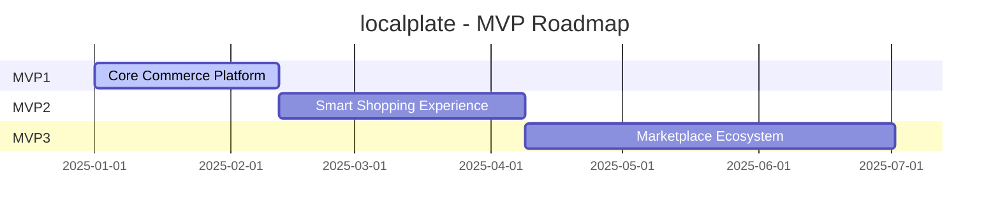
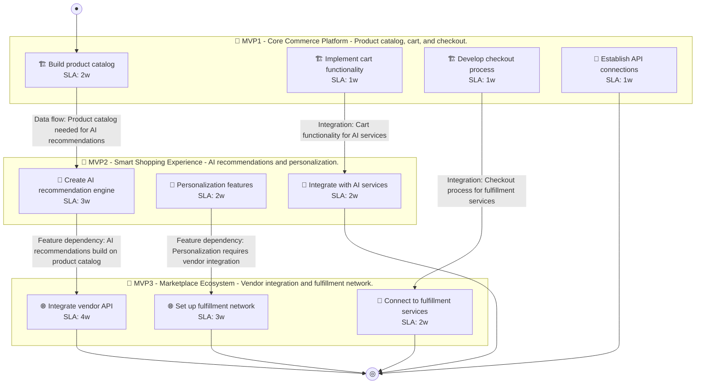

# 📊 Executive Summary: localplate

> **Domain:** Ecommerce | **Generated:** 2025-12-11 11:30:14 | **Expert Grade:** A-

---

## 🎯 Quick Metrics

| Metric | Value |
|--------|-------|
| **Total MVPs** | 3 |
| **Total Timeline** | 26 weeks |
| **Artifacts Generated** | 15 |
| **Specs Generated** | 3 |
| **Average MAS Score** | 90.3 |
| **Expert Grade** | **A-** |
| **Production Ready** | ✅ Yes |
| **Execution Time** | 317.3s |

---

## 📅 Product Roadmap Timeline



---

## 📦 MVP Breakdown

| MVP | Name | Duration | Deliverables | Artifacts | Avg Score | Grade |
|-----|------|----------|--------------|-----------|-----------|-------|
| **MVP1** | Core Commerce Platform | 6 weeks | 5 | 5 | 91.1 | A- |
| **MVP2** | Smart Shopping Experience | 8 weeks | 5 | 5 | 89.5 | B+ |
| **MVP3** | Marketplace Ecosystem | 12 weeks | 5 | 5 | 90.3 | A- |

### MVP1: Core Commerce Platform

**Description:** Product catalog, cart, and checkout. I want to build a local artisan food delivery platform called LocalPlate that connects consumers directly with local farmers, bakeries, and food artisans, offering subscription boxes and same-day deli

**Duration:** 6 weeks

**Key Deliverables:**
- Local artisan product catalog
- Subscription box service for seasonal produce
- Same-day delivery scheduling system
- User reviews and ratings for vendors
- Secure payment processing system

**Generated Artifacts:**

| Artifact Type | MAS Score | Status |
|---------------|-----------|--------|
| User Journey | 81.3 | ⚠️ |
| Swimlane | 94.4 | ✅ |
| Decision Tree | 94.6 | ✅ |
| Value Stream | 92.7 | ✅ |
| Business Process | 92.6 | ✅ |


**Spec Location:** `localplate/localplate-mvp1`


### MVP2: Smart Shopping Experience

**Description:** AI recommendations and personalization. I want to build a local artisan food delivery platform called LocalPlate that connects consumers directly with local farmers, bakeries, and food artisans, offering subscription boxes and same-day deli

**Duration:** 8 weeks

**Key Deliverables:**
- Personalized product recommendations USING MVP1 purchase data
- Demand forecasting for subscription boxes BUILDING ON MVP1 customer preferences
- Delivery route optimization USING MVP1 order data
- Dynamic pricing model USING MVP1 demand trends
- Customer feedback analysis for vendor improvement BUILDING ON MVP1 reviews

**Generated Artifacts:**

| Artifact Type | MAS Score | Status |
|---------------|-----------|--------|
| User Journey | 78.5 | ⚠️ |
| Swimlane | 89.3 | ✅ |
| Decision Tree | 96.0 | ✅ |
| Value Stream | 92.4 | ✅ |
| Business Process | 91.2 | ✅ |


**Spec Location:** `localplate/localplate-mvp2`


### MVP3: Marketplace Ecosystem

**Description:** Vendor integration and fulfillment network. I want to build a local artisan food delivery platform called LocalPlate that connects consumers directly with local farmers, bakeries, and food artisans, offering subscription boxes and same-day deli

**Duration:** 12 weeks

**Key Deliverables:**
- Integration with local farmers' inventory systems ENRICHING MVP2 personalized recommendations
- Partnership API for local bakeries USING MVP1 subscription data + MVP2 demand forecasting
- GPS tracking API for real-time delivery updates ENRICHING MVP2 delivery route optimization
- Marketplace integration for additional artisan products USING MVP1 catalog + MVP2 customer feedback analysis
- Cross-promotional collaborations with local events ENRICHING MVP2 customer preferences analysis

**Generated Artifacts:**

| Artifact Type | MAS Score | Status |
|---------------|-----------|--------|
| User Journey | 79.8 | ⚠️ |
| Swimlane | 92.7 | ✅ |
| Decision Tree | 96.0 | ✅ |
| Value Stream | 90.4 | ✅ |
| Business Process | 92.6 | ✅ |


**Spec Location:** `localplate/localplate-mvp3`


---

## 🔗 Cross-MVP Dependencies


| From | To | Type | Criticality | Description |
|------|-----|------|-------------|-------------|
| MVP1 | MVP2 | Data | CRITICAL | Data models and schemas from Core Commerce Platform required by Smart Shopping Experience |
| MVP1 | MVP2 | Feature | HIGH | Core features from Core Commerce Platform enable Smart Shopping Experience capabilities |
| MVP2 | MVP3 | Data | CRITICAL | Data models and schemas from Smart Shopping Experience required by Marketplace Ecosystem |
| MVP2 | MVP3 | Feature | HIGH | Core features from Smart Shopping Experience enable Marketplace Ecosystem capabilities |





---

## 🎓 Expert Assessment

### Overall Evaluation

| Dimension | Score | Status |
|-----------|-------|--------|
| **Overall Grade** | **A-** | ✅ |
| Semantic Preservation | 90.3% | ✅ |
| Cross-MVP Coherence | 95.0% | ✅ |
| Domain Accuracy | 85.8% | ⚠️ |
| Completeness | 100.0% | ✅ |
| Confidence Level | 0.9 | ✅ |

### Per-MVP Grades

| MVP | Grade | Status |
|-----|-------|--------|
| MVP1 | A- | ✅ |
| MVP2 | B+ | ✅ |
| MVP3 | A- | ✅ |


### ✅ Strengths

- Excellent semantic and structural across all diagrams
- Strong artifact quality with minor improvements possible
- Clear cross-MVP dependency mapping
- Complete artifact coverage for all MVPs


### 📝 Recommendations

1. Focus on improving pragmatic (current: 53.2/100) across all artifacts


---

## 📁 Generated Specification Files

### 1. localplate-mvp1

```
localplate/localplate-mvp1/
├── requirements.md
├── design.md
├── tasks.md
├── knowledge.md
└── glossary.md
```

### 2. localplate-mvp2

```
localplate/localplate-mvp2/
├── requirements.md
├── design.md
├── tasks.md
├── knowledge.md
└── glossary.md
```

### 3. localplate-mvp3

```
localplate/localplate-mvp3/
├── requirements.md
├── design.md
├── tasks.md
├── knowledge.md
└── glossary.md
```

---

## ⚠️ Issues & Warnings


*No errors encountered.*


### ⚠️ Warnings (1)

- Vision market research disabled


---

## 📊 Execution Metrics

| Metric | Value |
|--------|-------|
| Target Duration | 300s |
| Actual Duration | 317.3s |
| Performance | 94.6% of target |
| Artifacts/Minute | 2.8 |

---

*Generated by MAS Premium Roadmap Workflow v1.0 on 2025-12-11 11:30:14*