# Localplate Mvp1 - Design Document

## Overview

Core Commerce Platform: Product catalog, cart, and checkout. I want to build a local artisan food delivery platform called LocalPlate that connects consumers directly with local farmers, bakeries, and food artisans, offering subscription boxes and same-day deli

**Generated**: 2025-12-11 11:29:13  
**Diagrams Included**: 5

### Target Users

- **Customer**

## Architecture

## Components and Interfaces

### Approval Required?

- **Type**: Component
- **Purpose**: Part of the Localplate Mvp1 system
### Approved

- **Type**: Component
- **Purpose**: Part of the Localplate Mvp1 system
### Commerce

- **Type**: Component
- **Purpose**: Part of the Localplate Mvp1 system
### Complete

- **Type**: Component
- **Purpose**: Part of the Localplate Mvp1 system
### Core

- **Type**: Component
- **Purpose**: Part of the Localplate Mvp1 system
### Customer Support

- **Type**: Component
- **Purpose**: Part of the Localplate Mvp1 system
### Delivery Agent

- **Type**: Component
- **Purpose**: Part of the Localplate Mvp1 system
### Local

- **Type**: Component
- **Purpose**: Part of the Localplate Mvp1 system
### Local artisan product catalog

- **Type**: Component
- **Purpose**: Part of the Localplate Mvp1 system
### PAIN

- **Type**: Component
- **Purpose**: Part of the Localplate Mvp1 system

## Cross-Functional Process Flows (Swimlane)

> **Purpose**: Shows how work flows across different roles, departments, or systems. Each lane represents a responsible party, making handoffs and bottlenecks visible. Essential for RACI matrix creation and workflow optimization.

### Swimlane Process 1

```mermaid
graph TB
    %% Start Event
    Start((●))
    Start --> task_1

    subgraph MVP1["🎯 MVP1 - Core features"]
        task_1["🛍️ Local artisan product catalog<br/>SLA: 4h"]
        task_2["🏭 Subscription box service for seasonal produce<br/>SLA: 6h"]
        task_3["🚚 Same-day delivery scheduling system<br/>SLA: 8h"]
        task_4["💬 User reviews and ratings for vendors<br/>SLA: 1d"]
        task_5["👤 Secure payment processing system<br/>SLA: 1h"]
    end



    task_1 -->|Product catalog to subscription service| task_2
    task_2 -->|Subscription service to delivery scheduling| task_3
    task_3 -->|Delivery to customer| task_5
    task_4 -->|Customer support to customer| task_5

    %% End Event
    task_5 --> End((◎))

```

**MAS Score**: 94.4

## Business Process Workflows (BPMN)

> **Purpose**: Represents end-to-end business processes following BPMN 2.0 notation. Shows tasks, gateways (decision points), events, and process flow. Used for process automation and SLA tracking.

### Business Process 1

```mermaid
flowchart TD
    Start(["🎯 Process Initiated"])

    subgraph verification["Verification Phase<br/>📅 5 minutes"]
        task_1["🤖 Local artisan product catalog<br/>Owner: Admin<br/>SLA: 0.083h<br/>Automation: Automated"]
        task_3["🤖 Same-day delivery scheduling system<br/>Owner: Admin<br/>SLA: 0.083h<br/>Automation: Automated"]
        task_5["🤖 Secure payment processing system<br/>Owner: Admin<br/>SLA: 0.083h<br/>Automation: Automated"]
    end
    subgraph approval["Approval Phase<br/>📅 1 hour"]
        task_2["📋 Subscription box service for seasonal produce<br/>Owner: Admin<br/>SLA: 1h<br/>Automation: Manual"]
        task_4["📋 User reviews and ratings for vendors<br/>Owner: User<br/>SLA: 1h<br/>Automation: Manual"]
    end

    milestone_1{"🎯 Verification Complete<br/>All verification tasks completed"}
    milestone_2{"🚦 Approval Required<br/>Approval tasks need to be completed"}

    gateway_1{"❓ Verification Complete?"}
    gateway_2{"❓ Approval Required?"}
    
    end_success(["✅ Workflow Completed"])
    
    end_failure(["❌ Rejected"])

    Start -->|Start Verification| task_1
    task_1 -->|Verification Complete?| gateway_1
    gateway_1 -->|Yes| milestone_1
    gateway_1 -->|No| task_3
    task_3 -->|Continue Verification| task_5
    task_5 -->|Verification Complete| gateway_2
    gateway_2 -->|Approval Required?| task_2
    task_2 -->|Approved| milestone_2
    task_4 -->|Under Review| milestone_2

    style Start fill:#ccffcc
    style end_success fill:#ccffcc
    style end_failure fill:#ffcccc
    style verification fill:#e3f2fd,stroke:#1976d2
    style approval fill:#e3f2fd,stroke:#1976d2
    style milestone_1 fill:#fce4ec,stroke:#c2185b
    style milestone_2 fill:#fff3e0,stroke:#f57c00

```

**MAS Score**: 92.60000000000001

## Decision Logic Trees

> **Purpose**: Visualizes decision-making logic with conditions and outcomes. Each node represents a decision point, branches show conditions (yes/no, thresholds), and leaves show final outcomes. Critical for business rules documentation and algorithm design.

### Decision Tree 1

```mermaid
flowchart TD
    %% Title: Core Commerce Platform Decision Logic
    %% Description: Decision tree for: Decision tree for Core Commerce Platform decision logic with multi-tier approval logic. Decisions:...
    
    %% Start Node
    Start(["💰 Start Decision"])


    %% Decision Nodes
    Start --> decision_1
        decision_1{"🔴 Is shipping method selected?<br/>🔴 CRITICAL<br/>Effort: 1.0w"}
    
        decision_2{"🟠 Is delivery address valid?<br/>🟠 HIGH<br/>Effort: 1.0w"}
    decision_1 -->|"Yes"| decision_2
    
        decision_3{"🟡 Is carrier available for selected shipping?<br/>🟡 MEDIUM<br/>Effort: 1.0w"}
    decision_2 -->|"Yes"| decision_3
    
    

    

    


    %% Outcome Nodes
    outcome_no_shipping_selected["❌ Shipping method must be selected before proceeding<br/>Reason: Not specified"]
    outcome_invalid_address["❌ Delivery address is invalid, please correct it<br/>Reason: Not specified"]
    outcome_shipping_confirmed["✅ Shipping confirmed, proceed to payment<br/>"]
    outcome_carrier_unavailable["❌ Selected carrier is unavailable, please choose another<br/>Reason: Not specified"]

    %% Outcome Edge Connections (from leaf decisions to outcomes)
    decision_1 -->|"No"| outcome_no_shipping_selected
    decision_2 -->|"No"| outcome_invalid_address
    decision_3 -->|"Yes"| outcome_shipping_confirmed
    decision_3 -->|"No"| outcome_carrier_unavailable

    %% Styling
    style outcome_no_shipping_selected fill:#ffcccc,stroke:#dc3545
    style outcome_invalid_address fill:#ffcccc,stroke:#dc3545
    style outcome_shipping_confirmed fill:#ccffcc,stroke:#28a745
    style outcome_carrier_unavailable fill:#ffcccc,stroke:#dc3545

    %% Priority Legend
    subgraph Legend["📊 Priority Legend"]
        direction TB
        L1["🔴 CRITICAL: Immediate action required"]
        L2["🟠 HIGH: Plan for next sprint"]
        L3["🟡 MEDIUM: Quarterly planning"]
        L4["🟢 LOW: Backlog/nice-to-have"]
    end
    
    style L1 fill:#ffcccc
    style L2 fill:#ffe0cc
    style L3 fill:#ffffcc
    style L4 fill:#ccffcc


```

**MAS Score**: 94.63333333333334

## Value Stream Maps (Lean)

> **Purpose**: Shows the flow of value from request to delivery, identifying process time (PT), wait time (WT), and efficiency metrics. Used for identifying bottlenecks, waste elimination, and continuous improvement initiatives.

### Value Stream 1

```mermaid
flowchart LR
    %% Title and styling
    %% Value Stream: Core Commerce Platform Value Stream
    
    %% ========== PROCESS STEPS ==========
    step_1["📦 Local artisan product catalog<br/>PT: 30 min<br/>WT: 2 hours"]
    step_2["📦 Subscription box service for seasonal produce<br/>PT: 1 hours<br/>WT: 4 hours"]
    step_3["📦 Same-day delivery scheduling system<br/>PT: 1.5 hours<br/>WT: 7.5 hours"]
    step_4["📦 User reviews and ratings for vendors<br/>PT: 2 hours<br/>WT: 10 hours"]
    step_5["📦 Secure payment processing system<br/>PT: 2.5 hours<br/>WT: 12.5 hours"]
    
    %% ========== FLOW CONNECTIONS ==========
    step_1 -->|flow| step_2
    step_2 -->|flow| step_3
    step_3 -->|flow| step_4
    step_4 -->|flow| step_5
    
    %% ========== METRICS SUMMARY ==========
    subgraph Metrics["📊 Metrics Summary"]
        direction TB
        LT["⏱️ Lead Time: 36 hours"]
        PT["⚙️ Process Time: 450 minutes"]
        WT["⏳ Wait Time: 1.5 days"]
        EFF["📈 Efficiency: 12.5%"]
    end
    
    %% ========== WASTE INDICATORS ==========
    
    %% ========== STYLING ==========
    %% Highlight steps with waste
    style step_1 fill:#ffcccc,stroke:#cc0000,stroke-width:2px
    style step_2 fill:#ffcccc,stroke:#cc0000,stroke-width:2px
    style step_3 fill:#ffcccc,stroke:#cc0000,stroke-width:2px
    style step_4 fill:#ffcccc,stroke:#cc0000,stroke-width:2px
    style step_5 fill:#ffcccc,stroke:#cc0000,stroke-width:2px
    
    %% Waste subgraph styling
    
    %% Metrics subgraph styling
    style Metrics fill:#f0fff0,stroke:#00cc00
    style LT fill:#e6ffe6,stroke:#009900
    style PT fill:#e6ffe6,stroke:#009900
    style WT fill:#fff0e6,stroke:#cc6600
    style EFF fill:#e6ffe6,stroke:#009900

```

**MAS Score**: 92.7

## User Journeys (Experience Maps)

> **Purpose**: Maps the user's emotional journey through the product, from discovery to engagement. Each touchpoint shows satisfaction scores and emotional states, helping identify pain points and opportunities for UX improvement.

### User Journey 1

**MAS Score**: 81.35

## Diagram Summary

This design document includes **5 MAS artifacts** across the following categories:

| Diagram Type | Count | Average MAS Score | Purpose |
|--------------|-------|-------------------|---------|
| User Journey | 1 | 81.3 | UX experience map |
| Swimlane | 1 | 94.4 | Cross-functional workflow |
| Decision Tree | 1 | 94.6 | Decision logic |
| Value Stream | 1 | 92.7 | Lean efficiency |
| Business Process | 1 | 92.6 | BPMN process flow |

---

*Generated by MAS Compiler Spec Generator v1.0.0*