# Localplate Mvp2 - Design Document

## Overview

Smart Shopping Experience: AI recommendations and personalization. I want to build a local artisan food delivery platform called LocalPlate that connects consumers directly with local farmers, bakeries, and food artisans, offering subscription boxes and same-day deli

**Generated**: 2025-12-11 11:29:44  
**Diagrams Included**: 5

### Target Users

- **Customer**


## Architecture


## Components and Interfaces

### Approval Required?

- **Type**: Component
- **Purpose**: Part of the Localplate Mvp2 system
### Approved

- **Type**: Component
- **Purpose**: Part of the Localplate Mvp2 system
### BUILDING

- **Type**: Component
- **Purpose**: Part of the Localplate Mvp2 system
### Customer Support

- **Type**: Component
- **Purpose**: Part of the Localplate Mvp2 system
### Customer feedback analysis

- **Type**: Component
- **Purpose**: Part of the Localplate Mvp2 system
### Customer feedback analysis for vendor improvement

- **Type**: Component
- **Purpose**: Part of the Localplate Mvp2 system
### Delivery Agent

- **Type**: Component
- **Purpose**: Part of the Localplate Mvp2 system
### Delivery route optimization

- **Type**: Component
- **Purpose**: Part of the Localplate Mvp2 system
### Demand forecasting for subscription boxes

- **Type**: Component
- **Purpose**: Part of the Localplate Mvp2 system
### Dynamic pricing model

- **Type**: Component
- **Purpose**: Part of the Localplate Mvp2 system


## Cross-Functional Process Flows (Swimlane)

> **Purpose**: Shows how work flows across different roles, departments, or systems. Each lane represents a responsible party, making handoffs and bottlenecks visible. Essential for RACI matrix creation and workflow optimization.

### Swimlane Process 1

```mermaid
graph TB
    %% Start Event
    Start((●))
    Start --> task_1

    subgraph MVP1["🎯 MVP1 - Core features"]
        task_1["3e8 Personalized product recommendations USING MVP1 purchase data<br/>SLA: 4h"]
        task_2["3ed Demand forecasting for subscription boxes BUILDING ON MVP1 customer preferences<br/>SLA: 6h"]
        task_3["69a Delivery route optimization USING MVP1 order data<br/>SLA: 8h"]
        task_4["4e1 Dynamic pricing model USING MVP1 demand trends<br/>SLA: 4h"]
        task_5["464 Customer feedback analysis for vendor improvement BUILDING ON MVP1 reviews<br/>SLA: 4h"]
    end



    task_1 -->|to| task_2
    task_2 -->|to| task_3
    task_3 -->|to| task_4
    task_4 -->|to| task_5

    %% End Event
    task_5 --> End((◎))

```



**MAS Score**: 89.3


## Business Process Workflows (BPMN)

> **Purpose**: Represents end-to-end business processes following BPMN 2.0 notation. Shows tasks, gateways (decision points), events, and process flow. Used for process automation and SLA tracking.

### Business Process 1

```mermaid
flowchart TD
    Start(["🎯 Start Smart Shopping Experience"])

    subgraph mvp1["MVP1: Smart Shopping Features<br/>📅 1 month"]
        task_1["🤖 Personalized product recommendations<br/>Owner: System<br/>SLA: 0.083h<br/>Automation: Automated"]
        task_2["📋 Demand forecasting for subscription boxes<br/>Owner: Analyst<br/>SLA: 8h<br/>Automation: Manual"]
        task_3["🤖 Delivery route optimization<br/>Owner: System<br/>SLA: 0.083h<br/>Automation: Automated"]
        task_4["📋 Dynamic pricing model<br/>Owner: Analyst<br/>SLA: 8h<br/>Automation: Manual"]
        task_5["🤖 Customer feedback analysis<br/>Owner: System<br/>SLA: 0.083h<br/>Automation: Automated"]
    end

    milestone_1{"🚦 Workflow Approved<br/>All tasks approved or under review"}

    gateway_1{"❓ Verification Complete?"}
    gateway_2{"❓ Approval Required?"}
    
    end_success(["✅ End Workflow"])
    
    end_failure(["❌ Rejected"])

    Start Smart Shopping Experience --> gateway_1
    gateway_1 -->|Yes| task_1
    gateway_1 -->|No| task_2
    task_1 --> gateway_2
    task_2 --> gateway_2
    gateway_2 -->|Yes| task_3
    gateway_2 -->|No| task_4
    task_3 --> milestone_1
    task_4 --> milestone_1
    task_5 --> milestone_1

    style Start fill:#ccffcc
    style end_success fill:#ccffcc
    style end_failure fill:#ffcccc
    style mvp1 fill:#e3f2fd,stroke:#1976d2
    style milestone_1 fill:#fff3e0,stroke:#f57c00

```

**MAS Score**: 91.2


## Decision Logic Trees

> **Purpose**: Visualizes decision-making logic with conditions and outcomes. Each node represents a decision point, branches show conditions (yes/no, thresholds), and leaves show final outcomes. Critical for business rules documentation and algorithm design.

### Decision Tree 1

```mermaid
flowchart TD
    %% Title: Smart Shopping Experience Decision Tree
    %% Description: Decision tree for: Decision tree for Smart Shopping Experience decision logic with multi-tier approval logic. Decision...
    
    %% Start Node
    Start(["💰 Start Decision"])


    %% Decision Nodes
    Start --> decision_1
        decision_1{"🟠 Is shipping option selected?<br/>🟠 HIGH<br/>Effort: 1.0w"}
    
        decision_2{"🔴 Is delivery method available?<br/>🔴 CRITICAL<br/>Effort: 1.0w"}
    decision_1 -->|"Yes"| decision_2
    
        decision_3{"🟡 Is carrier selected?<br/>🟡 MEDIUM<br/>Effort: 1.0w"}
    decision_2 -->|"Yes"| decision_3
    
    

    

    


    %% Outcome Nodes
    outcome_no_shipping["❌ No shipping option selected, please choose a shipping method.<br/>Reason: Not specified"]
    outcome_delivery_not_available["❌ Selected delivery method is not available, please choose another.<br/>Reason: Not specified"]
    outcome_no_carrier_selected["❌ No carrier selected, please select a shipping carrier.<br/>Reason: Not specified"]
    outcome_shipping_confirmed["✅ Shipping option confirmed, proceed to checkout.<br/>"]

    %% Outcome Edge Connections (from leaf decisions to outcomes)
    decision_1 -->|"No"| outcome_no_shipping
    decision_2 -->|"No"| outcome_delivery_not_available
    decision_3 -->|"Yes"| outcome_shipping_confirmed
    decision_3 -->|"No"| outcome_no_carrier_selected

    %% Styling
    style outcome_no_shipping fill:#ffcccc,stroke:#dc3545
    style outcome_delivery_not_available fill:#ffcccc,stroke:#dc3545
    style outcome_no_carrier_selected fill:#ffcccc,stroke:#dc3545
    style outcome_shipping_confirmed fill:#ccffcc,stroke:#28a745

    %% Priority Legend
    subgraph Legend["📊 Priority Legend"]
        direction TB
        L1["🔴 CRITICAL: Immediate action required"]
        L2["🟠 HIGH: Plan for next sprint"]
        L3["🟡 MEDIUM: Quarterly planning"]
        L4["🟢 LOW: Backlog/nice-to-have"]
    end
    
    style L1 fill:#ffcccc
    style L2 fill:#ffe0cc
    style L3 fill:#ffffcc
    style L4 fill:#ccffcc


```



**MAS Score**: 95.96666666666667


## Value Stream Maps (Lean)

> **Purpose**: Shows the flow of value from request to delivery, identifying process time (PT), wait time (WT), and efficiency metrics. Used for identifying bottlenecks, waste elimination, and continuous improvement initiatives.

### Value Stream 1


**MAS Score**: 92.4


## User Journeys (Experience Maps)

> **Purpose**: Maps the user's emotional journey through the product, from discovery to engagement. Each touchpoint shows satisfaction scores and emotional states, helping identify pain points and opportunities for UX improvement.

### User Journey 1


**MAS Score**: 78.55


## Diagram Summary

This design document includes **5 MAS artifacts** across the following categories:

| Diagram Type | Count | Average MAS Score | Purpose |
|--------------|-------|-------------------|---------|
| User Journey | 1 | 78.5 | UX experience map |
| Swimlane | 1 | 89.3 | Cross-functional workflow |
| Decision Tree | 1 | 96.0 | Decision logic |
| Value Stream | 1 | 92.4 | Lean efficiency |
| Business Process | 1 | 91.2 | BPMN process flow |

---

*Generated by MAS Compiler Spec Generator v1.0.0*