# 📊 Executive Summary: mindwell-ai

> **Domain:** Healthcare | **Generated:** 2025-12-11 10:52:12 | **Expert Grade:** A-

---

## 🎯 Quick Metrics

| Metric | Value |
|--------|-------|
| **Total MVPs** | 3 |
| **Total Timeline** | 26 weeks |
| **Artifacts Generated** | 15 |
| **Specs Generated** | 3 |
| **Average MAS Score** | 90.1 |
| **Expert Grade** | **A-** |
| **Production Ready** | ✅ Yes |
| **Execution Time** | 314.2s |

---

## 📅 Product Roadmap Timeline


---

## 📦 MVP Breakdown

| MVP | Name | Duration | Deliverables | Artifacts | Avg Score | Grade |
|-----|------|----------|--------------|-----------|-----------|-------|
| **MVP1** | Core Care Coordination | 6 weeks | 5 | 5 | 92.2 | A- |
| **MVP2** | Intelligent Health Insights | 8 weeks | 5 | 5 | 89.2 | B+ |
| **MVP3** | Healthcare Ecosystem | 12 weeks | 5 | 5 | 89.0 | B+ |

### MVP1: Core Care Coordination

**Description:** Foundation for patient-provider coordination. I want to build a mental health therapy platform called MindWell AI that provides personalized cognitive behavioral therapy sessions, mood tracking, and connects users with licensed therapists for vir

**Duration:** 6 weeks

**Key Deliverables:**
- Personalized therapy session generator
- Mood tracking interface
- Therapist directory with profiles
- Virtual consultation booking system
- Progress tracking dashboard

**Generated Artifacts:**

| Artifact Type | MAS Score | Status |
|---------------|-----------|--------|
| User Journey | 81.0 | ⚠️ |
| Swimlane | 95.9 | ✅ |
| Decision Tree | 96.3 | ✅ |
| Value Stream | 92.7 | ✅ |
| Business Process | 95.3 | ✅ |


**Spec Location:** `mindwell-ai/mindwell-ai-mvp1`


### MVP2: Intelligent Health Insights

**Description:** AI-powered analytics and predictions. I want to build a mental health therapy platform called MindWell AI that provides personalized cognitive behavioral therapy sessions, mood tracking, and connects users with licensed therapists for vir

**Duration:** 8 weeks

**Key Deliverables:**
- AI-driven mood analysis USING MVP1 mood tracking data
- Session personalization suggestions BUILDING ON MVP1 therapy session generator
- Predictive analytics for therapy outcomes USING MVP1 progress data
- Behavioral trends identification BUILDING ON MVP1 user dashboard
- Automated reminders for therapy sessions USING MVP1 booking system

**Generated Artifacts:**

| Artifact Type | MAS Score | Status |
|---------------|-----------|--------|
| User Journey | 78.8 | ⚠️ |
| Swimlane | 88.8 | ✅ |
| Decision Tree | 96.3 | ✅ |
| Value Stream | 89.8 | ✅ |
| Business Process | 92.3 | ✅ |


**Spec Location:** `mindwell-ai/mindwell-ai-mvp2`


### MVP3: Healthcare Ecosystem

**Description:** Integration with EHR, telehealth, and partners. I want to build a mental health therapy platform called MindWell AI that provides personalized cognitive behavioral therapy sessions, mood tracking, and connects users with licensed therapists for vir

**Duration:** 12 weeks

**Key Deliverables:**
- Teletherapy facilitation ENRICHING MVP2 session personalization suggestions
- Third-party wellness content integration USING MVP1 therapeutic data + MVP2 predictive analytics
- Content sharing with therapists USING MVP1 therapist directory + MVP2 AI-driven mood analysis
- Community support groups feature USING MVP1 progress tracking dashboard + MVP2 behavioral trends identification
- Loyalty rewards program that tracks user engagement USING MVP1 mood tracking + MVP2 session personalization

**Generated Artifacts:**

| Artifact Type | MAS Score | Status |
|---------------|-----------|--------|
| User Journey | 78.0 | ⚠️ |
| Swimlane | 89.0 | ✅ |
| Decision Tree | 96.3 | ✅ |
| Value Stream | 91.5 | ✅ |
| Business Process | 90.1 | ✅ |


**Spec Location:** `mindwell-ai/mindwell-ai-mvp3`


---

## 🔗 Cross-MVP Dependencies


| From | To | Type | Criticality | Description |
|------|-----|------|-------------|-------------|
| MVP1 | MVP2 | Data | CRITICAL | Data models and schemas from Core Care Coordination required by Intelligent Health Insights |
| MVP1 | MVP2 | Feature | HIGH | Core features from Core Care Coordination enable Intelligent Health Insights capabilities |
| MVP2 | MVP3 | Data | CRITICAL | Data models and schemas from Intelligent Health Insights required by Healthcare Ecosystem |
| MVP2 | MVP3 | Feature | HIGH | Core features from Intelligent Health Insights enable Healthcare Ecosystem capabilities |

```mermaid
graph TB
    %% Start Event
    Start((●))
    Start --> task_1

    subgraph MVP1["🎯 MVP1 - Core Care Coordination - Foundation for patient-provider coordination."]
        task_1["🏗️ Establish patient-provider coordination framework<br/>SLA: 1 month"]
        task_2["🏗️ Provide data for analytics<br/>SLA: ongoing"]
        task_7["🔗 API development for data exchange<br/>SLA: 1 month"]
    end

    subgraph MVP2["🎯 MVP2 - Intelligent Health Insights - AI-powered analytics and predictions."]
        task_3["🤖 Develop AI analytics for health insights<br/>SLA: 2 months"]
        task_4["🤖 Integrate data from MVP1<br/>SLA: 1 month"]
        task_8["🔗 Ensure data availability for MVP2 and MVP3<br/>SLA: ongoing"]
    end

    subgraph MVP3["🎯 MVP3 - Healthcare Ecosystem - Integration with EHR, telehealth, and partners."]
        task_5["🌐 Integrate with EHR systems<br/>SLA: 3 months"]
        task_6["🌐 Connect with telehealth services<br/>SLA: 2 months"]
    end



    task_1 -->|Foundation for analytics| task_3
    task_2 -->|Data flow to analytics| task_4
    task_2 -->|Data availability for integration| task_8
    task_3 -->|Analytics build on foundation| task_5
    task_4 -->|Requires API for data exchange| task_7
    task_5 -->|Integration with telehealth| task_6

    %% End Event
    task_6 --> End((◎))
    task_7 --> End((◎))
    task_8 --> End((◎))

```





---

## 🎓 Expert Assessment

### Overall Evaluation

| Dimension | Score | Status |
|-----------|-------|--------|
| **Overall Grade** | **A-** | ✅ |
| Semantic Preservation | 90.1% | ✅ |
| Cross-MVP Coherence | 95.0% | ✅ |
| Domain Accuracy | 85.6% | ⚠️ |
| Completeness | 100.0% | ✅ |
| Confidence Level | 0.9 | ✅ |

### Per-MVP Grades

| MVP | Grade | Status |
|-----|-------|--------|
| MVP1 | A- | ✅ |
| MVP2 | B+ | ✅ |
| MVP3 | B+ | ✅ |


### ✅ Strengths

- Excellent semantic and structural across all diagrams
- Strong artifact quality with minor improvements possible
- Clear cross-MVP dependency mapping
- Complete artifact coverage for all MVPs


### 📝 Recommendations

1. Focus on improving pragmatic (current: 54.9/100) across all artifacts


---

## 📁 Generated Specification Files

### 1. mindwell-ai-mvp1

```
mindwell-ai/mindwell-ai-mvp1/
├── requirements.md
├── design.md
├── tasks.md
├── knowledge.md
└── glossary.md
```

### 2. mindwell-ai-mvp2

```
mindwell-ai/mindwell-ai-mvp2/
├── requirements.md
├── design.md
├── tasks.md
├── knowledge.md
└── glossary.md
```

### 3. mindwell-ai-mvp3

```
mindwell-ai/mindwell-ai-mvp3/
├── requirements.md
├── design.md
├── tasks.md
├── knowledge.md
└── glossary.md
```

---

## ⚠️ Issues & Warnings


*No errors encountered.*


### ⚠️ Warnings (1)

- Vision market research disabled


---

## 📊 Execution Metrics

| Metric | Value |
|--------|-------|
| Target Duration | 300s |
| Actual Duration | 314.2s |
| Performance | 95.5% of target |
| Artifacts/Minute | 2.9 |

---

*Generated by MAS Premium Roadmap Workflow v1.0 on 2025-12-11 10:52:12*