# Mindwell Ai Mvp2 - Design Document

## Overview

Intelligent Health Insights: AI-powered analytics and predictions. I want to build a mental health therapy platform called MindWell AI that provides personalized cognitive behavioral therapy sessions, mood tracking, and connects users with licensed therapists for vir

**Generated**: 2025-12-11 10:51:38  
**Diagrams Included**: 5

## Architecture

## Components and Interfaces

### AI-driven mood analysis

- **Type**: Component
- **Purpose**: Part of the Mindwell Ai Mvp2 system
### Approval Required?

- **Type**: Component
- **Purpose**: Part of the Mindwell Ai Mvp2 system
### Approved

- **Type**: Component
- **Purpose**: Part of the Mindwell Ai Mvp2 system
### Automated reminders for therapy sessions

- **Type**: Component
- **Purpose**: Part of the Mindwell Ai Mvp2 system
### BUILDING

- **Type**: Component
- **Purpose**: Part of the Mindwell Ai Mvp2 system
### Behavioral trends identification

- **Type**: Component
- **Purpose**: Part of the Mindwell Ai Mvp2 system
### Caregiver

- **Type**: Component
- **Purpose**: Part of the Mindwell Ai Mvp2 system
### Intelligent Health Insights

- **Type**: Component
- **Purpose**: Part of the Mindwell Ai Mvp2 system
### MVP1

- **Type**: Component
- **Purpose**: Part of the Mindwell Ai Mvp2 system
### MVP1 booking system

- **Type**: Component
- **Purpose**: Part of the Mindwell Ai Mvp2 system

## Cross-Functional Process Flows (Swimlane)

> **Purpose**: Shows how work flows across different roles, departments, or systems. Each lane represents a responsible party, making handoffs and bottlenecks visible. Essential for RACI matrix creation and workflow optimization.

### Swimlane Process 1

```mermaid
graph TB
    %% Start Event
    Start((●))
    Start --> task_1

    subgraph MVP1["🎯 MVP1 - Core features"]
        task_1["F469F3A5 AI-driven mood analysis using MVP1 mood tracking data<br/>SLA: 4h"]
        task_2["F468F3A5 Session personalization suggestions building on MVP1 therapy session generator<br/>SLA: 6h"]
        task_3["F469F3A5 Predictive analytics for therapy outcomes using MVP1 progress data<br/>SLA: 8h"]
        task_4["F9D1F3A5 Behavioral trends identification building on MVP1 user dashboard<br/>SLA: 12h"]
        task_5["F3E5 Automated reminders for therapy sessions using MVP1 booking system<br/>SLA: 1d"]
    end



    task_1 -->|provides mood analysis| task_2
    task_2 -->|provides session suggestions| task_3
    task_3 -->|provides predictive analytics| task_4
    task_4 -->|provides behavioral trends| task_5

    %% End Event
    task_5 --> End((◎))

```

**MAS Score**: 88.8

## Business Process Workflows (BPMN)

> **Purpose**: Represents end-to-end business processes following BPMN 2.0 notation. Shows tasks, gateways (decision points), events, and process flow. Used for process automation and SLA tracking.

### Business Process 1

```mermaid
flowchart TD
    Start(["🎯 Initiate Workflow"])

    subgraph mvp1["MVP1: Workflow Automation<br/>📅 2 weeks"]
        task_1["🤖 AI-driven mood analysis<br/>Owner: Automated System<br/>SLA: 0.0833h<br/>Automation: Automated"]
        task_2["📋 Session personalization suggestions<br/>Owner: Care Coordinator<br/>SLA: 1h<br/>Automation: Manual"]
        task_3["🤖 Predictive analytics for therapy outcomes<br/>Owner: Automated System<br/>SLA: 0.0833h<br/>Automation: Automated"]
        task_4["📋 Behavioral trends identification<br/>Owner: Care Coordinator<br/>SLA: 1h<br/>Automation: Manual"]
        task_5["🤖 Automated reminders for therapy sessions<br/>Owner: Automated System<br/>SLA: 0.0833h<br/>Automation: Automated"]
    end

    milestone_1{"🎯 Workflow Initiated<br/>All initial tasks started"}
    milestone_2{"🚦 Outcome Approved<br/>Outcome is Approved"}
    milestone_3{"🚦 Outcome Rejected<br/>Outcome is Rejected"}
    milestone_4{"🚦 Outcome Under Review<br/>Outcome is Under Review"}

    gateway_1{"❓ Verification Complete?"}
    gateway_2{"❓ Approval Required?"}
    
    end_success(["✅ Outcome Determined"])
    
    end_failure(["❌ Rejected"])

    Start -->|Start AI analysis| task_1
    task_1 -->|Mood analysis complete| gateway_1
    gateway_1 -->|Yes| task_2
    gateway_1 -->|No| milestone_2
    task_2 -->|Session suggestions made| gateway_2
    gateway_2 -->|Approval Required| task_3
    task_3 -->|Predictive analytics complete| gateway_2
    gateway_2 -->|Approval Required| task_4
    task_4 -->|Behavioral trends identified| gateway_2
    gateway_2 -->|Approval Required| task_5
    task_5 -->|Reminders sent| milestone_2

    style Start fill:#ccffcc
    style end_success fill:#ccffcc
    style end_failure fill:#ffcccc
    style mvp1 fill:#e3f2fd,stroke:#1976d2
    style milestone_1 fill:#fce4ec,stroke:#c2185b
    style milestone_2 fill:#fff3e0,stroke:#f57c00
    style milestone_3 fill:#fff3e0,stroke:#f57c00
    style milestone_4 fill:#fff3e0,stroke:#f57c00

```

**MAS Score**: 92.30000000000001

## Decision Logic Trees

> **Purpose**: Visualizes decision-making logic with conditions and outcomes. Each node represents a decision point, branches show conditions (yes/no, thresholds), and leaves show final outcomes. Critical for business rules documentation and algorithm design.

### Decision Tree 1

```mermaid
flowchart TD
    %% Title: Intelligent Health Insights Decision Logic
    %% Description: Decision tree for: Decision tree for Intelligent Health Insights decision logic with multi-tier approval logic. Decisi...
    
    %% Start Node
    Start(["💰 Start Decision"])


    %% Decision Nodes
    Start --> decision_1
        decision_1{"🟠 Is treatment protocol required?<br/>🟠 HIGH<br/>Effort: 1.0w"}
    
        decision_2{"🟡 Is therapy type available?<br/>🟡 MEDIUM<br/>Effort: 1.0w"}
    decision_1 -->|"Yes"| decision_2
    
        decision_3{"🟡 Is medication prescribed?<br/>🟡 MEDIUM<br/>Effort: 1.0w"}
    decision_2 -->|"Yes"| decision_3
    
    

    

    


    %% Outcome Nodes
    outcome_no_treatment["✅ No treatment protocol required at this time<br/>"]
    outcome_no_therapy["❌ No available therapy for the current condition<br/>Reason: Not specified"]
    outcome_medication_prescribed["✅ Medication has been prescribed as per protocol<br/>"]
    outcome_no_medication["❌ No medication prescribed; alternative options may be considered<br/>Reason: Not specified"]

    %% Outcome Edge Connections (from leaf decisions to outcomes)
    decision_1 -->|"No"| outcome_no_treatment
    decision_2 -->|"No"| outcome_no_therapy
    decision_3 -->|"Yes"| outcome_medication_prescribed
    decision_3 -->|"No"| outcome_no_medication

    %% Styling
    style outcome_no_treatment fill:#ccffcc,stroke:#28a745
    style outcome_no_therapy fill:#ffcccc,stroke:#dc3545
    style outcome_medication_prescribed fill:#ccffcc,stroke:#28a745
    style outcome_no_medication fill:#ffcccc,stroke:#dc3545

    %% Priority Legend
    subgraph Legend["📊 Priority Legend"]
        direction TB
        L1["🔴 CRITICAL: Immediate action required"]
        L2["🟠 HIGH: Plan for next sprint"]
        L3["🟡 MEDIUM: Quarterly planning"]
        L4["🟢 LOW: Backlog/nice-to-have"]
    end
    
    style L1 fill:#ffcccc
    style L2 fill:#ffe0cc
    style L3 fill:#ffffcc
    style L4 fill:#ccffcc


```

**MAS Score**: 96.26666666666667

## Value Stream Maps (Lean)

> **Purpose**: Shows the flow of value from request to delivery, identifying process time (PT), wait time (WT), and efficiency metrics. Used for identifying bottlenecks, waste elimination, and continuous improvement initiatives.

### Value Stream 1

```mermaid
flowchart LR
    %% Title and styling
    %% Value Stream: Intelligent Health Insights Value Stream
    
    %% ========== PROCESS STEPS ==========
    step_1["📦 AI-driven mood analysis<br/>PT: 30 min<br/>WT: 2 hours"]
    step_2["📦 Session personalization suggestions<br/>PT: 1 hours<br/>WT: 3.5 hours"]
    step_3["📦 Predictive analytics for therapy outcomes<br/>PT: 1.5 hours<br/>WT: 7.5 hours"]
    step_4["📦 Behavioral trends identification<br/>PT: 2 hours<br/>WT: 10 hours"]
    step_5["📦 Automated reminders for therapy sessions<br/>PT: 2.5 hours<br/>WT: 12.5 hours"]
    
    %% ========== FLOW CONNECTIONS ==========
    step_1 -->|flow| step_2
    step_2 -->|flow| step_3
    step_3 -->|flow| step_4
    step_4 -->|flow| step_5
    
    %% ========== METRICS SUMMARY ==========
    subgraph Metrics["📊 Metrics Summary"]
        direction TB
        LT["⏱️ Lead Time: 36 hours 0 minutes"]
        PT["⚙️ Process Time: 450 minutes"]
        WT["⏳ Wait Time: 1.5 days"]
        EFF["📈 Efficiency: 12.5%"]
    end
    
    %% ========== WASTE INDICATORS ==========
    
    %% ========== STYLING ==========
    %% Highlight steps with waste
    style step_1 fill:#ffcccc,stroke:#cc0000,stroke-width:2px
    style step_2 fill:#ffcccc,stroke:#cc0000,stroke-width:2px
    style step_3 fill:#ffcccc,stroke:#cc0000,stroke-width:2px
    style step_4 fill:#ffcccc,stroke:#cc0000,stroke-width:2px
    style step_5 fill:#ffcccc,stroke:#cc0000,stroke-width:2px
    
    %% Waste subgraph styling
    
    %% Metrics subgraph styling
    style Metrics fill:#f0fff0,stroke:#00cc00
    style LT fill:#e6ffe6,stroke:#009900
    style PT fill:#e6ffe6,stroke:#009900
    style WT fill:#fff0e6,stroke:#cc6600
    style EFF fill:#e6ffe6,stroke:#009900

```

**MAS Score**: 89.8

## User Journeys (Experience Maps)

> **Purpose**: Maps the user's emotional journey through the product, from discovery to engagement. Each touchpoint shows satisfaction scores and emotional states, helping identify pain points and opportunities for UX improvement.

### User Journey 1

**MAS Score**: 78.85

## Diagram Summary

This design document includes **5 MAS artifacts** across the following categories:

| Diagram Type | Count | Average MAS Score | Purpose |
|--------------|-------|-------------------|---------|
| User Journey | 1 | 78.8 | UX experience map |
| Swimlane | 1 | 88.8 | Cross-functional workflow |
| Decision Tree | 1 | 96.3 | Decision logic |
| Value Stream | 1 | 89.8 | Lean efficiency |
| Business Process | 1 | 92.3 | BPMN process flow |

---

*Generated by MAS Compiler Spec Generator v1.0.0*