# Mindwell Ai Mvp3 - Design Document

## Overview

Healthcare Ecosystem: Integration with EHR, telehealth, and partners. I want to build a mental health therapy platform called MindWell AI that provides personalized cognitive behavioral therapy sessions, mood tracking, and connects users with licensed therapists for vir

**Generated**: 2025-12-11 10:52:11  
**Diagrams Included**: 5

## Architecture

## Components and Interfaces

### Approval Required?

- **Type**: Component
- **Purpose**: Part of the Mindwell Ai Mvp3 system
### Approved

- **Type**: Component
- **Purpose**: Part of the Mindwell Ai Mvp3 system
### Caregiver

- **Type**: Component
- **Purpose**: Part of the Mindwell Ai Mvp3 system
### Community support groups feature

- **Type**: Component
- **Purpose**: Part of the Mindwell Ai Mvp3 system
### Content sharing with therapists

- **Type**: Component
- **Purpose**: Part of the Mindwell Ai Mvp3 system
### ENRICHING

- **Type**: Component
- **Purpose**: Part of the Mindwell Ai Mvp3 system
### Healthcare Ecosystem

- **Type**: Component
- **Purpose**: Part of the Mindwell Ai Mvp3 system
### Loyalty rewards program

- **Type**: Component
- **Purpose**: Part of the Mindwell Ai Mvp3 system
### MVP1

- **Type**: Component
- **Purpose**: Part of the Mindwell Ai Mvp3 system
### MVP2

- **Type**: Component
- **Purpose**: Part of the Mindwell Ai Mvp3 system

## Cross-Functional Process Flows (Swimlane)

> **Purpose**: Shows how work flows across different roles, departments, or systems. Each lane represents a responsible party, making handoffs and bottlenecks visible. Essential for RACI matrix creation and workflow optimization.

### Swimlane Process 1

```mermaid
graph TB
    %% Start Event
    Start((●))
    Start --> task_1

    subgraph MVP1["🎯 MVP1 - Core features"]
        task_2["F468F3A8 Integrate third-party wellness content using therapeutic data<br/>SLA: 6h"]
        task_3["F469F3A8 Share content with therapists using therapist directory<br/>SLA: 8h"]
        task_4["F9D1F3A8 Manage community support groups feature<br/>SLA: ongoing"]
        task_5["F464 Participate in loyalty rewards program tracking engagement<br/>SLA: ongoing"]
    end

    subgraph MVP2["🎯 MVP2 - Advanced features"]
        task_1["F469F3A8 Facilitate Teletherapy session with personalization suggestions<br/>SLA: 4h"]
    end



    task_1 -->|Facilitates| task_2
    task_2 -->|Integrates| task_3
    task_3 -->|Shares| task_4
    task_4 -->|Supports| task_5

    %% End Event
    task_5 --> End((◎))

```

**MAS Score**: 89.0

## Business Process Workflows (BPMN)

> **Purpose**: Represents end-to-end business processes following BPMN 2.0 notation. Shows tasks, gateways (decision points), events, and process flow. Used for process automation and SLA tracking.

### Business Process 1

```mermaid
flowchart TD
    Start(["🎯 Workflow Initiation"])

    subgraph mvp1["MVP1: Initial Features<br/>📅 Months 1-3"]
        task_2["📋 Third-party wellness content integration USING MVP1 therapeutic data + MVP2 predictive analytics<br/>Owner: Admin<br/>SLA: 2h<br/>Automation: Manual"]
        task_3["🤖 Content sharing with therapists USING MVP1 therapist directory + MVP2 AI-driven mood analysis<br/>Owner: Nurse<br/>SLA: 0.083h<br/>Automation: Automated"]
        task_4["📋 Community support groups feature USING MVP1 progress tracking dashboard + MVP2 behavioral trends ide<br/>Owner: Team Lead<br/>SLA: 2h<br/>Automation: Manual"]
    end
    subgraph mvp2["MVP2: Advanced Personalization<br/>📅 Months 4-6"]
        task_1["🤖 Teletherapy facilitation ENRICHING MVP2 session personalization suggestions<br/>Owner: Care Coordinator<br/>SLA: 0.083h<br/>Automation: Automated"]
        task_5["🤖 Loyalty rewards program that tracks user engagement USING MVP1 mood tracking + MVP2 session personal<br/>Owner: Account Owner<br/>SLA: 0.083h<br/>Automation: Automated"]
    end

    milestone_1{"🚦 MVP1 Completion<br/>All MVP1 features integrated and tested."}
    milestone_2{"🚀 MVP2 Launch<br/>MVP2 features deployed and operational."}

    gateway_1{"❓ Verification Complete?"}
    gateway_2{"❓ Approval Required?"}
    
    end_success(["✅ Final Approval Status"])
    
    end_failure(["❌ Rejected"])

    Start -->|Initiate Teletherapy| task_1
    task_1 -->|Session Completed| gateway_1
    gateway_1 -->|Verification Complete| task_2
    task_2 -->|Content Integrated| gateway_2
    gateway_2 -->|Approval Required| task_3
    task_3 -->|Content Shared| task_4
    task_4 -->|Community Feature Developed| task_5
    task_5 -->|Loyalty Program Implemented| milestone_2
    gateway_2 -->|Approved| end_success
    gateway_2 -->|Rejected| end_failure
    gateway_2 -->|Under Review| end_failure

    style Start fill:#ccffcc
    style end_success fill:#ccffcc
    style end_failure fill:#ffcccc
    style mvp1 fill:#e3f2fd,stroke:#1976d2
    style mvp2 fill:#e3f2fd,stroke:#1976d2
    style milestone_1 fill:#fff3e0,stroke:#f57c00
    style milestone_2 fill:#e8f5e9,stroke:#388e3c

```

**MAS Score**: 90.10000000000001

## Decision Logic Trees

> **Purpose**: Visualizes decision-making logic with conditions and outcomes. Each node represents a decision point, branches show conditions (yes/no, thresholds), and leaves show final outcomes. Critical for business rules documentation and algorithm design.

### Decision Tree 1

**MAS Score**: 96.26666666666667

## Value Stream Maps (Lean)

> **Purpose**: Shows the flow of value from request to delivery, identifying process time (PT), wait time (WT), and efficiency metrics. Used for identifying bottlenecks, waste elimination, and continuous improvement initiatives.

### Value Stream 1

```mermaid
flowchart LR
    %% Title and styling
    %% Value Stream: Healthcare Ecosystem Value Stream Optimization
    
    %% ========== PROCESS STEPS ==========
    step_1["📦 Teletherapy facilitation<br/>PT: 30 min<br/>WT: 2 hours"]
    step_2["📦 Third-party wellness content integration<br/>PT: 1 hours<br/>WT: 4 hours"]
    step_3["📦 Content sharing with therapists<br/>PT: 1.5 hours<br/>WT: 7.5 hours"]
    step_4["📦 Community support groups feature<br/>PT: 2 hours<br/>WT: 10 hours"]
    step_5["📦 Loyalty rewards program<br/>PT: 2.5 hours<br/>WT: 12.5 hours"]
    
    %% ========== FLOW CONNECTIONS ==========
    step_1 -->|flow| step_2
    step_2 -->|flow| step_3
    step_3 -->|flow| step_4
    step_4 -->|flow| step_5
    
    %% ========== METRICS SUMMARY ==========
    subgraph Metrics["📊 Metrics Summary"]
        direction TB
        LT["⏱️ Lead Time: 36 hours 0 minutes"]
        PT["⚙️ Process Time: 450 minutes"]
        WT["⏳ Wait Time: 1.5 days"]
        EFF["📈 Efficiency: 12.5%"]
    end
    
    %% ========== WASTE INDICATORS ==========
    
    %% ========== STYLING ==========
    %% Highlight steps with waste
    style step_1 fill:#ffcccc,stroke:#cc0000,stroke-width:2px
    style step_2 fill:#ffcccc,stroke:#cc0000,stroke-width:2px
    style step_3 fill:#ffcccc,stroke:#cc0000,stroke-width:2px
    style step_4 fill:#ffcccc,stroke:#cc0000,stroke-width:2px
    style step_5 fill:#ffcccc,stroke:#cc0000,stroke-width:2px
    
    %% Waste subgraph styling
    
    %% Metrics subgraph styling
    style Metrics fill:#f0fff0,stroke:#00cc00
    style LT fill:#e6ffe6,stroke:#009900
    style PT fill:#e6ffe6,stroke:#009900
    style WT fill:#fff0e6,stroke:#cc6600
    style EFF fill:#e6ffe6,stroke:#009900

```

**MAS Score**: 91.5

## User Journeys (Experience Maps)

> **Purpose**: Maps the user's emotional journey through the product, from discovery to engagement. Each touchpoint shows satisfaction scores and emotional states, helping identify pain points and opportunities for UX improvement.

### User Journey 1

**MAS Score**: 77.95

## Diagram Summary

This design document includes **5 MAS artifacts** across the following categories:

| Diagram Type | Count | Average MAS Score | Purpose |
|--------------|-------|-------------------|---------|
| User Journey | 1 | 78.0 | UX experience map |
| Swimlane | 1 | 89.0 | Cross-functional workflow |
| Decision Tree | 1 | 96.3 | Decision logic |
| Value Stream | 1 | 91.5 | Lean efficiency |
| Business Process | 1 | 90.1 | BPMN process flow |

---

*Generated by MAS Compiler Spec Generator v1.0.0*