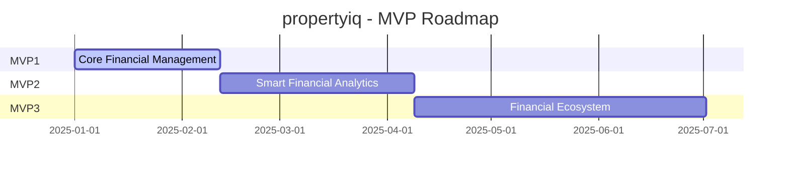
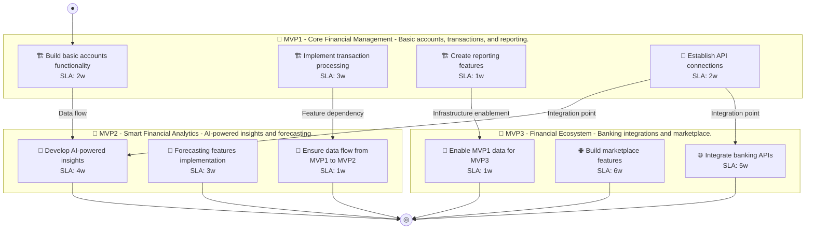

# 📊 Executive Summary: propertyiq

> **Domain:** Finance | **Generated:** 2025-12-11 11:52:07 | **Expert Grade:** B+

---

## 🎯 Quick Metrics

| Metric | Value |
|--------|-------|
| **Total MVPs** | 3 |
| **Total Timeline** | 26 weeks |
| **Artifacts Generated** | 15 |
| **Specs Generated** | 3 |
| **Average MAS Score** | 89.8 |
| **Expert Grade** | **B+** |
| **Production Ready** | ✅ Yes |
| **Execution Time** | 310.4s |

---

## 📅 Product Roadmap Timeline



---

## 📦 MVP Breakdown

| MVP | Name | Duration | Deliverables | Artifacts | Avg Score | Grade |
|-----|------|----------|--------------|-----------|-----------|-------|
| **MVP1** | Core Financial Management | 6 weeks | 5 | 5 | 91.1 | A- |
| **MVP2** | Smart Financial Analytics | 8 weeks | 5 | 5 | 89.1 | B+ |
| **MVP3** | Financial Ecosystem | 12 weeks | 5 | 5 | 89.2 | B+ |

### MVP1: Core Financial Management

**Description:** Basic accounts, transactions, and reporting. I want to build a property investment analysis platform called PropertyIQ that uses AI to evaluate real estate opportunities, predicts neighborhood growth patterns, calculates ROI projections, and pro

**Duration:** 6 weeks

**Key Deliverables:**
- Property investment search engine
- ROI projection calculator
- Neighborhood growth trend analysis
- Automated due diligence checklist
- User-generated property review system

**Generated Artifacts:**

| Artifact Type | MAS Score | Status |
|---------------|-----------|--------|
| User Journey | 81.3 | ⚠️ |
| Swimlane | 91.5 | ✅ |
| Decision Tree | 96.9 | ✅ |
| Value Stream | 93.0 | ✅ |
| Business Process | 92.8 | ✅ |


**Spec Location:** `propertyiq/propertyiq-mvp1`


### MVP2: Smart Financial Analytics

**Description:** AI-powered insights and forecasting. I want to build a property investment analysis platform called PropertyIQ that uses AI to evaluate real estate opportunities, predicts neighborhood growth patterns, calculates ROI projections, and pro

**Duration:** 8 weeks

**Key Deliverables:**
- Neighborhood growth prediction USING MVP1 neighborhood data
- Enhanced ROI projection analytics BUILDING ON MVP1 ROI calculator
- Machine learning-based risk assessment system USING MVP1 property data
- Automated due diligence insights BUILDING ON MVP1 checklist
- User behavior analytics for personalized recommendations USING MVP1 user reviews

**Generated Artifacts:**

| Artifact Type | MAS Score | Status |
|---------------|-----------|--------|
| User Journey | 78.5 | ⚠️ |
| Swimlane | 88.5 | ✅ |
| Decision Tree | 96.9 | ✅ |
| Value Stream | 91.8 | ✅ |
| Business Process | 90.0 | ✅ |


**Spec Location:** `propertyiq/propertyiq-mvp2`


### MVP3: Financial Ecosystem

**Description:** Banking integrations and marketplace. I want to build a property investment analysis platform called PropertyIQ that uses AI to evaluate real estate opportunities, predicts neighborhood growth patterns, calculates ROI projections, and pro

**Duration:** 12 weeks

**Key Deliverables:**
- Investment property analytics dashboard ENRICHING MVP2 predictions
- API integration for real-time market data USING MVP1+MVP2 analytics
- Partnership with lenders providing real-time valuation reports USING MVP1+MVP2 data
- Integration with real estate MLS for comprehensive listings USING MVP1+MVP2 features
- Collaboration platform for real estate professionals USING MVP1+MVP2 user behavior analytics

**Generated Artifacts:**

| Artifact Type | MAS Score | Status |
|---------------|-----------|--------|
| User Journey | 80.2 | ⚠️ |
| Swimlane | 86.5 | ✅ |
| Decision Tree | 96.9 | ✅ |
| Value Stream | 92.1 | ✅ |
| Business Process | 90.4 | ✅ |


**Spec Location:** `propertyiq/propertyiq-mvp3`


---

## 🔗 Cross-MVP Dependencies


| From | To | Type | Criticality | Description |
|------|-----|------|-------------|-------------|
| MVP1 | MVP2 | Data | CRITICAL | Data models and schemas from Core Financial Management required by Smart Financial Analytics |
| MVP1 | MVP2 | Feature | HIGH | Core features from Core Financial Management enable Smart Financial Analytics capabilities |
| MVP2 | MVP3 | Data | CRITICAL | Data models and schemas from Smart Financial Analytics required by Financial Ecosystem |
| MVP2 | MVP3 | Feature | HIGH | Core features from Smart Financial Analytics enable Financial Ecosystem capabilities |





---

## 🎓 Expert Assessment

### Overall Evaluation

| Dimension | Score | Status |
|-----------|-------|--------|
| **Overall Grade** | **B+** | ✅ |
| Semantic Preservation | 89.8% | ⚠️ |
| Cross-MVP Coherence | 95.0% | ✅ |
| Domain Accuracy | 85.3% | ⚠️ |
| Completeness | 100.0% | ✅ |
| Confidence Level | 0.9 | ⚠️ |

### Per-MVP Grades

| MVP | Grade | Status |
|-----|-------|--------|
| MVP1 | A- | ✅ |
| MVP2 | B+ | ✅ |
| MVP3 | B+ | ✅ |


### ✅ Strengths

- Excellent semantic and structural across all diagrams
- Strong artifact quality with minor improvements possible
- Clear cross-MVP dependency mapping
- Complete artifact coverage for all MVPs


### 📝 Recommendations

1. Focus on improving pragmatic (current: 54.7/100) across all artifacts


---

## 📁 Generated Specification Files

### 1. propertyiq-mvp1

```
propertyiq/propertyiq-mvp1/
├── requirements.md
├── design.md
├── tasks.md
├── knowledge.md
└── glossary.md
```

### 2. propertyiq-mvp2

```
propertyiq/propertyiq-mvp2/
├── requirements.md
├── design.md
├── tasks.md
├── knowledge.md
└── glossary.md
```

### 3. propertyiq-mvp3

```
propertyiq/propertyiq-mvp3/
├── requirements.md
├── design.md
├── tasks.md
├── knowledge.md
└── glossary.md
```

---

## ⚠️ Issues & Warnings


*No errors encountered.*


### ⚠️ Warnings (1)

- Vision market research disabled


---

## 📊 Execution Metrics

| Metric | Value |
|--------|-------|
| Target Duration | 300s |
| Actual Duration | 310.4s |
| Performance | 96.6% of target |
| Artifacts/Minute | 2.9 |

---

*Generated by MAS Premium Roadmap Workflow v1.0 on 2025-12-11 11:52:07*