# Propertyiq Mvp3 - Design Document

## Overview

Financial Ecosystem: Banking integrations and marketplace. I want to build a property investment analysis platform called PropertyIQ that uses AI to evaluate real estate opportunities, predicts neighborhood growth patterns, calculates ROI projections, and pro

**Generated**: 2025-12-11 11:52:07  
**Diagrams Included**: 5

### Target Users

- **Customer**

## Architecture

## Components and Interfaces

### API integration for real-time market data

- **Type**: Component
- **Purpose**: Part of the Propertyiq Mvp3 system
### Account Manager

- **Type**: Component
- **Purpose**: Part of the Propertyiq Mvp3 system
### Advisor

- **Type**: Component
- **Purpose**: Part of the Propertyiq Mvp3 system
### Analyst

- **Type**: Component
- **Purpose**: Part of the Propertyiq Mvp3 system
### Approval Required?

- **Type**: Component
- **Purpose**: Part of the Propertyiq Mvp3 system
### Approved

- **Type**: Component
- **Purpose**: Part of the Propertyiq Mvp3 system
### CRITICAL

- **Type**: Component
- **Purpose**: Part of the Propertyiq Mvp3 system
### Compliance Officer

- **Type**: Component
- **Purpose**: Part of the Propertyiq Mvp3 system
### ENRICHING

- **Type**: Component
- **Purpose**: Part of the Propertyiq Mvp3 system
### Financial Ecosystem

- **Type**: Component
- **Purpose**: Part of the Propertyiq Mvp3 system

## Cross-Functional Process Flows (Swimlane)

> **Purpose**: Shows how work flows across different roles, departments, or systems. Each lane represents a responsible party, making handoffs and bottlenecks visible. Essential for RACI matrix creation and workflow optimization.

### Swimlane Process 1

```mermaid
graph TB
    %% Start Event
    Start((●))
    Start --> task_1

    subgraph MVP1["🎯 MVP1 - Core features"]
        task_2["6E1️ API integration for real-time market data USING MVP1+MVP2 analytics<br/>SLA: 6h"]
        task_3["F4C8 Partnership with lenders providing real-time valuation reports USING MVP1+MVP2 data<br/>SLA: 8h"]
    end

    subgraph MVP2["🎯 MVP2 - Advanced features"]
        task_1["4B3 Investment property analytics dashboard ENRICHING MVP2 predictions<br/>SLA: 4h"]
        task_4["F4BC Integration with real estate MLS for comprehensive listings USING MVP1+MVP2 features<br/>SLA: 8h"]
    end

    subgraph MVP3["🎯 MVP3 - Enterprise features"]
        task_5["F465 Collaboration platform for real estate professionals USING MVP1+MVP2 user behavior analytics<br/>SLA: 8h"]
    end



    task_1 -->|provides insights| task_2
    task_2 -->|shares data| task_3
    task_3 -->|delivers reports| task_4
    task_4 -->|offers listings| task_5

    %% End Event
    task_5 --> End((◎))

```

**MAS Score**: 86.5

## Business Process Workflows (BPMN)

> **Purpose**: Represents end-to-end business processes following BPMN 2.0 notation. Shows tasks, gateways (decision points), events, and process flow. Used for process automation and SLA tracking.

### Business Process 1

```mermaid
flowchart TD
    Start(["🎯 Initiate Workflow"])

    subgraph mvp1["MVP1: Core Integrations<br/>📅 Months 1-3"]
        task_2["🤖 API integration for real-time market data USING MVP1+MVP2 analytics<br/>Owner: System<br/>SLA: 0.083h<br/>Automation: Automated"]
        task_3["🤖 Partnership with lenders providing real-time valuation reports USING MVP1+MVP2 data<br/>Owner: System<br/>SLA: 0.083h<br/>Automation: Automated"]
        task_4["📋 Integration with real estate MLS for comprehensive listings USING MVP1+MVP2 features<br/>Owner: System<br/>SLA: 1h<br/>Automation: Manual"]
    end
    subgraph mvp2["MVP2: Enhanced Analytics<br/>📅 Months 4-6"]
        task_1["🤖 Investment property analytics dashboard ENRICHING MVP2 predictions<br/>Owner: System<br/>SLA: 0.083h<br/>Automation: Automated"]
        task_5["🤖 Collaboration platform for real estate professionals USING MVP1+MVP2 user behavior analytics<br/>Owner: System<br/>SLA: 0.083h<br/>Automation: Automated"]
    end

    milestone_1{"🚦 MVP1 Go/No-Go<br/>Core integrations complete, 50 users onboarded."}
    milestone_2{"🚀 MVP2 Launch<br/>Enhanced analytics features deployed successfully."}

    gateway_1{"❓ Verification Complete?"}
    gateway_2{"❓ Approval Required?"}
    
    end_success(["✅ Process Complete"])
    
    end_failure(["❌ Rejected"])

    Start -->|Initiate| task_1
    task_1 -->|Complete Analytics| gateway_1
    gateway_1 -->|Yes| task_2
    gateway_1 -->|No| task_4
    task_2 -->|Market Data Integrated| gateway_2
    gateway_2 -->|Yes| task_3
    gateway_2 -->|No| task_5
    task_3 -->|Partnership Established| milestone_1
    task_5 -->|Collaboration Platform Ready| milestone_2

    style Start fill:#ccffcc
    style end_success fill:#ccffcc
    style end_failure fill:#ffcccc
    style mvp1 fill:#e3f2fd,stroke:#1976d2
    style mvp2 fill:#e3f2fd,stroke:#1976d2
    style milestone_1 fill:#fff3e0,stroke:#f57c00
    style milestone_2 fill:#e8f5e9,stroke:#388e3c

```

**MAS Score**: 90.4

## Decision Logic Trees

> **Purpose**: Visualizes decision-making logic with conditions and outcomes. Each node represents a decision point, branches show conditions (yes/no, thresholds), and leaves show final outcomes. Critical for business rules documentation and algorithm design.

### Decision Tree 1

```mermaid
flowchart TD
    %% Title: Financial Ecosystem Decision Logic
    %% Description: Decision tree for: Decision tree for Financial Ecosystem decision logic with multi-tier approval logic. Decisions: - I...
    
    %% Start Node
    Start(["💰 Start Decision"])


    %% Decision Nodes
    Start --> decision_1
        decision_1{"🟡 Is the condition above the Standard threshold?<br/>🟡 MEDIUM<br/>Effort: 1.0w"}
    
        decision_2{"🟠 Is the condition at a MEDIUM level?<br/>🟠 HIGH<br/>Effort: 1.0w"}
    decision_1 -->|"Yes"| decision_2
    
        decision_3{"🔴 Is the condition at a HIGH level?<br/>🔴 CRITICAL<br/>Effort: 1.0w"}
    decision_2 -->|"Yes"| decision_3
    
    

    

    


    %% Outcome Nodes
    outcome_low["✅ Condition is LOW, no action required<br/>"]
    outcome_medium["✅ Condition is MEDIUM, review required<br/>"]
    outcome_high["❌ Condition is HIGH, immediate action required<br/>Reason: Not specified"]
    outcome_critical["❌ Condition is CRITICAL, escalate immediately<br/>Reason: Not specified"]

    %% Outcome Edge Connections (from leaf decisions to outcomes)
    decision_1 -->|"No"| outcome_low
    decision_2 -->|"No"| outcome_medium
    decision_3 -->|"Yes"| outcome_high
    decision_3 -->|"No"| outcome_critical

    %% Styling
    style outcome_low fill:#ccffcc,stroke:#28a745
    style outcome_medium fill:#ccffcc,stroke:#28a745
    style outcome_high fill:#ffcccc,stroke:#dc3545
    style outcome_critical fill:#ffcccc,stroke:#dc3545

    %% Priority Legend
    subgraph Legend["📊 Priority Legend"]
        direction TB
        L1["🔴 CRITICAL: Immediate action required"]
        L2["🟠 HIGH: Plan for next sprint"]
        L3["🟡 MEDIUM: Quarterly planning"]
        L4["🟢 LOW: Backlog/nice-to-have"]
    end
    
    style L1 fill:#ffcccc
    style L2 fill:#ffe0cc
    style L3 fill:#ffffcc
    style L4 fill:#ccffcc


```

**MAS Score**: 96.86666666666667

## Value Stream Maps (Lean)

> **Purpose**: Shows the flow of value from request to delivery, identifying process time (PT), wait time (WT), and efficiency metrics. Used for identifying bottlenecks, waste elimination, and continuous improvement initiatives.

### Value Stream 1

```mermaid
flowchart LR
    %% Title and styling
    %% Value Stream: Financial Ecosystem Value Stream
    
    %% ========== PROCESS STEPS ==========
    step_1["📦 Investment property analytics dashboard<br/>PT: 30 min<br/>WT: 2 hours"]
    step_2["📦 API integration for real-time market data<br/>PT: 1 hours<br/>WT: 3 hours"]
    step_3["📦 Partnership with lenders providing real-time valuation reports<br/>PT: 1.5 hours<br/>WT: 7.5 hours"]
    step_4["📦 Integration with real estate MLS for comprehensive listings<br/>PT: 2 hours<br/>WT: 10 hours"]
    step_5["📦 Collaboration platform for real estate professionals<br/>PT: 2.5 hours<br/>WT: 12.5 hours"]
    
    %% ========== FLOW CONNECTIONS ==========
    step_1 -->|flow| step_2
    step_2 -->|flow| step_3
    step_3 -->|flow| step_4
    step_4 -->|flow| step_5
    
    %% ========== METRICS SUMMARY ==========
    subgraph Metrics["📊 Metrics Summary"]
        direction TB
        LT["⏱️ Lead Time: 2700 minutes (1.875 days)"]
        PT["⚙️ Process Time: 450 minutes (7.5 hours)"]
        WT["⏳ Wait Time: 1.5 days"]
        EFF["📈 Efficiency: 16.67%"]
    end
    
    %% ========== WASTE INDICATORS ==========
    
    %% ========== STYLING ==========
    %% Highlight steps with waste
    style step_1 fill:#ffcccc,stroke:#cc0000,stroke-width:2px
    style step_2 fill:#ffcccc,stroke:#cc0000,stroke-width:2px
    style step_3 fill:#ffcccc,stroke:#cc0000,stroke-width:2px
    style step_4 fill:#ffcccc,stroke:#cc0000,stroke-width:2px
    style step_5 fill:#ffcccc,stroke:#cc0000,stroke-width:2px
    
    %% Waste subgraph styling
    
    %% Metrics subgraph styling
    style Metrics fill:#f0fff0,stroke:#00cc00
    style LT fill:#e6ffe6,stroke:#009900
    style PT fill:#e6ffe6,stroke:#009900
    style WT fill:#fff0e6,stroke:#cc6600
    style EFF fill:#e6ffe6,stroke:#009900

```

**MAS Score**: 92.10000000000001

## User Journeys (Experience Maps)

> **Purpose**: Maps the user's emotional journey through the product, from discovery to engagement. Each touchpoint shows satisfaction scores and emotional states, helping identify pain points and opportunities for UX improvement.

### User Journey 1

**MAS Score**: 80.15

## Diagram Summary

This design document includes **5 MAS artifacts** across the following categories:

| Diagram Type | Count | Average MAS Score | Purpose |
|--------------|-------|-------------------|---------|
| User Journey | 1 | 80.2 | UX experience map |
| Swimlane | 1 | 86.5 | Cross-functional workflow |
| Decision Tree | 1 | 96.9 | Decision logic |
| Value Stream | 1 | 92.1 | Lean efficiency |
| Business Process | 1 | 90.4 | BPMN process flow |

---

*Generated by MAS Compiler Spec Generator v1.0.0*