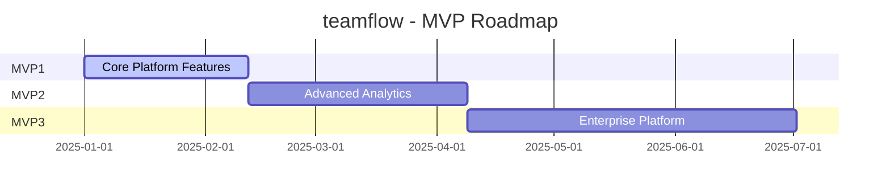
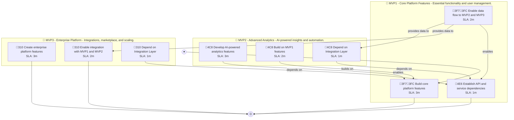

# 📊 Executive Summary: teamflow

> **Domain:** Saas | **Generated:** 2025-12-11 11:35:27 | **Expert Grade:** A-

---

## 🎯 Quick Metrics

| Metric | Value |
|--------|-------|
| **Total MVPs** | 3 |
| **Total Timeline** | 26 weeks |
| **Artifacts Generated** | 15 |
| **Specs Generated** | 3 |
| **Average MAS Score** | 90.5 |
| **Expert Grade** | **A-** |
| **Production Ready** | ✅ Yes |
| **Execution Time** | 312.5s |

---

## 📅 Product Roadmap Timeline



---

## 📦 MVP Breakdown

| MVP | Name | Duration | Deliverables | Artifacts | Avg Score | Grade |
|-----|------|----------|--------------|-----------|-----------|-------|
| **MVP1** | Core Platform Features | 6 weeks | 5 | 5 | 92.2 | A- |
| **MVP2** | Advanced Analytics | 8 weeks | 5 | 5 | 89.9 | B+ |
| **MVP3** | Enterprise Platform | 12 weeks | 5 | 5 | 89.3 | B+ |

### MVP1: Core Platform Features

**Description:** Essential functionality and user management. I want to build a remote team collaboration platform called TeamFlow that combines async video messaging, AI-powered meeting summaries, project tracking, and virtual office spaces to help distributed 

**Duration:** 6 weeks

**Key Deliverables:**
- Async video messaging system
- Project tracking dashboard
- Virtual office space interface
- User task assignment tool
- Team activity feed

**Generated Artifacts:**

| Artifact Type | MAS Score | Status |
|---------------|-----------|--------|
| User Journey | 81.3 | ⚠️ |
| Swimlane | 95.9 | ✅ |
| Decision Tree | 95.6 | ✅ |
| Value Stream | 93.0 | ✅ |
| Business Process | 95.3 | ✅ |


**Spec Location:** `teamflow/teamflow-mvp1`


### MVP2: Advanced Analytics

**Description:** AI-powered insights and automation. I want to build a remote team collaboration platform called TeamFlow that combines async video messaging, AI-powered meeting summaries, project tracking, and virtual office spaces to help distributed 

**Duration:** 8 weeks

**Key Deliverables:**
- AI-powered meeting summary generation USING MVP1 async video messaging
- Sentiment analysis on video messages USING MVP1 user interactions
- Automated project status updates BUILDING ON MVP1 project tracking
- Recommendation engine for task assignments USING MVP1 task data
- Intelligent insights into team performance metrics USING MVP1 project dashboard

**Generated Artifacts:**

| Artifact Type | MAS Score | Status |
|---------------|-----------|--------|
| User Journey | 80.2 | ⚠️ |
| Swimlane | 86.8 | ✅ |
| Decision Tree | 96.6 | ✅ |
| Value Stream | 92.4 | ✅ |
| Business Process | 93.7 | ✅ |


**Spec Location:** `teamflow/teamflow-mvp2`


### MVP3: Enterprise Platform

**Description:** Integrations, marketplace, and scaling. I want to build a remote team collaboration platform called TeamFlow that combines async video messaging, AI-powered meeting summaries, project tracking, and virtual office spaces to help distributed 

**Duration:** 12 weeks

**Key Deliverables:**
- Integration with calendar apps ENRICHING MVP2 meeting summaries
- Third-party productivity tools integration USING MVP1 virtual office and MVP2 performance metrics
- Custom API for client applications USING MVP1+MVP2 data
- Real-time collaboration tools enhancement BUILDING ON MVP1 project tracking and MVP2 insights
- Data visualization tools for performance metrics USING MVP1 dashboard and MVP2 analytics

**Generated Artifacts:**

| Artifact Type | MAS Score | Status |
|---------------|-----------|--------|
| User Journey | 78.8 | ⚠️ |
| Swimlane | 91.3 | ✅ |
| Decision Tree | 96.6 | ✅ |
| Value Stream | 89.8 | ✅ |
| Business Process | 90.1 | ✅ |


**Spec Location:** `teamflow/teamflow-mvp3`


---

## 🔗 Cross-MVP Dependencies


| From | To | Type | Criticality | Description |
|------|-----|------|-------------|-------------|
| MVP1 | MVP2 | Data | CRITICAL | Data models and schemas from Core Platform Features required by Advanced Analytics |
| MVP1 | MVP2 | Feature | HIGH | Core features from Core Platform Features enable Advanced Analytics capabilities |
| MVP2 | MVP3 | Data | CRITICAL | Data models and schemas from Advanced Analytics required by Enterprise Platform |
| MVP2 | MVP3 | Feature | HIGH | Core features from Advanced Analytics enable Enterprise Platform capabilities |





---

## 🎓 Expert Assessment

### Overall Evaluation

| Dimension | Score | Status |
|-----------|-------|--------|
| **Overall Grade** | **A-** | ✅ |
| Semantic Preservation | 90.5% | ✅ |
| Cross-MVP Coherence | 95.0% | ✅ |
| Domain Accuracy | 86.0% | ⚠️ |
| Completeness | 100.0% | ✅ |
| Confidence Level | 0.9 | ✅ |

### Per-MVP Grades

| MVP | Grade | Status |
|-----|-------|--------|
| MVP1 | A- | ✅ |
| MVP2 | B+ | ✅ |
| MVP3 | B+ | ✅ |


### ✅ Strengths

- Excellent semantic and structural across all diagrams
- Strong artifact quality with minor improvements possible
- Clear cross-MVP dependency mapping
- Complete artifact coverage for all MVPs


### 📝 Recommendations

1. Focus on improving pragmatic (current: 58.1/100) across all artifacts


---

## 📁 Generated Specification Files

### 1. teamflow-mvp1

```
teamflow/teamflow-mvp1/
├── requirements.md
├── design.md
├── tasks.md
├── knowledge.md
└── glossary.md
```

### 2. teamflow-mvp2

```
teamflow/teamflow-mvp2/
├── requirements.md
├── design.md
├── tasks.md
├── knowledge.md
└── glossary.md
```

### 3. teamflow-mvp3

```
teamflow/teamflow-mvp3/
├── requirements.md
├── design.md
├── tasks.md
├── knowledge.md
└── glossary.md
```

---

## ⚠️ Issues & Warnings


*No errors encountered.*


### ⚠️ Warnings (1)

- Vision market research disabled


---

## 📊 Execution Metrics

| Metric | Value |
|--------|-------|
| Target Duration | 300s |
| Actual Duration | 312.5s |
| Performance | 96.0% of target |
| Artifacts/Minute | 2.9 |

---

*Generated by MAS Premium Roadmap Workflow v1.0 on 2025-12-11 11:35:27*