# Teamflow Mvp2 - Design Document

## Overview

Advanced Analytics: AI-powered insights and automation. I want to build a remote team collaboration platform called TeamFlow that combines async video messaging, AI-powered meeting summaries, project tracking, and virtual office spaces to help distributed 

**Generated**: 2025-12-11 11:34:58  
**Diagrams Included**: 5

### Target Users

- **Admin**

## Architecture

## Components and Interfaces

### AI-powered meeting summary generation

- **Type**: Component
- **Purpose**: Part of the Teamflow Mvp2 system
### Advanced Analytics

- **Type**: Component
- **Purpose**: Part of the Teamflow Mvp2 system
### Approval Required?

- **Type**: Component
- **Purpose**: Part of the Teamflow Mvp2 system
### Approved

- **Type**: Component
- **Purpose**: Part of the Teamflow Mvp2 system
### Automated project status updates

- **Type**: Component
- **Purpose**: Part of the Teamflow Mvp2 system
### BUILDING

- **Type**: Component
- **Purpose**: Part of the Teamflow Mvp2 system
### CRITICAL

- **Type**: Component
- **Purpose**: Part of the Teamflow Mvp2 system
### Developer

- **Type**: Component
- **Purpose**: Part of the Teamflow Mvp2 system
### HIGH

- **Type**: Component
- **Purpose**: Part of the Teamflow Mvp2 system
### Intelligent insights into team performance metrics

- **Type**: Component
- **Purpose**: Part of the Teamflow Mvp2 system

## Cross-Functional Process Flows (Swimlane)

> **Purpose**: Shows how work flows across different roles, departments, or systems. Each lane represents a responsible party, making handoffs and bottlenecks visible. Essential for RACI matrix creation and workflow optimization.

### Swimlane Process 1

```mermaid
graph TB
    %% Start Event
    Start((●))
    Start --> task_1

    subgraph MVP1["🎯 MVP1 - Core features"]
        task_1["F9D1F4BC AI-powered meeting summary generation USING MVP1 async video messaging<br/>SLA: 4h"]
        task_2["F4BB Sentiment analysis on video messages USING MVP1 user interactions<br/>SLA: 6h"]
        task_3["F4D6 Automated project status updates BUILDING ON MVP1 project tracking<br/>SLA: 8h"]
        task_4["F4BB Recommendation engine for task assignments USING MVP1 task data<br/>SLA: 4h"]
        task_5["F464 Intelligent insights into team performance metrics USING MVP1 project dashboard<br/>SLA: 4h"]
    end



    task_1 -->|Hand off meeting summary| task_2
    task_2 -->|Provide sentiment analysis| task_3
    task_3 -->|Share project status| task_4
    task_4 -->|Assign tasks based on recommendations| task_5

    %% End Event
    task_5 --> End((◎))

```

**MAS Score**: 86.8

## Business Process Workflows (BPMN)

> **Purpose**: Represents end-to-end business processes following BPMN 2.0 notation. Shows tasks, gateways (decision points), events, and process flow. Used for process automation and SLA tracking.

### Business Process 1

```mermaid
flowchart TD
    Start(["🎯 Initiate Workflow"])

    subgraph mvp1["MVP1: Advanced Analytics Features<br/>📅 1 month"]
        task_1["🤖 AI-powered meeting summary generation<br/>Owner: User<br/>SLA: 0.0833h<br/>Automation: Automated"]
        task_2["📋 Sentiment analysis on video messages<br/>Owner: User<br/>SLA: 1h<br/>Automation: Manual"]
        task_3["🤖 Automated project status updates<br/>Owner: User<br/>SLA: 0.0833h<br/>Automation: Automated"]
        task_4["📋 Recommendation engine for task assignments<br/>Owner: User<br/>SLA: 1h<br/>Automation: Manual"]
        task_5["🤖 Intelligent insights into team performance metrics<br/>Owner: User<br/>SLA: 0.0833h<br/>Automation: Automated"]
    end

    milestone_1{"🚦 MVP1 Completion<br/>All tasks completed and approved."}

    gateway_1{"❓ Verification Complete?"}
    gateway_2{"❓ Approval Required?"}
    
    end_success(["✅ Workflow Completed"])
    
    end_failure(["❌ Rejected"])

    Start -->|Initiate| task_1
    task_1 -->|Summary Generated| gateway_1
    gateway_1 -->|Yes| task_2
    task_2 -->|Sentiment Analyzed| gateway_2
    gateway_2 -->|Approval Required| task_3
    task_3 -->|Status Updated| task_4
    task_4 -->|Recommendations Generated| task_5
    task_5 -->|Insights Provided| milestone_1
    gateway_2 -->|Approved| end_success
    gateway_2 -->|Rejected| end_failure
    gateway_2 -->|Under Review| end_success

    style Start fill:#ccffcc
    style end_success fill:#ccffcc
    style end_failure fill:#ffcccc
    style mvp1 fill:#e3f2fd,stroke:#1976d2
    style milestone_1 fill:#fff3e0,stroke:#f57c00

```

**MAS Score**: 93.7

## Decision Logic Trees

> **Purpose**: Visualizes decision-making logic with conditions and outcomes. Each node represents a decision point, branches show conditions (yes/no, thresholds), and leaves show final outcomes. Critical for business rules documentation and algorithm design.

### Decision Tree 1

**MAS Score**: 96.56666666666666

## Value Stream Maps (Lean)

> **Purpose**: Shows the flow of value from request to delivery, identifying process time (PT), wait time (WT), and efficiency metrics. Used for identifying bottlenecks, waste elimination, and continuous improvement initiatives.

### Value Stream 1

**MAS Score**: 92.4

## User Journeys (Experience Maps)

> **Purpose**: Maps the user's emotional journey through the product, from discovery to engagement. Each touchpoint shows satisfaction scores and emotional states, helping identify pain points and opportunities for UX improvement.

### User Journey 1

**MAS Score**: 80.15

## Diagram Summary

This design document includes **5 MAS artifacts** across the following categories:

| Diagram Type | Count | Average MAS Score | Purpose |
|--------------|-------|-------------------|---------|
| User Journey | 1 | 80.2 | UX experience map |
| Swimlane | 1 | 86.8 | Cross-functional workflow |
| Decision Tree | 1 | 96.6 | Decision logic |
| Value Stream | 1 | 92.4 | Lean efficiency |
| Business Process | 1 | 93.7 | BPMN process flow |

---

*Generated by MAS Compiler Spec Generator v1.0.0*