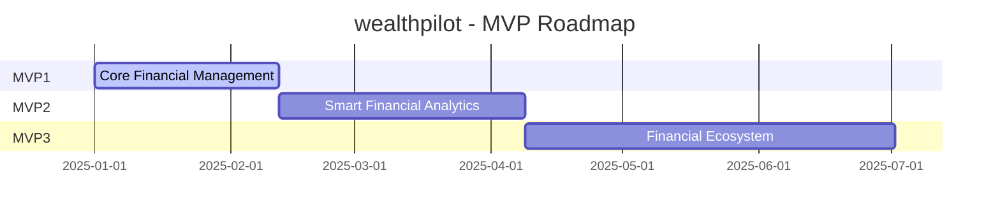
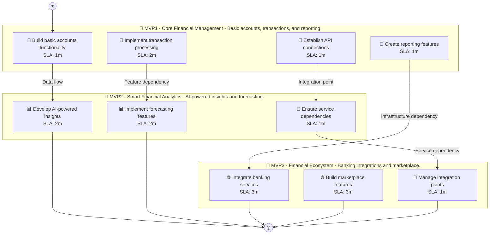

# 📊 Executive Summary: wealthpilot

> **Domain:** Finance | **Generated:** 2025-12-11 11:13:06 | **Expert Grade:** A-

---

## 🎯 Quick Metrics

| Metric | Value |
|--------|-------|
| **Total MVPs** | 3 |
| **Total Timeline** | 26 weeks |
| **Artifacts Generated** | 15 |
| **Specs Generated** | 3 |
| **Average MAS Score** | 90.1 |
| **Expert Grade** | **A-** |
| **Production Ready** | ✅ Yes |
| **Execution Time** | 352.2s |

---

## 📅 Product Roadmap Timeline



---

## 📦 MVP Breakdown

| MVP | Name | Duration | Deliverables | Artifacts | Avg Score | Grade |
|-----|------|----------|--------------|-----------|-----------|-------|
| **MVP1** | Core Financial Management | 6 weeks | 5 | 5 | 91.1 | A- |
| **MVP2** | Smart Financial Analytics | 8 weeks | 5 | 5 | 89.7 | B+ |
| **MVP3** | Financial Ecosystem | 12 weeks | 5 | 5 | 89.7 | B+ |

### MVP1: Core Financial Management

**Description:** Basic accounts, transactions, and reporting. I want to build a personal investment platform called WealthPilot that uses AI to analyze market trends, provides automated portfolio rebalancing, and offers personalized investment recommendations ba

**Duration:** 6 weeks

**Key Deliverables:**
- User-friendly investment portfolio builder
- Market trend analysis dashboard
- Risk assessment questionnaire
- Automated performance tracking
- Goal setting and management tool

**Generated Artifacts:**

| Artifact Type | MAS Score | Status |
|---------------|-----------|--------|
| User Journey | 81.3 | ⚠️ |
| Swimlane | 91.8 | ✅ |
| Decision Tree | 96.9 | ✅ |
| Value Stream | 93.0 | ✅ |
| Business Process | 92.4 | ✅ |


**Spec Location:** `wealthpilot/wealthpilot-mvp1`


### MVP2: Smart Financial Analytics

**Description:** AI-powered insights and forecasting. I want to build a personal investment platform called WealthPilot that uses AI to analyze market trends, provides automated portfolio rebalancing, and offers personalized investment recommendations ba

**Duration:** 8 weeks

**Key Deliverables:**
- AI-driven market trend forecasting USING MVP1 market trend analysis dashboard
- Personalized investment recommendations BUILDING ON MVP1 risk assessment questionnaire
- Automated portfolio rebalancing USING MVP1 automated performance tracking
- Insight generation through machine learning on user investment behavior USING MVP1 user-friendly investment portfolio builder
- Custom alerts for market changes BUILDING ON MVP1 goal setting and management tool

**Generated Artifacts:**

| Artifact Type | MAS Score | Status |
|---------------|-----------|--------|
| User Journey | 81.3 | ⚠️ |
| Swimlane | 86.2 | ✅ |
| Decision Tree | 96.3 | ✅ |
| Value Stream | 92.1 | ✅ |
| Business Process | 92.5 | ✅ |


**Spec Location:** `wealthpilot/wealthpilot-mvp2`


### MVP3: Financial Ecosystem

**Description:** Banking integrations and marketplace. I want to build a personal investment platform called WealthPilot that uses AI to analyze market trends, provides automated portfolio rebalancing, and offers personalized investment recommendations ba

**Duration:** 12 weeks

**Key Deliverables:**
- Integration with third-party financial news sources ENRICHING MVP2 AI-driven market trend forecasting
- Collaborative features for group investments USING MVP1 portfolio builder AND MVP2 personalized investment recommendations
- APIs for bank account linking USING MVP1 automated performance tracking AND MVP2 automated portfolio rebalancing
- Partnership features with investment advisors USING MVP1 risk assessment questionnaire AND MVP2 insight generation
- Social trading capabilities USING MVP1 goal setting and management tool AND MVP2 custom alerts

**Generated Artifacts:**

| Artifact Type | MAS Score | Status |
|---------------|-----------|--------|
| User Journey | 79.8 | ⚠️ |
| Swimlane | 88.6 | ✅ |
| Decision Tree | 96.6 | ✅ |
| Value Stream | 90.4 | ✅ |
| Business Process | 92.9 | ✅ |


**Spec Location:** `wealthpilot/wealthpilot-mvp3`


---

## 🔗 Cross-MVP Dependencies


| From | To | Type | Criticality | Description |
|------|-----|------|-------------|-------------|
| MVP1 | MVP2 | Data | CRITICAL | Data models and schemas from Core Financial Management required by Smart Financial Analytics |
| MVP1 | MVP2 | Feature | HIGH | Core features from Core Financial Management enable Smart Financial Analytics capabilities |
| MVP2 | MVP3 | Data | CRITICAL | Data models and schemas from Smart Financial Analytics required by Financial Ecosystem |
| MVP2 | MVP3 | Feature | HIGH | Core features from Smart Financial Analytics enable Financial Ecosystem capabilities |





---

## 🎓 Expert Assessment

### Overall Evaluation

| Dimension | Score | Status |
|-----------|-------|--------|
| **Overall Grade** | **A-** | ✅ |
| Semantic Preservation | 90.1% | ✅ |
| Cross-MVP Coherence | 95.0% | ✅ |
| Domain Accuracy | 85.6% | ⚠️ |
| Completeness | 100.0% | ✅ |
| Confidence Level | 0.9 | ✅ |

### Per-MVP Grades

| MVP | Grade | Status |
|-----|-------|--------|
| MVP1 | A- | ✅ |
| MVP2 | B+ | ✅ |
| MVP3 | B+ | ✅ |


### ✅ Strengths

- Excellent semantic and structural across all diagrams
- Strong artifact quality with minor improvements possible
- Clear cross-MVP dependency mapping
- Complete artifact coverage for all MVPs


### 📝 Recommendations

1. Focus on improving pragmatic (current: 52.6/100) across all artifacts
2. Address completeness issues: {'severity': 'medium', 'type': 'sub_metric', 'metric': 'RelationshipMetric', 'score': 0.0, 'threshold': 20.0, 'gap': 20.0, 'message': 'RelationshipMetric below threshold', 'reason': "Found 0/4 relationships (0.0%) (FAILED, threshold: 20%) Missing: ['User-friendly Investment Portfolio Builder->Market Trend Analysis Dashboard', 'Market Trend Analysis Dashboard->Risk Assessment Questionnaire', 'Risk Assessment Questionnaire->Automated Performance Tracking', '...+1 more']"}


---

## 📁 Generated Specification Files

### 1. wealthpilot-mvp1

```
wealthpilot/wealthpilot-mvp1/
├── requirements.md
├── design.md
├── tasks.md
├── knowledge.md
└── glossary.md
```

### 2. wealthpilot-mvp2

```
wealthpilot/wealthpilot-mvp2/
├── requirements.md
├── design.md
├── tasks.md
├── knowledge.md
└── glossary.md
```

### 3. wealthpilot-mvp3

```
wealthpilot/wealthpilot-mvp3/
├── requirements.md
├── design.md
├── tasks.md
├── knowledge.md
└── glossary.md
```

---

## ⚠️ Issues & Warnings


*No errors encountered.*


### ⚠️ Warnings (1)

- Vision market research disabled


---

## 📊 Execution Metrics

| Metric | Value |
|--------|-------|
| Target Duration | 300s |
| Actual Duration | 352.2s |
| Performance | 85.2% of target |
| Artifacts/Minute | 2.6 |

---

*Generated by MAS Premium Roadmap Workflow v1.0 on 2025-12-11 11:13:06*