# Wealthpilot Mvp2 - Design Document

## Overview

Smart Financial Analytics: AI-powered insights and forecasting. I want to build a personal investment platform called WealthPilot that uses AI to analyze market trends, provides automated portfolio rebalancing, and offers personalized investment recommendations ba

**Generated**: 2025-12-11 11:12:29  
**Diagrams Included**: 5

### Target Users

- **Customer**

## Architecture

## Components and Interfaces

### AI-driven market trend forecasting

- **Type**: Component
- **Purpose**: Part of the Wealthpilot Mvp2 system
### Account Manager

- **Type**: Component
- **Purpose**: Part of the Wealthpilot Mvp2 system
### Advisor

- **Type**: Component
- **Purpose**: Part of the Wealthpilot Mvp2 system
### Analyst

- **Type**: Component
- **Purpose**: Part of the Wealthpilot Mvp2 system
### Approval Required?

- **Type**: Component
- **Purpose**: Part of the Wealthpilot Mvp2 system
### Approved

- **Type**: Component
- **Purpose**: Part of the Wealthpilot Mvp2 system
### Automated portfolio rebalancing

- **Type**: Component
- **Purpose**: Part of the Wealthpilot Mvp2 system
### BUILDING

- **Type**: Component
- **Purpose**: Part of the Wealthpilot Mvp2 system
### CRITICAL

- **Type**: Component
- **Purpose**: Part of the Wealthpilot Mvp2 system
### Compliance Officer

- **Type**: Component
- **Purpose**: Part of the Wealthpilot Mvp2 system

## Cross-Functional Process Flows (Swimlane)

> **Purpose**: Shows how work flows across different roles, departments, or systems. Each lane represents a responsible party, making handoffs and bottlenecks visible. Essential for RACI matrix creation and workflow optimization.

### Swimlane Process 1

```mermaid
graph TB
    %% Start Event
    Start((●))
    Start --> task_1

    subgraph MVP1["🎯 MVP1 - Core features"]
        task_1["4BC AI-driven market trend forecasting using MVP1 market trend analysis dashboard<br/>SLA: 4h"]
        task_2["6A8 Personalized investment recommendations building on MVP1 risk assessment questionnaire<br/>SLA: 6h"]
        task_3["F4C8 Automated portfolio rebalancing using MVP1 automated performance tracking<br/>SLA: 8h"]
        task_4["F4C4 Insight generation through machine learning on user investment behavior using MVP1 user-friendly investment portfolio builder<br/>SLA: N/A"]
        task_5["F464 Custom alerts for market changes building on MVP1 goal setting and management tool<br/>SLA: N/A"]
    end



    task_1 -->|uses| task_1
    task_2 -->|builds on| task_2
    task_3 -->|uses| task_3
    task_4 -->|uses| task_4
    task_5 -->|builds on| task_5

    %% End Event
    task_5 --> End((◎))

```

**MAS Score**: 86.2

## Business Process Workflows (BPMN)

> **Purpose**: Represents end-to-end business processes following BPMN 2.0 notation. Shows tasks, gateways (decision points), events, and process flow. Used for process automation and SLA tracking.

### Business Process 1

```mermaid
flowchart TD
    Start(["🎯 Initiate Workflow"])

    subgraph mvp1["MVP1: Core Features<br/>📅 1 month"]
        task_1["🤖 AI-driven market trend forecasting<br/>Owner: System<br/>SLA: 0.083h<br/>Automation: Automated"]
        task_2["🤖 Personalized investment recommendations<br/>Owner: System<br/>SLA: 0.083h<br/>Automation: Automated"]
        task_3["🤖 Automated portfolio rebalancing<br/>Owner: System<br/>SLA: 0.083h<br/>Automation: Automated"]
        task_4["📋 Insight generation through machine learning on user investment behavior<br/>Owner: Team Lead<br/>SLA: 1h<br/>Automation: Manual"]
        task_5["🤖 Custom alerts for market changes<br/>Owner: System<br/>SLA: 0.083h<br/>Automation: Automated"]
    end

    milestone_1{"🚦 MVP1 Go/No-Go<br/>All features operational and verified"}

    gateway_1{"❓ Verification Complete?"}
    gateway_2{"❓ Approval Required?"}
    
    end_success(["✅ Final Decision"])
    
    end_failure(["❌ Rejected"])

    Start -->|Start Forecasting| task_1
    task_1 -->|Forecast Complete| gateway_1
    gateway_1 -->|Yes| task_2
    task_2 -->|Recommendations Ready| gateway_2
    gateway_2 -->|Yes| task_3
    task_3 -->|Rebalancing Complete| gateway_2
    gateway_2 -->|No| task_4
    task_4 -->|Insights Generated| task_5
    task_5 -->|Alerts Set| gateway_2
    gateway_2 -->|Approved| milestone_1
    gateway_2 -->|Rejected| end_failure
    gateway_2 -->|Under Review| end_failure

    style Start fill:#ccffcc
    style end_success fill:#ccffcc
    style end_failure fill:#ffcccc
    style mvp1 fill:#e3f2fd,stroke:#1976d2
    style milestone_1 fill:#fff3e0,stroke:#f57c00

```

**MAS Score**: 92.5

## Decision Logic Trees

> **Purpose**: Visualizes decision-making logic with conditions and outcomes. Each node represents a decision point, branches show conditions (yes/no, thresholds), and leaves show final outcomes. Critical for business rules documentation and algorithm design.

### Decision Tree 1

```mermaid
flowchart TD
    %% Title: Smart Financial Analytics Decision Logic
    %% Description: Decision tree for: Decision tree for Smart Financial Analytics decision logic with multi-tier approval logic. Decision...
    
    %% Start Node
    Start(["💰 Start Decision"])


    %% Decision Nodes
    Start --> decision_1
        decision_1{"🟡 Is the condition met?<br/>🟡 MEDIUM<br/>Effort: 1.0w"}
    
        decision_2{"🟠 Is the action required?<br/>🟠 HIGH<br/>Effort: 1.0w"}
    decision_1 -->|"Yes"| decision_2
    
    

    


    %% Outcome Nodes
    outcome_low["❌ Action not required - Low priority<br/>Reason: Not specified"]
    outcome_medium["✅ Action required - Medium priority<br/>"]
    outcome_high["✅ Action required - High priority<br/>"]

    %% Outcome Edge Connections (from leaf decisions to outcomes)
    decision_1 -->|"No"| outcome_low
    decision_2 -->|"Yes"| outcome_high
    decision_2 -->|"No"| outcome_medium

    %% Styling
    style outcome_low fill:#ffcccc,stroke:#dc3545
    style outcome_medium fill:#ccffcc,stroke:#28a745
    style outcome_high fill:#ccffcc,stroke:#28a745

    %% Priority Legend
    subgraph Legend["📊 Priority Legend"]
        direction TB
        L1["🔴 CRITICAL: Immediate action required"]
        L2["🟠 HIGH: Plan for next sprint"]
        L3["🟡 MEDIUM: Quarterly planning"]
        L4["🟢 LOW: Backlog/nice-to-have"]
    end
    
    style L1 fill:#ffcccc
    style L2 fill:#ffe0cc
    style L3 fill:#ffffcc
    style L4 fill:#ccffcc


```

**MAS Score**: 96.26666666666667

## Value Stream Maps (Lean)

> **Purpose**: Shows the flow of value from request to delivery, identifying process time (PT), wait time (WT), and efficiency metrics. Used for identifying bottlenecks, waste elimination, and continuous improvement initiatives.

### Value Stream 1

**MAS Score**: 92.10000000000001

## User Journeys (Experience Maps)

> **Purpose**: Maps the user's emotional journey through the product, from discovery to engagement. Each touchpoint shows satisfaction scores and emotional states, helping identify pain points and opportunities for UX improvement.

### User Journey 1

**MAS Score**: 81.35

## Diagram Summary

This design document includes **5 MAS artifacts** across the following categories:

| Diagram Type | Count | Average MAS Score | Purpose |
|--------------|-------|-------------------|---------|
| User Journey | 1 | 81.3 | UX experience map |
| Swimlane | 1 | 86.2 | Cross-functional workflow |
| Decision Tree | 1 | 96.3 | Decision logic |
| Value Stream | 1 | 92.1 | Lean efficiency |
| Business Process | 1 | 92.5 | BPMN process flow |

---

*Generated by MAS Compiler Spec Generator v1.0.0*