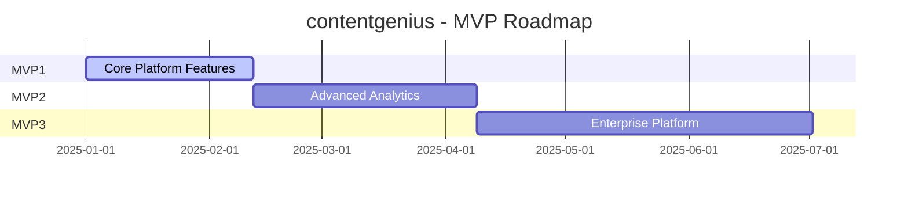
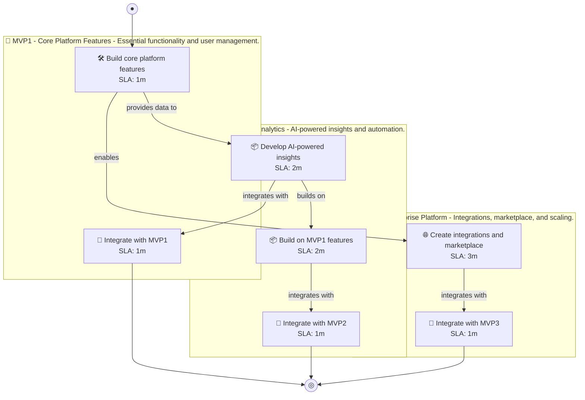

# 📊 Executive Summary: contentgenius

> **Domain:** Saas | **Generated:** 2025-12-10 13:21:27 | **Expert Grade:** A-

---

## 🎯 Quick Metrics

| Metric | Value |
|--------|-------|
| **Total MVPs** | 3 |
| **Total Timeline** | 26 weeks |
| **Artifacts Generated** | 15 |
| **Specs Generated** | 3 |
| **Average MAS Score** | 90.8 |
| **Expert Grade** | **A-** |
| **Production Ready** | ✅ Yes |
| **Execution Time** | 341.9s |

---

## 📅 Product Roadmap Timeline



---

## 📦 MVP Breakdown

| MVP | Name | Duration | Deliverables | Artifacts | Avg Score | Grade |
|-----|------|----------|--------------|-----------|-----------|-------|
| **MVP1** | Core Platform Features | 6 weeks | 5 | 5 | 92.0 | A- |
| **MVP2** | Advanced Analytics | 8 weeks | 5 | 5 | 90.0 | B+ |
| **MVP3** | Enterprise Platform | 12 weeks | 5 | 5 | 90.4 | A- |

### MVP1: Core Platform Features

**Description:** Essential functionality and user management. I want to build an AI content creation platform called ContentGenius for marketing teams that generates blog posts, social media content, email campaigns, and ad copy while maintaining brand voice con

**Duration:** 6 weeks

**Key Deliverables:**
- Content generation engine for blog posts
- Social media content scheduler
- Email campaign builder
- Ad copy creator
- Brand voice consistency checker

**Generated Artifacts:**

| Artifact Type | MAS Score | Status |
|---------------|-----------|--------|
| User Journey | 92.3 | ✅ |
| Swimlane | 92.4 | ✅ |
| Decision Tree | 96.2 | ✅ |
| Value Stream | 90.9 | ✅ |
| Business Process | 88.1 | ✅ |


**Spec Location:** `contentgenius/contentgenius-mvp1`


### MVP2: Advanced Analytics

**Description:** AI-powered insights and automation. I want to build an AI content creation platform called ContentGenius for marketing teams that generates blog posts, social media content, email campaigns, and ad copy while maintaining brand voice con

**Duration:** 8 weeks

**Key Deliverables:**
- AI-driven content optimization USING MVP1 content generation
- Sentiment analysis BUILDING ON MVP1 brand voice consistency checker
- Topic suggestion engine USING MVP1 content generation data
- Automated content performance analytics BUILDING ON MVP1 email campaign builder
- Predictive engagement metrics USING MVP1 social media content scheduler

**Generated Artifacts:**

| Artifact Type | MAS Score | Status |
|---------------|-----------|--------|
| User Journey | 92.0 | ✅ |
| Swimlane | 86.6 | ✅ |
| Decision Tree | 93.1 | ✅ |
| Value Stream | 87.6 | ✅ |
| Business Process | 90.5 | ✅ |


**Spec Location:** `contentgenius/contentgenius-mvp2`


### MVP3: Enterprise Platform

**Description:** Integrations, marketplace, and scaling. I want to build an AI content creation platform called ContentGenius for marketing teams that generates blog posts, social media content, email campaigns, and ad copy while maintaining brand voice con

**Duration:** 12 weeks

**Key Deliverables:**
- Third-party marketing tool integrations ENRICHING MVP2 predictive engagement metrics
- Multi-channel campaign management USING MVP1+MVP2 content generation and analytics
- Collaborative editing feature USING MVP1 content generation and MVP2 optimization insights
- Dynamic audience targeting USING MVP1 email campaign builder and MVP2 performance analytics
- API for external data integration USING MVP1+MVP2 analytics and continuing performance insights

**Generated Artifacts:**

| Artifact Type | MAS Score | Status |
|---------------|-----------|--------|
| User Journey | 92.0 | ✅ |
| Swimlane | 87.2 | ✅ |
| Decision Tree | 93.0 | ✅ |
| Value Stream | 87.9 | ✅ |
| Business Process | 91.9 | ✅ |


**Spec Location:** `contentgenius/contentgenius-mvp3`


---

## 🔗 Cross-MVP Dependencies


| From | To | Type | Criticality | Description |
|------|-----|------|-------------|-------------|
| MVP1 | MVP2 | Data | CRITICAL | Data models and schemas from Core Platform Features required by Advanced Analytics |
| MVP1 | MVP2 | Feature | HIGH | Core features from Core Platform Features enable Advanced Analytics capabilities |
| MVP2 | MVP3 | Data | CRITICAL | Data models and schemas from Advanced Analytics required by Enterprise Platform |
| MVP2 | MVP3 | Feature | HIGH | Core features from Advanced Analytics enable Enterprise Platform capabilities |





---

## 🎓 Expert Assessment

### Overall Evaluation

| Dimension | Score | Status |
|-----------|-------|--------|
| **Overall Grade** | **A-** | ✅ |
| Semantic Preservation | 90.8% | ✅ |
| Cross-MVP Coherence | 95.0% | ✅ |
| Domain Accuracy | 86.3% | ⚠️ |
| Completeness | 100.0% | ✅ |
| Confidence Level | 0.91 | ✅ |

### Per-MVP Grades

| MVP | Grade | Status |
|-----|-------|--------|
| MVP1 | A- | ✅ |
| MVP2 | B+ | ✅ |
| MVP3 | A- | ✅ |


### ✅ Strengths

- Excellent semantic and structural across all diagrams
- Strong artifact quality with minor improvements possible
- Clear cross-MVP dependency mapping
- Complete artifact coverage for all MVPs


### 📝 Recommendations

1. Focus on improving pragmatic (current: 36.4/100) across all artifacts


---

## 📁 Generated Specification Files

### 1. contentgenius-mvp1

```
contentgenius/contentgenius-mvp1/
├── requirements.md
├── design.md
├── tasks.md
├── knowledge.md
└── glossary.md
```

### 2. contentgenius-mvp2

```
contentgenius/contentgenius-mvp2/
├── requirements.md
├── design.md
├── tasks.md
├── knowledge.md
└── glossary.md
```

### 3. contentgenius-mvp3

```
contentgenius/contentgenius-mvp3/
├── requirements.md
├── design.md
├── tasks.md
├── knowledge.md
└── glossary.md
```

---

## ⚠️ Issues & Warnings


*No errors encountered.*


*No warnings generated.*


---

## 📊 Execution Metrics

| Metric | Value |
|--------|-------|
| Target Duration | 300s |
| Actual Duration | 341.9s |
| Performance | 87.7% of target |
| Artifacts/Minute | 2.6 |

---

*Generated by MAS Premium Roadmap Workflow v1.0 on 2025-12-10 13:21:27*