# Contentgenius Mvp1 - Design Document

## Overview

Core Platform Features: Essential functionality and user management. I want to build an AI content creation platform called ContentGenius for marketing teams that generates blog posts, social media content, email campaigns, and ad copy while maintaining brand voice con

**Generated**: 2025-12-10 13:20:29  
**Diagrams Included**: 5

## Architecture

## Components and Interfaces

### Ad copy creator

- **Type**: Component
- **Purpose**: Part of the Contentgenius Mvp1 system
### Addresses

- **Type**: Component
- **Purpose**: Part of the Contentgenius Mvp1 system
### Aligns

- **Type**: Component
- **Purpose**: Part of the Contentgenius Mvp1 system
### Brand voice consistency checker

- **Type**: Component
- **Purpose**: Part of the Contentgenius Mvp1 system
### Content Generation Engine

- **Type**: Component
- **Purpose**: Part of the Contentgenius Mvp1 system
### Content generation engine for blog posts

- **Type**: Component
- **Purpose**: Part of the Contentgenius Mvp1 system
### ContentGenius

- **Type**: Component
- **Purpose**: Part of the Contentgenius Mvp1 system
### Email Campaign Builder

- **Type**: Component
- **Purpose**: Part of the Contentgenius Mvp1 system
### Ensures

- **Type**: Component
- **Purpose**: Part of the Contentgenius Mvp1 system
### Incorporates

- **Type**: Component
- **Purpose**: Part of the Contentgenius Mvp1 system

## Cross-Functional Process Flows (Swimlane)

> **Purpose**: Shows how work flows across different roles, departments, or systems. Each lane represents a responsible party, making handoffs and bottlenecks visible. Essential for RACI matrix creation and workflow optimization.

### Swimlane Process 1

```mermaid
graph TB
    %% Start Event
    Start((●))
    Start --> task_1

    subgraph MVP1["🎯 MVP1 - Core functionality"]
        task_1["📝 Generate blog posts<br/>SLA: 1d"]
        task_2["📅 Schedule social media posts<br/>SLA: 1d"]
        task_3["📧 Create email campaigns<br/>SLA: 1d"]
        task_4["🖊️ Generate ad copy<br/>SLA: 1d"]
        task_5["🔍 Ensure brand voice consistency<br/>SLA: 1d"]
    end



    task_1 -->|Content creation| task_2
    task_2 -->|Scheduling| task_3
    task_3 -->|Campaign creation| task_4
    task_4 -->|Consistency check| task_5

    %% End Event
    task_5 --> End((◎))

```

**MAS Score**: 92.4

## Business Process Workflows (BPMN)

> **Purpose**: Represents end-to-end business processes following BPMN 2.0 notation. Shows tasks, gateways (decision points), events, and process flow. Used for process automation and SLA tracking.

### Business Process 1

```mermaid
flowchart TD
    Start(["🎯 User Plans Content"])

    subgraph mvp1["MVP1: Core Platform Features<br/>📅 6 weeks"]
        task_1["📋 Plan Content<br/>Owner: User<br/>SLA: 5h<br/>Automation: Manual"]
        task_2["🤖 Generate Content<br/>Owner: Content Generation Engine<br/>SLA: 10h<br/>Automation: Automated"]
        task_3["🤖 Ensure Brand Voice Consistency<br/>Owner: Brand Voice Consistency Checker<br/>SLA: 4h<br/>Automation: Automated"]
        task_4["📋 Incorporate Feedback<br/>Owner: User<br/>SLA: 3h<br/>Automation: Manual"]
        task_5["🤖 Analyze Performance Metrics<br/>Owner: User<br/>SLA: 6h<br/>Automation: Automated"]
    end


    
    end_success(["✅ Content Performance Analyzed"])
    
    end_failure(["❌ Rejected"])

    Start -->|User starts planning| task_1
    task_1 -->|Content planned| task_2
    task_2 -->|Content generated| task_3
    task_3 -->|Brand voice ensured| task_4
    task_4 -->|Feedback incorporated| task_5
    task_5 -->|Performance analyzed| end_success

    style Start fill:#ccffcc
    style end_success fill:#ccffcc
    style end_failure fill:#ffcccc
    style mvp1 fill:#e3f2fd,stroke:#1976d2

```

**MAS Score**: 88.1

## Decision Logic Trees

> **Purpose**: Visualizes decision-making logic with conditions and outcomes. Each node represents a decision point, branches show conditions (yes/no, thresholds), and leaves show final outcomes. Critical for business rules documentation and algorithm design.

### Decision Tree 1

**MAS Score**: 96.2

## Value Stream Maps (Lean)

> **Purpose**: Shows the flow of value from request to delivery, identifying process time (PT), wait time (WT), and efficiency metrics. Used for identifying bottlenecks, waste elimination, and continuous improvement initiatives.

### Value Stream 1

```mermaid
flowchart LR
    %% Title and styling
    %% Value Stream: ContentGenius Value Stream
    
    %% ========== PROCESS STEPS ==========
    step_1["📦 Content Generation Engine for Blog Posts<br/>PT: 3 days<br/>WT: 3 days"]
    step_2["📦 Social Media Content Scheduler<br/>PT: 3 days<br/>WT: 3 days"]
    step_3["📦 Email Campaign Builder<br/>PT: 3 days<br/>WT: 3 days"]
    step_4["📦 Ad Copy Creator<br/>PT: 3 days<br/>WT: 3 days"]
    step_5["📦 Brand Voice Consistency Checker<br/>PT: 3 days<br/>WT: 3 days"]
    
    %% ========== FLOW CONNECTIONS ==========
    step_1 -->|flow| step_2
    step_2 -->|flow| step_3
    step_3 -->|flow| step_4
    step_4 -->|flow| step_5
    
    %% ========== METRICS SUMMARY ==========
    subgraph Metrics["📊 Metrics Summary"]
        direction TB
        LT["⏱️ Lead Time: 43200 minutes (30 days)"]
        PT["⚙️ Process Time: 21600 minutes (15 days)"]
        WT["⏳ Wait Time: 15 days"]
        EFF["📈 Efficiency: 50.0%"]
    end
    
    %% ========== WASTE INDICATORS ==========
    
    %% ========== STYLING ==========
    %% Highlight steps with waste
    style step_1 fill:#e6f3ff,stroke:#0066cc,stroke-width:1px
    style step_2 fill:#e6f3ff,stroke:#0066cc,stroke-width:1px
    style step_3 fill:#e6f3ff,stroke:#0066cc,stroke-width:1px
    style step_4 fill:#e6f3ff,stroke:#0066cc,stroke-width:1px
    style step_5 fill:#e6f3ff,stroke:#0066cc,stroke-width:1px
    
    %% Waste subgraph styling
    
    %% Metrics subgraph styling
    style Metrics fill:#f0fff0,stroke:#00cc00
    style LT fill:#e6ffe6,stroke:#009900
    style PT fill:#e6ffe6,stroke:#009900
    style WT fill:#fff0e6,stroke:#cc6600
    style EFF fill:#e6ffe6,stroke:#009900

```

**MAS Score**: 90.9

## User Journeys (Experience Maps)

> **Purpose**: Maps the user's emotional journey through the product, from discovery to engagement. Each touchpoint shows satisfaction scores and emotional states, helping identify pain points and opportunities for UX improvement.

### User Journey 1

**MAS Score**: 92.35

## Diagram Summary

This design document includes **5 MAS artifacts** across the following categories:

| Diagram Type | Count | Average MAS Score | Purpose |
|--------------|-------|-------------------|---------|
| User Journey | 1 | 92.3 | UX experience map |
| Swimlane | 1 | 92.4 | Cross-functional workflow |
| Decision Tree | 1 | 96.2 | Decision logic |
| Value Stream | 1 | 90.9 | Lean efficiency |
| Business Process | 1 | 88.1 | BPMN process flow |

---

*Generated by MAS Compiler Spec Generator v1.0.0*