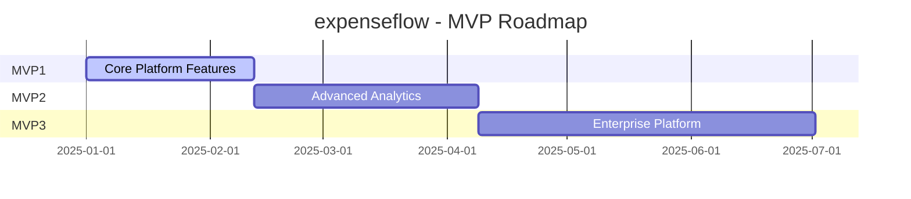
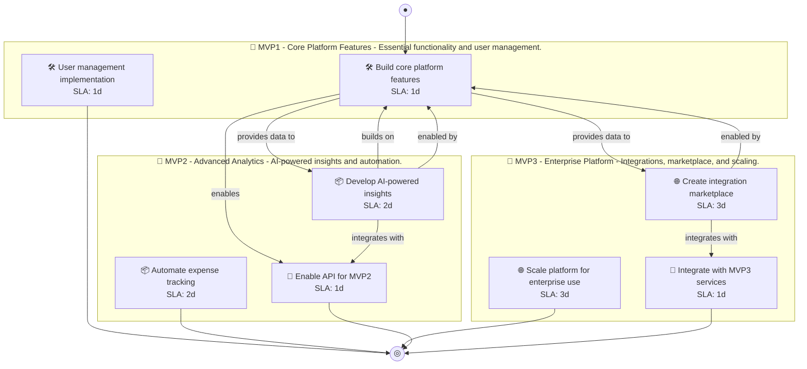

# 📊 Executive Summary: expenseflow

> **Domain:** Saas | **Generated:** 2025-12-10 12:53:59 | **Expert Grade:** A-

---

## 🎯 Quick Metrics

| Metric | Value |
|--------|-------|
| **Total MVPs** | 3 |
| **Total Timeline** | 26 weeks |
| **Artifacts Generated** | 15 |
| **Specs Generated** | 3 |
| **Average MAS Score** | 91.0 |
| **Expert Grade** | **A-** |
| **Production Ready** | ✅ Yes |
| **Execution Time** | 381.0s |

---

## 📅 Product Roadmap Timeline



---

## 📦 MVP Breakdown

| MVP | Name | Duration | Deliverables | Artifacts | Avg Score | Grade |
|-----|------|----------|--------------|-----------|-----------|-------|
| **MVP1** | Core Platform Features | 6 weeks | 5 | 5 | 91.7 | A- |
| **MVP2** | Advanced Analytics | 8 weeks | 5 | 5 | 89.9 | B+ |
| **MVP3** | Enterprise Platform | 12 weeks | 5 | 5 | 91.2 | A- |

### MVP1: Core Platform Features

**Description:** Essential functionality and user management. I want to build a small business expense management platform called ExpenseFlow that automates receipt scanning, categorizes expenses with AI, generates tax-ready reports, and integrates with popular 

**Duration:** 6 weeks

**Key Deliverables:**
- Automated receipt scanning system
- Expense categorization engine
- User-friendly expense dashboard
- Tax report generator
- Integration with user bank statements

**Generated Artifacts:**

| Artifact Type | MAS Score | Status |
|---------------|-----------|--------|
| User Journey | 91.8 | ✅ |
| Swimlane | 91.7 | ✅ |
| Decision Tree | 91.9 | ✅ |
| Value Stream | 90.0 | ✅ |
| Business Process | 93.1 | ✅ |


**Spec Location:** `expenseflow/expenseflow-mvp1`


### MVP2: Advanced Analytics

**Description:** AI-powered insights and automation. I want to build a small business expense management platform called ExpenseFlow that automates receipt scanning, categorizes expenses with AI, generates tax-ready reports, and integrates with popular 

**Duration:** 8 weeks

**Key Deliverables:**
- AI-powered expense categorization USING MVP1 expense data
- Smart tax classification suggestions BUILDING ON MVP1 tax report generator
- Anomaly detection for expense reporting USING MVP1 data
- Predictive insights on spending trends USING MVP1 dashboard
- Enhanced reporting capabilities BUILDING ON MVP1 user-friendly dashboard

**Generated Artifacts:**

| Artifact Type | MAS Score | Status |
|---------------|-----------|--------|
| User Journey | 91.5 | ✅ |
| Swimlane | 87.6 | ✅ |
| Decision Tree | 92.8 | ✅ |
| Value Stream | 89.4 | ✅ |
| Business Process | 88.4 | ✅ |


**Spec Location:** `expenseflow/expenseflow-mvp2`


### MVP3: Enterprise Platform

**Description:** Integrations, marketplace, and scaling. I want to build a small business expense management platform called ExpenseFlow that automates receipt scanning, categorizes expenses with AI, generates tax-ready reports, and integrates with popular 

**Duration:** 12 weeks

**Key Deliverables:**
- Integration with popular accounting software USING MVP1+MVP2 expense reports
- Collaboration tools for team expense approvals USING MVP1 dashboard and MVP2 insights
- Real-time alerts for unusual spending patterns ENRICHING MVP2 anomaly detection
- Customizable dashboard widgets USING MVP1 data and MVP2 analytics
- Third-party app integrations for enhanced financial insights USING MVP1+MVP2 data

**Generated Artifacts:**

| Artifact Type | MAS Score | Status |
|---------------|-----------|--------|
| User Journey | 91.8 | ✅ |
| Swimlane | 92.3 | ✅ |
| Decision Tree | 92.8 | ✅ |
| Value Stream | 87.6 | ✅ |
| Business Process | 91.7 | ✅ |


**Spec Location:** `expenseflow/expenseflow-mvp3`


---

## 🔗 Cross-MVP Dependencies


| From | To | Type | Criticality | Description |
|------|-----|------|-------------|-------------|
| MVP1 | MVP2 | Data | CRITICAL | Data models and schemas from Core Platform Features required by Advanced Analytics |
| MVP1 | MVP2 | Feature | HIGH | Core features from Core Platform Features enable Advanced Analytics capabilities |
| MVP2 | MVP3 | Data | CRITICAL | Data models and schemas from Advanced Analytics required by Enterprise Platform |
| MVP2 | MVP3 | Feature | HIGH | Core features from Advanced Analytics enable Enterprise Platform capabilities |





---

## 🎓 Expert Assessment

### Overall Evaluation

| Dimension | Score | Status |
|-----------|-------|--------|
| **Overall Grade** | **A-** | ✅ |
| Semantic Preservation | 91.0% | ✅ |
| Cross-MVP Coherence | 95.0% | ✅ |
| Domain Accuracy | 86.4% | ⚠️ |
| Completeness | 100.0% | ✅ |
| Confidence Level | 0.91 | ✅ |

### Per-MVP Grades

| MVP | Grade | Status |
|-----|-------|--------|
| MVP1 | A- | ✅ |
| MVP2 | B+ | ✅ |
| MVP3 | A- | ✅ |


### ✅ Strengths

- Excellent semantic and structural across all diagrams
- Strong artifact quality with minor improvements possible
- Clear cross-MVP dependency mapping
- Complete artifact coverage for all MVPs


### 📝 Recommendations

1. Focus on improving pragmatic (current: 42.0/100) across all artifacts


---

## 📁 Generated Specification Files

### 1. expenseflow-mvp1

```
expenseflow/expenseflow-mvp1/
├── requirements.md
├── design.md
├── tasks.md
├── knowledge.md
└── glossary.md
```

### 2. expenseflow-mvp2

```
expenseflow/expenseflow-mvp2/
├── requirements.md
├── design.md
├── tasks.md
├── knowledge.md
└── glossary.md
```

### 3. expenseflow-mvp3

```
expenseflow/expenseflow-mvp3/
├── requirements.md
├── design.md
├── tasks.md
├── knowledge.md
└── glossary.md
```

---

## ⚠️ Issues & Warnings


*No errors encountered.*


*No warnings generated.*


---

## 📊 Execution Metrics

| Metric | Value |
|--------|-------|
| Target Duration | 300s |
| Actual Duration | 381.0s |
| Performance | 78.7% of target |
| Artifacts/Minute | 2.4 |

---

*Generated by MAS Premium Roadmap Workflow v1.0 on 2025-12-10 12:53:59*