# Expenseflow Mvp1 - Design Document

## Overview

Core Platform Features: Essential functionality and user management. I want to build a small business expense management platform called ExpenseFlow that automates receipt scanning, categorizes expenses with AI, generates tax-ready reports, and integrates with popular 

**Generated**: 2025-12-10 12:52:47  
**Diagrams Included**: 5

## Architecture

## Components and Interfaces

### Accounting Software

- **Type**: Component
- **Purpose**: Part of the Expenseflow Mvp1 system
### Addresses

- **Type**: Component
- **Purpose**: Part of the Expenseflow Mvp1 system
### Aligns

- **Type**: Component
- **Purpose**: Part of the Expenseflow Mvp1 system
### Automated Receipt Scanning System

- **Type**: Component
- **Purpose**: Part of the Expenseflow Mvp1 system
### Ensures

- **Type**: Component
- **Purpose**: Part of the Expenseflow Mvp1 system
### Expense categorization engine

- **Type**: Component
- **Purpose**: Part of the Expenseflow Mvp1 system
### ExpenseFlow

- **Type**: Component
- **Purpose**: Part of the Expenseflow Mvp1 system
### Incorporates

- **Type**: Component
- **Purpose**: Part of the Expenseflow Mvp1 system
### Integration with user bank statements

- **Type**: Component
- **Purpose**: Part of the Expenseflow Mvp1 system
### MVP1

- **Type**: Component
- **Purpose**: Part of the Expenseflow Mvp1 system

## Cross-Functional Process Flows (Swimlane)

> **Purpose**: Shows how work flows across different roles, departments, or systems. Each lane represents a responsible party, making handoffs and bottlenecks visible. Essential for RACI matrix creation and workflow optimization.

### Swimlane Process 1

```mermaid
graph TB
    %% Start Event
    Start((●))
    Start --> task_1

    subgraph MVP1["🎯 MVP1 - Core functionality"]
        task_1["👤 Sign up<br/>SLA: instant"]
        task_2["👤 Complete tutorial<br/>SLA: 1d"]
        task_3["👤 Create project<br/>SLA: 1d"]
        task_4["👤 Invite team<br/>SLA: 1d"]
        task_5["👤 Upgrade plan<br/>SLA: 1d"]
        task_6["📷 Scan receipts<br/>SLA: instant"]
        task_7["📷 Feed data to Expense Categorization Engine<br/>SLA: instant"]
        task_8["📊 Categorize expenses<br/>SLA: instant"]
        task_9["📊 Provide categorized expenses to Tax Report Generator<br/>SLA: instant"]
        task_10["🧾 Generate tax report<br/>SLA: 1d"]
        task_11["🧾 Integrate with User Bank Statements<br/>SLA: 1d"]
        task_12["🏦 Sync bank statements<br/>SLA: 1d"]
    end



    task_1 -->|User onboarding| task_2
    task_2 -->|Tutorial completion| task_3
    task_3 -->|Project setup| task_4
    task_4 -->|Team collaboration| task_5
    task_5 -->|Start using the system| task_6
    task_6 -->|Data flow| task_7
    task_7 -->|Expense categorization| task_8
    task_8 -->|Categorized data| task_9
    task_9 -->|Tax report generation| task_10
    task_10 -->|Bank integration| task_11
    task_11 -->|Syncing bank data| task_12

    %% End Event
    task_12 --> End((◎))

```

**MAS Score**: 91.7

## Business Process Workflows (BPMN)

> **Purpose**: Represents end-to-end business processes following BPMN 2.0 notation. Shows tasks, gateways (decision points), events, and process flow. Used for process automation and SLA tracking.

### Business Process 1

```mermaid
flowchart TD
    Start(["🎯 User Scans Receipt"])

    subgraph mvp1["Core Platform Features<br/>📅 6 weeks"]
        task_1["🤖 Scan and Upload Receipt<br/>Owner: User<br/>SLA: 1h<br/>Automation: Automated"]
        task_2["🤖 Categorize Expenses<br/>Owner: Receipt Management System<br/>SLA: 2h<br/>Automation: Automated"]
        task_3["🤖 Generate Tax Report<br/>Owner: User<br/>SLA: 1h<br/>Automation: Automated"]
        task_4["📋 Integrate with Accounting Software<br/>Owner: User<br/>SLA: 3h<br/>Automation: Manual"]
        task_5["🤖 Provide Insights on Spending<br/>Owner: Expense Categorization Engine<br/>SLA: 2h<br/>Automation: Automated"]
        task_6["📋 Manage Finances<br/>Owner: User<br/>SLA: 2h<br/>Automation: Manual"]
    end


    
    end_success(["✅ Tax Report Generated"])
    
    end_failure(["❌ Rejected"])

    Start -->|User starts| task_1
    task_1 -->|Receipt uploaded| task_2
    task_2 -->|Expenses categorized| task_3
    task_3 -->|Tax report generated| task_4
    task_4 -->|Integration completed| task_5
    task_5 -->|Insights provided| task_6
    task_6 -->|Finances managed| end_success

    style Start fill:#ccffcc
    style end_success fill:#ccffcc
    style end_failure fill:#ffcccc
    style mvp1 fill:#e3f2fd,stroke:#1976d2

```

**MAS Score**: 93.13333333333334

## Decision Logic Trees

> **Purpose**: Visualizes decision-making logic with conditions and outcomes. Each node represents a decision point, branches show conditions (yes/no, thresholds), and leaves show final outcomes. Critical for business rules documentation and algorithm design.

### Decision Tree 1

**MAS Score**: 91.9

## Value Stream Maps (Lean)

> **Purpose**: Shows the flow of value from request to delivery, identifying process time (PT), wait time (WT), and efficiency metrics. Used for identifying bottlenecks, waste elimination, and continuous improvement initiatives.

### Value Stream 1

```mermaid
flowchart LR
    %% Title and styling
    %% Value Stream: ExpenseFlow Value Stream
    
    %% ========== PROCESS STEPS ==========
    step_1["📦 Automated Receipt Scanning System<br/>PT: 3 days<br/>WT: 3 days"]
    step_2["📦 Expense Categorization Engine<br/>PT: 3 days<br/>WT: 3 days"]
    step_3["📦 User-Friendly Expense Dashboard<br/>PT: 3 days<br/>WT: 3 days"]
    step_4["📦 Tax Report Generator<br/>PT: 3 days<br/>WT: 3 days"]
    step_5["📦 Integration with User Bank Statements<br/>PT: 3 days<br/>WT: 3 days"]
    
    %% ========== FLOW CONNECTIONS ==========
    step_1 -->|flow| step_2
    step_2 -->|flow| step_3
    step_3 -->|flow| step_4
    step_4 -->|flow| step_5
    
    %% ========== METRICS SUMMARY ==========
    subgraph Metrics["📊 Metrics Summary"]
        direction TB
        LT["⏱️ Lead Time: 43200 minutes (30 days)"]
        PT["⚙️ Process Time: 21600 minutes (15 days)"]
        WT["⏳ Wait Time: 15 days"]
        EFF["📈 Efficiency: 50.0%"]
    end
    
    %% ========== WASTE INDICATORS ==========
    
    %% ========== STYLING ==========
    %% Highlight steps with waste
    style step_1 fill:#e6f3ff,stroke:#0066cc,stroke-width:1px
    style step_2 fill:#e6f3ff,stroke:#0066cc,stroke-width:1px
    style step_3 fill:#e6f3ff,stroke:#0066cc,stroke-width:1px
    style step_4 fill:#e6f3ff,stroke:#0066cc,stroke-width:1px
    style step_5 fill:#e6f3ff,stroke:#0066cc,stroke-width:1px
    
    %% Waste subgraph styling
    
    %% Metrics subgraph styling
    style Metrics fill:#f0fff0,stroke:#00cc00
    style LT fill:#e6ffe6,stroke:#009900
    style PT fill:#e6ffe6,stroke:#009900
    style WT fill:#fff0e6,stroke:#cc6600
    style EFF fill:#e6ffe6,stroke:#009900

```

**MAS Score**: 90.0

## User Journeys (Experience Maps)

> **Purpose**: Maps the user's emotional journey through the product, from discovery to engagement. Each touchpoint shows satisfaction scores and emotional states, helping identify pain points and opportunities for UX improvement.

### User Journey 1

**MAS Score**: 91.75

## Diagram Summary

This design document includes **5 MAS artifacts** across the following categories:

| Diagram Type | Count | Average MAS Score | Purpose |
|--------------|-------|-------------------|---------|
| User Journey | 1 | 91.8 | UX experience map |
| Swimlane | 1 | 91.7 | Cross-functional workflow |
| Decision Tree | 1 | 91.9 | Decision logic |
| Value Stream | 1 | 90.0 | Lean efficiency |
| Business Process | 1 | 93.1 | BPMN process flow |

---

*Generated by MAS Compiler Spec Generator v1.0.0*