# Expenseflow Mvp2 - Design Document

## Overview

Advanced Analytics: AI-powered insights and automation. I want to build a small business expense management platform called ExpenseFlow that automates receipt scanning, categorizes expenses with AI, generates tax-ready reports, and integrates with popular 

**Generated**: 2025-12-10 12:53:19  
**Diagrams Included**: 5

## Architecture

## Components and Interfaces

### AI-powered expense categorization

- **Type**: Component
- **Purpose**: Part of the Expenseflow Mvp2 system
### Accounting Software

- **Type**: Component
- **Purpose**: Part of the Expenseflow Mvp2 system
### Addresses

- **Type**: Component
- **Purpose**: Part of the Expenseflow Mvp2 system
### Aligns

- **Type**: Component
- **Purpose**: Part of the Expenseflow Mvp2 system
### Anomaly detection for expense reporting

- **Type**: Component
- **Purpose**: Part of the Expenseflow Mvp2 system
### BUILDING

- **Type**: Component
- **Purpose**: Part of the Expenseflow Mvp2 system
### Business Finances

- **Type**: Component
- **Purpose**: Part of the Expenseflow Mvp2 system
### Enhanced reporting capabilities

- **Type**: Component
- **Purpose**: Part of the Expenseflow Mvp2 system
### Ensures

- **Type**: Component
- **Purpose**: Part of the Expenseflow Mvp2 system
### ExpenseFlow

- **Type**: Component
- **Purpose**: Part of the Expenseflow Mvp2 system

## Cross-Functional Process Flows (Swimlane)

> **Purpose**: Shows how work flows across different roles, departments, or systems. Each lane represents a responsible party, making handoffs and bottlenecks visible. Essential for RACI matrix creation and workflow optimization.

### Swimlane Process 1

```mermaid
graph TB
    %% Start Event
    Start((●))
    Start --> task_1

    subgraph MVP2["🎯 MVP2 - Advanced features"]
        task_1["👤 Use AI-powered expense categorization<br/>SLA: 1d"]
        task_2["👤 Receive smart tax classification suggestions<br/>SLA: 1d"]
        task_3["👤 Report anomalies in expense reporting<br/>SLA: 1d"]
        task_4["👤 View predictive insights on spending trends<br/>SLA: 1d"]
        task_5["👤 Access enhanced reporting capabilities<br/>SLA: 1d"]
        task_6["🛠️ Monitor AI categorization performance<br/>SLA: 1d"]
        task_7["🛠️ Adjust tax classification algorithms<br/>SLA: 1d"]
        task_8["🛠️ Review anomaly detection reports<br/>SLA: 1d"]
        task_9["🛠️ Analyze spending trends data<br/>SLA: 1d"]
        task_10["🛠️ Enhance reporting features based on feedback<br/>SLA: 1d"]
        task_11["📊 Evaluate user adoption metrics<br/>SLA: 1d"]
        task_12["📊 Ensure system uptime and performance<br/>SLA: 1d"]
        task_13["📊 Gather user satisfaction feedback<br/>SLA: 1d"]
    end



    task_1 -->|User feedback| task_6
    task_2 -->|User input| task_7
    task_3 -->|Anomaly reports| task_8
    task_4 -->|Trend analysis| task_9
    task_5 -->|Reporting enhancements| task_10
    task_11 -->|Performance review| task_12
    task_12 -->|Satisfaction assessment| task_13

    %% End Event
    task_6 --> End((◎))
    task_7 --> End((◎))
    task_8 --> End((◎))
    task_9 --> End((◎))
    task_10 --> End((◎))
    task_13 --> End((◎))

```

**MAS Score**: 87.6

## Business Process Workflows (BPMN)

> **Purpose**: Represents end-to-end business processes following BPMN 2.0 notation. Shows tasks, gateways (decision points), events, and process flow. Used for process automation and SLA tracking.

### Business Process 1

```mermaid
flowchart TD
    Start(["🎯 User Scans Receipts"])

    subgraph mvp2["MVP2: Advanced Analytics<br/>📅 8 weeks"]
        task_1["🤖 Scan and Upload Receipts<br/>Owner: User<br/>SLA: 1h<br/>Automation: Automated"]
        task_2["🤖 Categorize Expenses<br/>Owner: Receipt Management<br/>SLA: 2h<br/>Automation: Automated"]
        task_3["🤖 Generate Tax-Ready Reports<br/>Owner: Tax-Ready Reports<br/>SLA: 3h<br/>Automation: Automated"]
        task_4["📋 Integrate with Accounting Software<br/>Owner: User<br/>SLA: 4h<br/>Automation: Manual"]
        task_5["🤖 Provide Spending Insights<br/>Owner: Spending Insights<br/>SLA: 2h<br/>Automation: Automated"]
        task_6["📋 Manage Business Finances<br/>Owner: Business Finances<br/>SLA: 5h<br/>Automation: Manual"]
    end


    
    end_success(["✅ Tax-Ready Report Generated"])
    
    end_failure(["❌ Rejected"])

    Start -->|User starts scanning| task_1
    task_1 -->|Receipts uploaded| task_2
    task_2 -->|Expenses categorized| task_3
    task_3 -->|Reports generated| task_4
    task_4 -->|Integration completed| task_5
    task_5 -->|Insights provided| task_6
    task_6 -->|Finances managed| end_success

    style Start fill:#ccffcc
    style end_success fill:#ccffcc
    style end_failure fill:#ffcccc
    style mvp2 fill:#e3f2fd,stroke:#1976d2

```

**MAS Score**: 88.43333333333334

## Decision Logic Trees

> **Purpose**: Visualizes decision-making logic with conditions and outcomes. Each node represents a decision point, branches show conditions (yes/no, thresholds), and leaves show final outcomes. Critical for business rules documentation and algorithm design.

### Decision Tree 1

**MAS Score**: 92.80000000000001

## Value Stream Maps (Lean)

> **Purpose**: Shows the flow of value from request to delivery, identifying process time (PT), wait time (WT), and efficiency metrics. Used for identifying bottlenecks, waste elimination, and continuous improvement initiatives.

### Value Stream 1

**MAS Score**: 89.4

## User Journeys (Experience Maps)

> **Purpose**: Maps the user's emotional journey through the product, from discovery to engagement. Each touchpoint shows satisfaction scores and emotional states, helping identify pain points and opportunities for UX improvement.

### User Journey 1

**MAS Score**: 91.45

## Diagram Summary

This design document includes **5 MAS artifacts** across the following categories:

| Diagram Type | Count | Average MAS Score | Purpose |
|--------------|-------|-------------------|---------|
| User Journey | 1 | 91.5 | UX experience map |
| Swimlane | 1 | 87.6 | Cross-functional workflow |
| Decision Tree | 1 | 92.8 | Decision logic |
| Value Stream | 1 | 89.4 | Lean efficiency |
| Business Process | 1 | 88.4 | BPMN process flow |

---

*Generated by MAS Compiler Spec Generator v1.0.0*