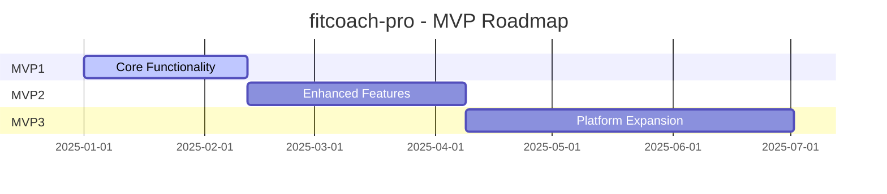
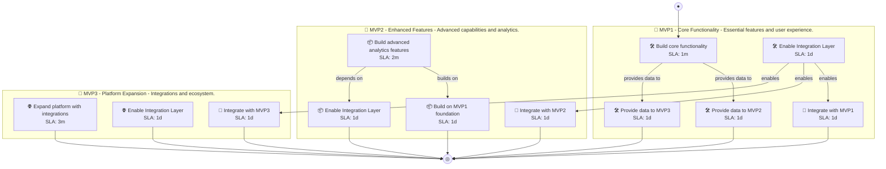

# 📊 Executive Summary: fitcoach-pro

> **Domain:** Generic | **Generated:** 2025-12-10 12:40:08 | **Expert Grade:** A-

---

## 🎯 Quick Metrics

| Metric | Value |
|--------|-------|
| **Total MVPs** | 3 |
| **Total Timeline** | 26 weeks |
| **Artifacts Generated** | 15 |
| **Specs Generated** | 3 |
| **Average MAS Score** | 91.0 |
| **Expert Grade** | **A-** |
| **Production Ready** | ✅ Yes |
| **Execution Time** | 472.4s |

---

## 📅 Product Roadmap Timeline



---

## 📦 MVP Breakdown

| MVP | Name | Duration | Deliverables | Artifacts | Avg Score | Grade |
|-----|------|----------|--------------|-----------|-----------|-------|
| **MVP1** | Core Functionality | 6 weeks | 5 | 5 | 91.7 | A- |
| **MVP2** | Enhanced Features | 8 weeks | 5 | 5 | 90.5 | A- |
| **MVP3** | Platform Expansion | 12 weeks | 5 | 5 | 90.7 | A- |

### MVP1: Core Functionality

**Description:** Essential features and user experience. I want to build an AI-powered fitness coaching app called FitCoach Pro that creates personalized workout plans, tracks nutrition through photo recognition, and adapts routines based on user progress a

**Duration:** 6 weeks

**Key Deliverables:**
- Personalized workout plan generator
- Photo recognition nutrition tracker
- Progress monitoring dashboard
- Wearable device synchronization
- User goal setting interface

**Generated Artifacts:**

| Artifact Type | MAS Score | Status |
|---------------|-----------|--------|
| User Journey | 91.5 | ✅ |
| Swimlane | 92.6 | ✅ |
| Decision Tree | 91.5 | ✅ |
| Value Stream | 89.6 | ✅ |
| Business Process | 93.4 | ✅ |


**Spec Location:** `fitcoach-pro/fitcoach-pro-mvp1`


### MVP2: Enhanced Features

**Description:** Advanced capabilities and analytics. I want to build an AI-powered fitness coaching app called FitCoach Pro that creates personalized workout plans, tracks nutrition through photo recognition, and adapts routines based on user progress a

**Duration:** 8 weeks

**Key Deliverables:**
- Adaptive workout optimization USING MVP1 user progress data
- AI-driven meal suggestions BUILDING ON MVP1 nutrition tracker
- Predictive performance analysis USING MVP1 workout history
- Intelligent recovery recommendations BUILDING ON MVP1 user feedback
- Personalized coaching tips USING MVP1+MVP2 data

**Generated Artifacts:**

| Artifact Type | MAS Score | Status |
|---------------|-----------|--------|
| User Journey | 91.8 | ✅ |
| Swimlane | 89.3 | ✅ |
| Decision Tree | 94.9 | ✅ |
| Value Stream | 87.8 | ✅ |
| Business Process | 88.9 | ✅ |


**Spec Location:** `fitcoach-pro/fitcoach-pro-mvp2`


### MVP3: Platform Expansion

**Description:** Integrations and ecosystem. I want to build an AI-powered fitness coaching app called FitCoach Pro that creates personalized workout plans, tracks nutrition through photo recognition, and adapts routines based on user progress a

**Duration:** 12 weeks

**Key Deliverables:**
- Integration with fitness wearables ENRICHING MVP2 adaptive workout
- APIs for health data sharing ENRICHING MVP1+MVP2 insights
- Partnerships with nutrition tracking apps USING MVP1+MVP2
- Community engagement platform USING MVP1+MVP2 data
- Virtual fitness challenges USING MVP1+MVP2 coaching features

**Generated Artifacts:**

| Artifact Type | MAS Score | Status |
|---------------|-----------|--------|
| User Journey | 91.5 | ✅ |
| Swimlane | 88.8 | ✅ |
| Decision Tree | 94.9 | ✅ |
| Value Stream | 89.3 | ✅ |
| Business Process | 88.9 | ✅ |


**Spec Location:** `fitcoach-pro/fitcoach-pro-mvp3`


---

## 🔗 Cross-MVP Dependencies


| From | To | Type | Criticality | Description |
|------|-----|------|-------------|-------------|
| MVP1 | MVP2 | Data | CRITICAL | Data models and schemas from Core Functionality required by Enhanced Features |
| MVP1 | MVP2 | Feature | HIGH | Core features from Core Functionality enable Enhanced Features capabilities |
| MVP2 | MVP3 | Data | CRITICAL | Data models and schemas from Enhanced Features required by Platform Expansion |
| MVP2 | MVP3 | Feature | HIGH | Core features from Enhanced Features enable Platform Expansion capabilities |





---

## 🎓 Expert Assessment

### Overall Evaluation

| Dimension | Score | Status |
|-----------|-------|--------|
| **Overall Grade** | **A-** | ✅ |
| Semantic Preservation | 91.0% | ✅ |
| Cross-MVP Coherence | 95.0% | ✅ |
| Domain Accuracy | 86.4% | ⚠️ |
| Completeness | 100.0% | ✅ |
| Confidence Level | 0.91 | ✅ |

### Per-MVP Grades

| MVP | Grade | Status |
|-----|-------|--------|
| MVP1 | A- | ✅ |
| MVP2 | A- | ✅ |
| MVP3 | A- | ✅ |


### ✅ Strengths

- Excellent semantic and structural across all diagrams
- Strong artifact quality with minor improvements possible
- Clear cross-MVP dependency mapping
- Complete artifact coverage for all MVPs


### 📝 Recommendations

1. Focus on improving pragmatic (current: 40.0/100) across all artifacts


---

## 📁 Generated Specification Files

### 1. fitcoach-pro-mvp1

```
fitcoach-pro/fitcoach-pro-mvp1/
├── requirements.md
├── design.md
├── tasks.md
├── knowledge.md
└── glossary.md
```

### 2. fitcoach-pro-mvp2

```
fitcoach-pro/fitcoach-pro-mvp2/
├── requirements.md
├── design.md
├── tasks.md
├── knowledge.md
└── glossary.md
```

### 3. fitcoach-pro-mvp3

```
fitcoach-pro/fitcoach-pro-mvp3/
├── requirements.md
├── design.md
├── tasks.md
├── knowledge.md
└── glossary.md
```

---

## ⚠️ Issues & Warnings


*No errors encountered.*


*No warnings generated.*


---

## 📊 Execution Metrics

| Metric | Value |
|--------|-------|
| Target Duration | 300s |
| Actual Duration | 472.4s |
| Performance | 63.5% of target |
| Artifacts/Minute | 1.9 |

---

*Generated by MAS Premium Roadmap Workflow v1.0 on 2025-12-10 12:40:08*