# Fitcoach Pro Mvp2 - Design Document

## Overview

Enhanced Features: Advanced capabilities and analytics. I want to build an AI-powered fitness coaching app called FitCoach Pro that creates personalized workout plans, tracks nutrition through photo recognition, and adapts routines based on user progress a

**Generated**: 2025-12-10 12:39:37  
**Diagrams Included**: 5

## Architecture

## Components and Interfaces

### AI System

- **Type**: Component
- **Purpose**: Part of the Fitcoach Pro Mvp2 system
### AI-driven meal suggestions

- **Type**: Component
- **Purpose**: Part of the Fitcoach Pro Mvp2 system
### Adaptive workout optimization

- **Type**: Component
- **Purpose**: Part of the Fitcoach Pro Mvp2 system
### Addresses

- **Type**: Component
- **Purpose**: Part of the Fitcoach Pro Mvp2 system
### Aligns

- **Type**: Component
- **Purpose**: Part of the Fitcoach Pro Mvp2 system
### BUILDING

- **Type**: Component
- **Purpose**: Part of the Fitcoach Pro Mvp2 system
### Coaching Support

- **Type**: Component
- **Purpose**: Part of the Fitcoach Pro Mvp2 system
### Ensures

- **Type**: Component
- **Purpose**: Part of the Fitcoach Pro Mvp2 system
### Feedback System

- **Type**: Component
- **Purpose**: Part of the Fitcoach Pro Mvp2 system
### FitCoach

- **Type**: Component
- **Purpose**: Part of the Fitcoach Pro Mvp2 system

## Cross-Functional Process Flows (Swimlane)

> **Purpose**: Shows how work flows across different roles, departments, or systems. Each lane represents a responsible party, making handoffs and bottlenecks visible. Essential for RACI matrix creation and workflow optimization.

### Swimlane Process 1

```mermaid
graph TB
    %% Start Event
    Start((●))
    Start --> task_1

    subgraph MVP2["🎯 MVP2 - Enhanced Features"]
        task_1["👤 Provide workout history to Performance Analyzer<br/>SLA: instant"]
        task_2["👤 Provide data to Nutrition Tracker<br/>SLA: instant"]
        task_3["👤 Give feedback to Feedback System<br/>SLA: instant"]
        task_4["👤 Receive coaching tips from AI System<br/>SLA: instant"]
        task_5["🤖 Optimize workouts using user progress data<br/>SLA: 1d"]
        task_6["🤖 Feed suggestions from Nutrition Tracker<br/>SLA: 1d"]
        task_7["🤖 Analyze data from Performance Analyzer<br/>SLA: 1d"]
        task_8["🤖 Provide insights from Feedback System<br/>SLA: 1d"]
        task_9["🥗 Provide meal suggestions to AI System<br/>SLA: 1d"]
        task_10["🏋️ Optimize workout plans based on user data<br/>SLA: 1d"]
        task_11["📊 Analyze workout history for predictive performance<br/>SLA: 1d"]
        task_12["💬 Collect user feedback for improvements<br/>SLA: 1d"]
    end



    task_1 -->|provides data to| task_11
    task_2 -->|provides data to| task_9
    task_3 -->|gives feedback to| task_12
    task_4 -->|receives coaching tips from| task_8
    task_5 -->|optimizes workouts using| task_10
    task_6 -->|feeds suggestions to| task_5
    task_7 -->|analyzes data for| task_6
    task_8 -->|provides insights to| task_7

    %% End Event
    task_9 --> End((◎))
    task_10 --> End((◎))
    task_11 --> End((◎))
    task_12 --> End((◎))

```

**MAS Score**: 89.33333333333333

## Business Process Workflows (BPMN)

> **Purpose**: Represents end-to-end business processes following BPMN 2.0 notation. Shows tasks, gateways (decision points), events, and process flow. Used for process automation and SLA tracking.

### Business Process 1

```mermaid
flowchart TD
    Start(["🎯 Process Start"])

    task_1["⚙️ Aligns with the semantic context provided above<br/>Owner: Persona<br/>Automation: Semi-Auto"]
    task_2["⚙️ Addresses the specific requirements of Enhanced Features<br/>Owner: User<br/>Automation: Semi-Auto"]
    task_3["⚙️ Ensures consistency with the product vision and domain<br/>Owner: Support<br/>Automation: Semi-Auto"]
    task_4["⚙️ Incorporates the job statements and market insights<br/>Owner: Coach<br/>Automation: Semi-Auto"]
    task_5["⚙️ Reflects the core activities and value stream<br/>Owner: System<br/>Automation: Semi-Auto"]


    gateway_1{"❓ user progress a..."}
    gateway_2{"❓ user performance and feedback."}
    gateway_3{"❓ their goals and progress."}
    
    end_success(["✅ Complete"])
    
    end_failure(["❌ Rejected"])

    Start --> task_1
    task_1 --> task_2
    task_2 --> task_3
    task_3 --> task_4
    task_4 --> task_5
    task_5 --> gateway_1
    gateway_1 -->|Yes| end_success
    gateway_1 -->|No| end_failure

    style Start fill:#ccffcc
    style end_success fill:#ccffcc
    style end_failure fill:#ffcccc

```

**MAS Score**: 88.86666666666667

## Decision Logic Trees

> **Purpose**: Visualizes decision-making logic with conditions and outcomes. Each node represents a decision point, branches show conditions (yes/no, thresholds), and leaves show final outcomes. Critical for business rules documentation and algorithm design.

### Decision Tree 1

**MAS Score**: 94.93333333333334

## Value Stream Maps (Lean)

> **Purpose**: Shows the flow of value from request to delivery, identifying process time (PT), wait time (WT), and efficiency metrics. Used for identifying bottlenecks, waste elimination, and continuous improvement initiatives.

### Value Stream 1

```mermaid
flowchart LR
    %% Title and styling
    %% Value Stream: FitCoach Pro Value Stream
    
    %% ========== PROCESS STEPS ==========
    step_1["📦 MVP1<br/>PT: 4 days<br/>WT: 4 days"]
    step_2["📦 Adaptive workout optimization<br/>PT: 2 days<br/>WT: 2 days"]
    step_3["📦 AI-driven meal suggestions<br/>PT: 2 days<br/>WT: 2 days"]
    step_4["📦 Predictive performance analysis<br/>PT: 2 days<br/>WT: 2 days"]
    step_5["📦 Intelligent recovery recommendations<br/>PT: 2 days<br/>WT: 2 days"]
    step_6["📦 Personalized coaching tips<br/>PT: 2 days<br/>WT: 2 days"]
    
    %% ========== FLOW CONNECTIONS ==========
    step_1 -->|flow| step_2
    step_2 -->|flow| step_3
    step_3 -->|flow| step_4
    step_4 -->|flow| step_5
    step_5 -->|flow| step_6
    
    %% ========== METRICS SUMMARY ==========
    subgraph Metrics["📊 Metrics Summary"]
        direction TB
        LT["⏱️ Lead Time: 57600 minutes (40 days)"]
        PT["⚙️ Process Time: 28800 minutes (20 days)"]
        WT["⏳ Wait Time: 14 days"]
        EFF["📈 Efficiency: 50.0%"]
    end
    
    %% ========== WASTE INDICATORS ==========
    
    %% ========== STYLING ==========
    %% Highlight steps with waste
    style step_1 fill:#e6f3ff,stroke:#0066cc,stroke-width:1px
    style step_2 fill:#e6f3ff,stroke:#0066cc,stroke-width:1px
    style step_3 fill:#e6f3ff,stroke:#0066cc,stroke-width:1px
    style step_4 fill:#e6f3ff,stroke:#0066cc,stroke-width:1px
    style step_5 fill:#e6f3ff,stroke:#0066cc,stroke-width:1px
    style step_6 fill:#e6f3ff,stroke:#0066cc,stroke-width:1px
    
    %% Waste subgraph styling
    
    %% Metrics subgraph styling
    style Metrics fill:#f0fff0,stroke:#00cc00
    style LT fill:#e6ffe6,stroke:#009900
    style PT fill:#e6ffe6,stroke:#009900
    style WT fill:#fff0e6,stroke:#cc6600
    style EFF fill:#e6ffe6,stroke:#009900

```

**MAS Score**: 87.83333333333334

## User Journeys (Experience Maps)

> **Purpose**: Maps the user's emotional journey through the product, from discovery to engagement. Each touchpoint shows satisfaction scores and emotional states, helping identify pain points and opportunities for UX improvement.

### User Journey 1

**MAS Score**: 91.75

## Diagram Summary

This design document includes **5 MAS artifacts** across the following categories:

| Diagram Type | Count | Average MAS Score | Purpose |
|--------------|-------|-------------------|---------|
| User Journey | 1 | 91.8 | UX experience map |
| Swimlane | 1 | 89.3 | Cross-functional workflow |
| Decision Tree | 1 | 94.9 | Decision logic |
| Value Stream | 1 | 87.8 | Lean efficiency |
| Business Process | 1 | 88.9 | BPMN process flow |

---

*Generated by MAS Compiler Spec Generator v1.0.0*