# Fitcoach Pro Mvp3 - Design Document

## Overview

Platform Expansion: Integrations and ecosystem. I want to build an AI-powered fitness coaching app called FitCoach Pro that creates personalized workout plans, tracks nutrition through photo recognition, and adapts routines based on user progress a

**Generated**: 2025-12-10 12:40:08  
**Diagrams Included**: 5

## Architecture

## Components and Interfaces

### APIs

- **Type**: Component
- **Purpose**: Part of the Fitcoach Pro Mvp3 system
### Addresses

- **Type**: Component
- **Purpose**: Part of the Fitcoach Pro Mvp3 system
### Aligns

- **Type**: Component
- **Purpose**: Part of the Fitcoach Pro Mvp3 system
### Coaching Support

- **Type**: Component
- **Purpose**: Part of the Fitcoach Pro Mvp3 system
### ENRICHING

- **Type**: Component
- **Purpose**: Part of the Fitcoach Pro Mvp3 system
### Ensures

- **Type**: Component
- **Purpose**: Part of the Fitcoach Pro Mvp3 system
### FitCoach

- **Type**: Component
- **Purpose**: Part of the Fitcoach Pro Mvp3 system
### FitCoach Pro

- **Type**: Component
- **Purpose**: Part of the Fitcoach Pro Mvp3 system
### Fitness Goals

- **Type**: Component
- **Purpose**: Part of the Fitcoach Pro Mvp3 system
### Fitness Wearables

- **Type**: Component
- **Purpose**: Part of the Fitcoach Pro Mvp3 system

## Cross-Functional Process Flows (Swimlane)

> **Purpose**: Shows how work flows across different roles, departments, or systems. Each lane represents a responsible party, making handoffs and bottlenecks visible. Essential for RACI matrix creation and workflow optimization.

### Swimlane Process 1

```mermaid
graph TB
    %% Start Event
    Start((●))
    Start --> task_1

    subgraph MVP3["🎯 MVP3 - Enterprise integration"]
        task_1["🏋️ Integrate with fitness wearables<br/>SLA: 4w"]
        task_2["🏋️ Implement health data sharing APIs<br/>SLA: 4w"]
        task_3["🏋️ Establish partnerships with nutrition tracking apps<br/>SLA: 4w"]
        task_4["🏋️ Develop community engagement platform<br/>SLA: 4w"]
        task_5["🏋️ Launch virtual fitness challenges<br/>SLA: 4w"]
        task_6["⌚ Provide data for integration<br/>SLA: 2w"]
        task_7["🔗 Share health data with FitCoach Pro<br/>SLA: 2w"]
        task_8["🥗 Provide nutrition data for integration<br/>SLA: 2w"]
        task_9["👥 Engage users with community features<br/>SLA: 2w"]
        task_10["🏆 Create and manage fitness challenges<br/>SLA: 2w"]
    end



    task_1 -->|uses| task_6
    task_2 -->|uses| task_7
    task_3 -->|uses| task_8
    task_4 -->|uses| task_9
    task_5 -->|uses| task_10

    %% End Event
    task_6 --> End((◎))
    task_7 --> End((◎))
    task_8 --> End((◎))
    task_9 --> End((◎))
    task_10 --> End((◎))

```

**MAS Score**: 88.83333333333334

## Business Process Workflows (BPMN)

> **Purpose**: Represents end-to-end business processes following BPMN 2.0 notation. Shows tasks, gateways (decision points), events, and process flow. Used for process automation and SLA tracking.

### Business Process 1

```mermaid
flowchart TD
    Start(["🎯 Process Start"])

    task_1["⚙️ Aligns with the semantic context provided above<br/>Owner: Persona<br/>Automation: Semi-Auto"]
    task_2["⚙️ Addresses the specific requirements of Platform Expansion<br/>Owner: User<br/>Automation: Semi-Auto"]
    task_3["⚙️ Ensures consistency with the product vision and domain<br/>Owner: Support<br/>Automation: Semi-Auto"]
    task_4["⚙️ Incorporates the job statements and market insights<br/>Owner: Coach<br/>Automation: Semi-Auto"]
    task_5["⚙️ Reflects the core activities and value stream<br/>Owner: System<br/>Automation: Semi-Auto"]


    gateway_1{"❓ user progress a..."}
    gateway_2{"❓ user performance and feedback."}
    gateway_3{"❓ their goals and progress."}
    
    end_success(["✅ Complete"])
    
    end_failure(["❌ Rejected"])

    Start --> task_1
    task_1 --> task_2
    task_2 --> task_3
    task_3 --> task_4
    task_4 --> task_5
    task_5 --> gateway_1
    gateway_1 -->|Yes| end_success
    gateway_1 -->|No| end_failure

    style Start fill:#ccffcc
    style end_success fill:#ccffcc
    style end_failure fill:#ffcccc

```

**MAS Score**: 88.86666666666667

## Decision Logic Trees

> **Purpose**: Visualizes decision-making logic with conditions and outcomes. Each node represents a decision point, branches show conditions (yes/no, thresholds), and leaves show final outcomes. Critical for business rules documentation and algorithm design.

### Decision Tree 1

```mermaid
flowchart TD
    %% Title: FitCoach Pro Platform Expansion Decision Tree
    %% Description: Decision tree for: ## Product: FitCoach Pro ## Domain: generic ## Vision: I want to build an AI-powered fitness coach...
    
    %% Start Node
    Start(["💰 Start Decision"])


    %% Decision Nodes
    Start --> decision_1
        decision_1{"🔴 Integrate with fitness wearables?<br/>🔴 CRITICAL<br/>Effort: 1.0w"}
    
        decision_2{"🟠 Implement health data sharing APIs?<br/>🟠 HIGH<br/>Effort: 1.0w"}
    decision_1 -->|"Yes"| decision_2
    
        decision_3{"🟡 Establish partnerships with nutrition tracking apps?<br/>🟡 MEDIUM<br/>Effort: 1.0w"}
    decision_2 -->|"Yes"| decision_3
    
        decision_4{"🟡 Develop community engagement platform?<br/>🟡 MEDIUM<br/>Effort: 1.0w"}
    decision_3 -->|"Yes"| decision_4
    
        decision_5{"🟢 Launch virtual fitness challenges?<br/>🟢 LOW<br/>Effort: 1.0w"}
    decision_4 -->|"Yes"| decision_5
    
    

    

    

    

    


    %% Outcome Nodes
    outcome_success["✅ Successfully expand FitCoach Pro platform with all key features<br/>"]
    outcome_failure["❌ Failed to implement key features for platform expansion<br/>Reason: Not specified"]

    %% Outcome Edge Connections (from leaf decisions to outcomes)
    decision_1 -->|"No"| outcome_failure
    decision_2 -->|"No"| outcome_failure
    decision_3 -->|"No"| outcome_failure
    decision_4 -->|"No"| outcome_failure
    decision_5 -->|"Yes"| outcome_success
    decision_5 -->|"No"| outcome_failure

    %% Styling
    style outcome_success fill:#ccffcc,stroke:#28a745
    style outcome_failure fill:#ffcccc,stroke:#dc3545

    %% Priority Legend
    subgraph Legend["📊 Priority Legend"]
        direction TB
        L1["🔴 CRITICAL: Immediate action required"]
        L2["🟠 HIGH: Plan for next sprint"]
        L3["🟡 MEDIUM: Quarterly planning"]
        L4["🟢 LOW: Backlog/nice-to-have"]
    end
    
    style L1 fill:#ffcccc
    style L2 fill:#ffe0cc
    style L3 fill:#ffffcc
    style L4 fill:#ccffcc


```

**MAS Score**: 94.93333333333334

## Value Stream Maps (Lean)

> **Purpose**: Shows the flow of value from request to delivery, identifying process time (PT), wait time (WT), and efficiency metrics. Used for identifying bottlenecks, waste elimination, and continuous improvement initiatives.

### Value Stream 1

```mermaid
flowchart LR
    %% Title and styling
    %% Value Stream: FitCoach Pro Value Stream
    
    %% ========== PROCESS STEPS ==========
    step_1["📦 Integration with fitness wearables<br/>PT: 3 days<br/>WT: 3 days"]
    step_2["📦 APIs for health data sharing<br/>PT: 3 days<br/>WT: 3 days"]
    step_3["📦 Partnerships with nutrition tracking apps<br/>PT: 3 days<br/>WT: 3 days"]
    step_4["📦 Community engagement platform<br/>PT: 3 days<br/>WT: 3 days"]
    step_5["📦 Virtual fitness challenges<br/>PT: 3 days<br/>WT: 3 days"]
    
    %% ========== FLOW CONNECTIONS ==========
    step_1 -->|flow| step_2
    step_2 -->|flow| step_3
    step_3 -->|flow| step_4
    step_4 -->|flow| step_5
    
    %% ========== METRICS SUMMARY ==========
    subgraph Metrics["📊 Metrics Summary"]
        direction TB
        LT["⏱️ Lead Time: 43200 minutes (30 days)"]
        PT["⚙️ Process Time: 21600 minutes (15 days)"]
        WT["⏳ Wait Time: 15 days"]
        EFF["📈 Efficiency: 50.0%"]
    end
    
    %% ========== WASTE INDICATORS ==========
    
    %% ========== STYLING ==========
    %% Highlight steps with waste
    style step_1 fill:#e6f3ff,stroke:#0066cc,stroke-width:1px
    style step_2 fill:#e6f3ff,stroke:#0066cc,stroke-width:1px
    style step_3 fill:#e6f3ff,stroke:#0066cc,stroke-width:1px
    style step_4 fill:#e6f3ff,stroke:#0066cc,stroke-width:1px
    style step_5 fill:#e6f3ff,stroke:#0066cc,stroke-width:1px
    
    %% Waste subgraph styling
    
    %% Metrics subgraph styling
    style Metrics fill:#f0fff0,stroke:#00cc00
    style LT fill:#e6ffe6,stroke:#009900
    style PT fill:#e6ffe6,stroke:#009900
    style WT fill:#fff0e6,stroke:#cc6600
    style EFF fill:#e6ffe6,stroke:#009900

```

**MAS Score**: 89.33333333333333

## User Journeys (Experience Maps)

> **Purpose**: Maps the user's emotional journey through the product, from discovery to engagement. Each touchpoint shows satisfaction scores and emotional states, helping identify pain points and opportunities for UX improvement.

### User Journey 1

**MAS Score**: 91.45

## Diagram Summary

This design document includes **5 MAS artifacts** across the following categories:

| Diagram Type | Count | Average MAS Score | Purpose |
|--------------|-------|-------------------|---------|
| User Journey | 1 | 91.5 | UX experience map |
| Swimlane | 1 | 88.8 | Cross-functional workflow |
| Decision Tree | 1 | 94.9 | Decision logic |
| Value Stream | 1 | 89.3 | Lean efficiency |
| Business Process | 1 | 88.9 | BPMN process flow |

---

*Generated by MAS Compiler Spec Generator v1.0.0*