# 📊 Executive Summary: greenthread

> **Domain:** Ecommerce | **Generated:** 2025-12-10 13:00:52 | **Expert Grade:** A-

---

## 🎯 Quick Metrics

| Metric | Value |
|--------|-------|
| **Total MVPs** | 3 |
| **Total Timeline** | 26 weeks |
| **Artifacts Generated** | 15 |
| **Specs Generated** | 3 |
| **Average MAS Score** | 91.6 |
| **Expert Grade** | **A-** |
| **Production Ready** | ✅ Yes |
| **Execution Time** | 413.0s |

---

## 📅 Product Roadmap Timeline


---

## 📦 MVP Breakdown

| MVP | Name | Duration | Deliverables | Artifacts | Avg Score | Grade |
|-----|------|----------|--------------|-----------|-----------|-------|
| **MVP1** | Core Commerce Platform | 6 weeks | 5 | 5 | 91.1 | A- |
| **MVP2** | Smart Shopping Experience | 8 weeks | 5 | 5 | 92.0 | A- |
| **MVP3** | Marketplace Ecosystem | 12 weeks | 5 | 5 | 91.8 | A- |

### MVP1: Core Commerce Platform

**Description:** Product catalog, cart, and checkout. I want to build a sustainable fashion marketplace called GreenThread that connects eco-conscious consumers with verified sustainable brands, provides carbon footprint tracking for purchases, and offer

**Duration:** 6 weeks

**Key Deliverables:**
- Sustainable Brand Directory
- Eco-Conscious Product Search
- Carbon Footprint Tracker
- Clothing Rental Options
- Resale Marketplace for Used Clothing

**Generated Artifacts:**

| Artifact Type | MAS Score | Status |
|---------------|-----------|--------|
| User Journey | 91.1 | ✅ |
| Swimlane | 86.9 | ✅ |
| Decision Tree | 94.5 | ✅ |
| Value Stream | 91.2 | ✅ |
| Business Process | 91.8 | ✅ |


**Spec Location:** `greenthread/greenthread-mvp1`


### MVP2: Smart Shopping Experience

**Description:** AI recommendations and personalization. I want to build a sustainable fashion marketplace called GreenThread that connects eco-conscious consumers with verified sustainable brands, provides carbon footprint tracking for purchases, and offer

**Duration:** 8 weeks

**Key Deliverables:**
- Personalized Eco-Product Recommendations USING MVP1 sustainable brand data
- Carbon Impact Analytics BUILDING ON MVP1 carbon footprint tracking
- Trend Forecasting for Sustainable Fashion USING MVP1 product search data
- Dynamic Pricing for Rental Options BUILDING ON MVP1 rental features
- Consumer Behavioral Insights BUILDING ON MVP1 user activity data

**Generated Artifacts:**

| Artifact Type | MAS Score | Status |
|---------------|-----------|--------|
| User Journey | 91.5 | ✅ |
| Swimlane | 92.1 | ✅ |
| Decision Tree | 94.8 | ✅ |
| Value Stream | 90.6 | ✅ |
| Business Process | 91.1 | ✅ |


**Spec Location:** `greenthread/greenthread-mvp2`


### MVP3: Marketplace Ecosystem

**Description:** Vendor integration and fulfillment network. I want to build a sustainable fashion marketplace called GreenThread that connects eco-conscious consumers with verified sustainable brands, provides carbon footprint tracking for purchases, and offer

**Duration:** 12 weeks

**Key Deliverables:**
- Affiliate Brand Partnerships USING MVP1 brand directory+MVP2 personalized recommendations
- Carbon Offset Opportunities ENRICHING MVP2 carbon analytics
- Integrated Payment Solutions USING MVP1 marketplace+MVP2 dynamic pricing
- Real-Time Inventory Updates USING MVP1 resale marketplace+MVP2 trend forecasting
- Social Sharing Features Enriching MVP2 consumer insights

**Generated Artifacts:**

| Artifact Type | MAS Score | Status |
|---------------|-----------|--------|
| User Journey | 91.8 | ✅ |
| Swimlane | 91.5 | ✅ |
| Decision Tree | 94.1 | ✅ |
| Value Stream | 89.7 | ✅ |
| Business Process | 91.7 | ✅ |


**Spec Location:** `greenthread/greenthread-mvp3`


---

## 🔗 Cross-MVP Dependencies


| From | To | Type | Criticality | Description |
|------|-----|------|-------------|-------------|
| MVP1 | MVP2 | Data | CRITICAL | Data models and schemas from Core Commerce Platform required by Smart Shopping Experience |
| MVP1 | MVP2 | Feature | HIGH | Core features from Core Commerce Platform enable Smart Shopping Experience capabilities |
| MVP2 | MVP3 | Data | CRITICAL | Data models and schemas from Smart Shopping Experience required by Marketplace Ecosystem |
| MVP2 | MVP3 | Feature | HIGH | Core features from Smart Shopping Experience enable Marketplace Ecosystem capabilities |

```mermaid
graph TB
    %% Start Event
    Start((●))
    Start --> task_1

    subgraph MVP1["🎯 MVP1 - Core Commerce Platform - Product catalog, cart, and checkout."]
        task_1["🏗️ Build product catalog<br/>SLA: 2w"]
        task_2["🏗️ Implement cart functionality<br/>SLA: 1w"]
        task_3["🏗️ Develop checkout process<br/>SLA: 1w"]
        task_8["🔗 Enable data flow from MVP1 to MVP2<br/>SLA: 1w"]
    end

    subgraph MVP2["🎯 MVP2 - Smart Shopping Experience - AI recommendations and personalization."]
        task_4["🤖 Create AI recommendation engine<br/>SLA: 3w"]
        task_5["🤖 Implement personalization features<br/>SLA: 2w"]
        task_9["🔗 Integrate MVP2 with MVP1<br/>SLA: 1w"]
    end

    subgraph MVP3["🎯 MVP3 - Marketplace Ecosystem - Vendor integration and fulfillment network."]
        task_6["🌐 Integrate vendor APIs<br/>SLA: 4w"]
        task_7["🌐 Establish fulfillment network<br/>SLA: 3w"]
        task_10["🔗 Integrate MVP3 with MVP1 and MVP2<br/>SLA: 1w"]
    end



    task_1 -->|Data flow| task_4
    task_2 -->|Feature dependency| task_5
    task_3 -->|Infrastructure| task_6
    task_8 -->|Integration point| task_9
    task_9 -->|Integration point| task_10

    %% End Event
    task_4 --> End((◎))
    task_5 --> End((◎))
    task_6 --> End((◎))
    task_7 --> End((◎))
    task_10 --> End((◎))

```





---

## 🎓 Expert Assessment

### Overall Evaluation

| Dimension | Score | Status |
|-----------|-------|--------|
| **Overall Grade** | **A-** | ✅ |
| Semantic Preservation | 91.6% | ✅ |
| Cross-MVP Coherence | 95.0% | ✅ |
| Domain Accuracy | 87.0% | ⚠️ |
| Completeness | 100.0% | ✅ |
| Confidence Level | 0.92 | ✅ |

### Per-MVP Grades

| MVP | Grade | Status |
|-----|-------|--------|
| MVP1 | A- | ✅ |
| MVP2 | A- | ✅ |
| MVP3 | A- | ✅ |


### ✅ Strengths

- Excellent semantic and structural across all diagrams
- Strong artifact quality with minor improvements possible
- Clear cross-MVP dependency mapping
- Complete artifact coverage for all MVPs


### 📝 Recommendations

1. Focus on improving pragmatic (current: 42.4/100) across all artifacts


---

## 📁 Generated Specification Files

### 1. greenthread-mvp1

```
greenthread/greenthread-mvp1/
├── requirements.md
├── design.md
├── tasks.md
├── knowledge.md
└── glossary.md
```

### 2. greenthread-mvp2

```
greenthread/greenthread-mvp2/
├── requirements.md
├── design.md
├── tasks.md
├── knowledge.md
└── glossary.md
```

### 3. greenthread-mvp3

```
greenthread/greenthread-mvp3/
├── requirements.md
├── design.md
├── tasks.md
├── knowledge.md
└── glossary.md
```

---

## ⚠️ Issues & Warnings


*No errors encountered.*


*No warnings generated.*


---

## 📊 Execution Metrics

| Metric | Value |
|--------|-------|
| Target Duration | 300s |
| Actual Duration | 413.0s |
| Performance | 72.6% of target |
| Artifacts/Minute | 2.2 |

---

*Generated by MAS Premium Roadmap Workflow v1.0 on 2025-12-10 13:00:52*