# Greenthread Mvp1 - Design Document

## Overview

Core Commerce Platform: Product catalog, cart, and checkout. I want to build a sustainable fashion marketplace called GreenThread that connects eco-conscious consumers with verified sustainable brands, provides carbon footprint tracking for purchases, and offer

**Generated**: 2025-12-10 12:59:39  
**Diagrams Included**: 5

## Architecture

## Components and Interfaces

### Addresses

- **Type**: Component
- **Purpose**: Part of the Greenthread Mvp1 system
### Aligns

- **Type**: Component
- **Purpose**: Part of the Greenthread Mvp1 system
### Carbon Footprint Tracker

- **Type**: Component
- **Purpose**: Part of the Greenthread Mvp1 system
### Clothing Rental Options

- **Type**: Component
- **Purpose**: Part of the Greenthread Mvp1 system
### Eco-Conscious Product Search

- **Type**: Component
- **Purpose**: Part of the Greenthread Mvp1 system
### Ensures

- **Type**: Component
- **Purpose**: Part of the Greenthread Mvp1 system
### GreenThread

- **Type**: Component
- **Purpose**: Part of the Greenthread Mvp1 system
### Incorporates

- **Type**: Component
- **Purpose**: Part of the Greenthread Mvp1 system
### MVP1

- **Type**: Component
- **Purpose**: Part of the Greenthread Mvp1 system
### Reflects

- **Type**: Component
- **Purpose**: Part of the Greenthread Mvp1 system

## Cross-Functional Process Flows (Swimlane)

> **Purpose**: Shows how work flows across different roles, departments, or systems. Each lane represents a responsible party, making handoffs and bottlenecks visible. Essential for RACI matrix creation and workflow optimization.

### Swimlane Process 1

```mermaid
graph TB
    %% Start Event
    Start((●))
    Start --> task_1

    subgraph MVP1["🎯 MVP1 - Core functionality"]
        task_1["📖 Implement brand verification process<br/>SLA: 2w"]
        task_2["📖 Create brand listing interface<br/>SLA: 1w"]
        task_3["🔍 Develop product search algorithm<br/>SLA: 2w"]
        task_4["🔍 Integrate product database<br/>SLA: 1w"]
        task_5["🌍 Create carbon footprint calculation model<br/>SLA: 2w"]
        task_6["🌍 Implement tracking feature in user profile<br/>SLA: 1w"]
        task_7["👗 Design rental process workflow<br/>SLA: 2w"]
        task_8["👗 Develop rental inventory management system<br/>SLA: 1w"]
        task_9["🛍️ Create listing feature for used clothing<br/>SLA: 2w"]
        task_10["🛍️ Implement transaction processing system<br/>SLA: 1w"]
    end



    task_1 -->|Brand verification complete| task_2
    task_3 -->|Search algorithm ready| task_4
    task_5 -->|Calculation model ready| task_6
    task_7 -->|Workflow designed| task_8
    task_9 -->|Listing feature ready| task_10

    %% End Event
    task_2 --> End((◎))
    task_4 --> End((◎))
    task_6 --> End((◎))
    task_8 --> End((◎))
    task_10 --> End((◎))

```

**MAS Score**: 86.9

## Business Process Workflows (BPMN)

> **Purpose**: Represents end-to-end business processes following BPMN 2.0 notation. Shows tasks, gateways (decision points), events, and process flow. Used for process automation and SLA tracking.

### Business Process 1

```mermaid
flowchart TD
    Start(["🎯 User Enters Marketplace"])

    subgraph mvp1["MVP1: Core Commerce Platform<br/>📅 6 weeks"]
        task_1["🤖 Discover Sustainable Brands<br/>Owner: User<br/>SLA: 1h<br/>Automation: Automated"]
        task_2["🤖 Track Carbon Footprint<br/>Owner: User<br/>SLA: 1h<br/>Automation: Automated"]
        task_3["📋 Rent Clothing<br/>Owner: User<br/>SLA: 2h<br/>Automation: Manual"]
        task_4["📋 Sell or Donate Clothing<br/>Owner: User<br/>SLA: 2h<br/>Automation: Manual"]
        task_5["📋 Share Eco-Friendly Choices<br/>Owner: User<br/>SLA: 1h<br/>Automation: Manual"]
    end


    
    end_success(["✅ User Completes Purchase"])
    
    end_failure(["❌ Rejected"])

    Start -->|User Enters Marketplace| task_1
    task_1 -->|Brands Discovered| task_2
    task_2 -->|Carbon Footprint Tracked| task_3
    task_3 -->|Clothing Options Rented| task_4
    task_4 -->|Clothing Sold or Donated| task_5
    task_5 -->|User Completes Purchase| end_success

    style Start fill:#ccffcc
    style end_success fill:#ccffcc
    style end_failure fill:#ffcccc
    style mvp1 fill:#e3f2fd,stroke:#1976d2

```

**MAS Score**: 91.8

## Decision Logic Trees

> **Purpose**: Visualizes decision-making logic with conditions and outcomes. Each node represents a decision point, branches show conditions (yes/no, thresholds), and leaves show final outcomes. Critical for business rules documentation and algorithm design.

### Decision Tree 1

**MAS Score**: 94.5

## Value Stream Maps (Lean)

> **Purpose**: Shows the flow of value from request to delivery, identifying process time (PT), wait time (WT), and efficiency metrics. Used for identifying bottlenecks, waste elimination, and continuous improvement initiatives.

### Value Stream 1

```mermaid
flowchart LR
    %% Title and styling
    %% Value Stream: GreenThread Sustainable Fashion Marketplace Value Stream
    
    %% ========== PROCESS STEPS ==========
    step_1["📦 Sustainable Brand Directory<br/>PT: 3 days<br/>WT: 3 days"]
    step_2["📦 Eco-Conscious Product Search<br/>PT: 3 days<br/>WT: 3 days"]
    step_3["📦 Carbon Footprint Tracker<br/>PT: 3 days<br/>WT: 3 days"]
    step_4["📦 Clothing Rental Options<br/>PT: 3 days<br/>WT: 3 days"]
    step_5["📦 Resale Marketplace for Used Clothing<br/>PT: 3 days<br/>WT: 3 days"]
    
    %% ========== FLOW CONNECTIONS ==========
    step_1 -->|flow| step_2
    step_2 -->|flow| step_3
    step_3 -->|flow| step_4
    step_4 -->|flow| step_5
    
    %% ========== METRICS SUMMARY ==========
    subgraph Metrics["📊 Metrics Summary"]
        direction TB
        LT["⏱️ Lead Time: 43200 minutes (30 days)"]
        PT["⚙️ Process Time: 21600 minutes (15 days)"]
        WT["⏳ Wait Time: 15 days"]
        EFF["📈 Efficiency: 50.0%"]
    end
    
    %% ========== WASTE INDICATORS ==========
    
    %% ========== STYLING ==========
    %% Highlight steps with waste
    style step_1 fill:#e6f3ff,stroke:#0066cc,stroke-width:1px
    style step_2 fill:#e6f3ff,stroke:#0066cc,stroke-width:1px
    style step_3 fill:#e6f3ff,stroke:#0066cc,stroke-width:1px
    style step_4 fill:#e6f3ff,stroke:#0066cc,stroke-width:1px
    style step_5 fill:#e6f3ff,stroke:#0066cc,stroke-width:1px
    
    %% Waste subgraph styling
    
    %% Metrics subgraph styling
    style Metrics fill:#f0fff0,stroke:#00cc00
    style LT fill:#e6ffe6,stroke:#009900
    style PT fill:#e6ffe6,stroke:#009900
    style WT fill:#fff0e6,stroke:#cc6600
    style EFF fill:#e6ffe6,stroke:#009900

```

**MAS Score**: 91.2

## User Journeys (Experience Maps)

> **Purpose**: Maps the user's emotional journey through the product, from discovery to engagement. Each touchpoint shows satisfaction scores and emotional states, helping identify pain points and opportunities for UX improvement.

### User Journey 1

**MAS Score**: 91.14999999999999

## Diagram Summary

This design document includes **5 MAS artifacts** across the following categories:

| Diagram Type | Count | Average MAS Score | Purpose |
|--------------|-------|-------------------|---------|
| User Journey | 1 | 91.1 | UX experience map |
| Swimlane | 1 | 86.9 | Cross-functional workflow |
| Decision Tree | 1 | 94.5 | Decision logic |
| Value Stream | 1 | 91.2 | Lean efficiency |
| Business Process | 1 | 91.8 | BPMN process flow |

---

*Generated by MAS Compiler Spec Generator v1.0.0*