# Greenthread Mvp2 - Design Document

## Overview

Smart Shopping Experience: AI recommendations and personalization. I want to build a sustainable fashion marketplace called GreenThread that connects eco-conscious consumers with verified sustainable brands, provides carbon footprint tracking for purchases, and offer

**Generated**: 2025-12-10 13:00:11  
**Diagrams Included**: 5

## Architecture

## Components and Interfaces

### Addresses

- **Type**: Component
- **Purpose**: Part of the Greenthread Mvp2 system
### Aligns

- **Type**: Component
- **Purpose**: Part of the Greenthread Mvp2 system
### BUILDING

- **Type**: Component
- **Purpose**: Part of the Greenthread Mvp2 system
### Carbon Footprint Tracking

- **Type**: Component
- **Purpose**: Part of the Greenthread Mvp2 system
### Carbon Impact Analytics

- **Type**: Component
- **Purpose**: Part of the Greenthread Mvp2 system
### Clothing Rental

- **Type**: Component
- **Purpose**: Part of the Greenthread Mvp2 system
### Clothing Selling/Donating

- **Type**: Component
- **Purpose**: Part of the Greenthread Mvp2 system
### Consumer Behavioral Insights

- **Type**: Component
- **Purpose**: Part of the Greenthread Mvp2 system
### Dynamic Pricing for Rental Options

- **Type**: Component
- **Purpose**: Part of the Greenthread Mvp2 system
### Eco-Conscious Consumers

- **Type**: Component
- **Purpose**: Part of the Greenthread Mvp2 system

## Cross-Functional Process Flows (Swimlane)

> **Purpose**: Shows how work flows across different roles, departments, or systems. Each lane represents a responsible party, making handoffs and bottlenecks visible. Essential for RACI matrix creation and workflow optimization.

### Swimlane Process 1

```mermaid
graph TB
    %% Start Event
    Start((●))
    Start --> task_1

    subgraph MVP2["🎯 MVP2 - Advanced features for Smart Shopping Experience"]
        task_1["🌱 Receive Personalized Eco-Product Recommendations<br/>SLA: instant"]
        task_2["🌱 Utilize Carbon Impact Analytics<br/>SLA: instant"]
        task_3["🌱 Receive Trend Forecasts for Sustainable Fashion<br/>SLA: instant"]
        task_4["🌱 Engage with Dynamic Pricing for Rental Options<br/>SLA: instant"]
        task_5["🌱 Analyze Consumer Behavioral Insights<br/>SLA: instant"]
        task_6["🏷️ Provide Data for Personalized Eco-Product Recommendations<br/>SLA: 1d"]
        task_7["📊 Track Carbon Footprint for Purchases<br/>SLA: 1d"]
        task_8["🔍 Analyze Carbon Impact Data<br/>SLA: 1d"]
        task_9["📈 Forecast Trends for Sustainable Fashion<br/>SLA: 1d"]
        task_10["💲 Implement Dynamic Pricing Strategies<br/>SLA: 1d"]
        task_11["📊 Analyze User Activity Data<br/>SLA: 1d"]
    end



    task_6 -->|provides data for| task_1
    task_7 -->|tracks| task_8
    task_1 -->|utilizes| task_2
    task_8 -->|analyzes| task_2
    task_9 -->|forecasts| task_3
    task_10 -->|implements| task_4
    task_11 -->|analyzes| task_5

    %% End Event
    task_2 --> End((◎))
    task_3 --> End((◎))
    task_4 --> End((◎))
    task_5 --> End((◎))

```

**MAS Score**: 92.10000000000001

## Business Process Workflows (BPMN)

> **Purpose**: Represents end-to-end business processes following BPMN 2.0 notation. Shows tasks, gateways (decision points), events, and process flow. Used for process automation and SLA tracking.

### Business Process 1

```mermaid
flowchart TD
    Start(["🎯 Process Start"])

    task_1["⚙️ Aligns with the semantic context provided above<br/>Owner: System<br/>Automation: Semi-Auto"]
    task_2["⚙️ Addresses the specific requirements of Smart Shopping Experience<br/>Owner: Persona<br/>Automation: Semi-Auto"]
    task_3["⚙️ Ensures consistency with the product vision and domain<br/>Owner: User<br/>Automation: Semi-Auto"]
    task_4["⚙️ Incorporates the job statements and market insights<br/>Owner: Sustainable Brands<br/>Automation: Semi-Auto"]
    task_5["⚙️ Reflects the core activities and value stream<br/>Owner: Carbon Footprint Tracking<br/>Automation: Semi-Auto"]


    
    end_success(["✅ Complete"])
    
    end_failure(["❌ Rejected"])

    Start --> task_1
    task_1 --> task_2
    task_2 --> task_3
    task_3 --> task_4
    task_4 --> task_5
    task_5 --> end_success

    style Start fill:#ccffcc
    style end_success fill:#ccffcc
    style end_failure fill:#ffcccc

```

**MAS Score**: 91.10000000000001

## Decision Logic Trees

> **Purpose**: Visualizes decision-making logic with conditions and outcomes. Each node represents a decision point, branches show conditions (yes/no, thresholds), and leaves show final outcomes. Critical for business rules documentation and algorithm design.

### Decision Tree 1

**MAS Score**: 94.80000000000001

## Value Stream Maps (Lean)

> **Purpose**: Shows the flow of value from request to delivery, identifying process time (PT), wait time (WT), and efficiency metrics. Used for identifying bottlenecks, waste elimination, and continuous improvement initiatives.

### Value Stream 1

```mermaid
flowchart LR
    %% Title and styling
    %% Value Stream: GreenThread Sustainable Fashion Marketplace Value Stream
    
    %% ========== PROCESS STEPS ==========
    step_1["📦 Personalized Eco-Product Recommendations<br/>PT: 2 days<br/>WT: 2 days"]
    step_2["📦 Carbon Impact Analytics<br/>PT: 2 days<br/>WT: 2 days"]
    step_3["📦 Trend Forecasting for Sustainable Fashion<br/>PT: 2 days<br/>WT: 2 days"]
    step_4["📦 Dynamic Pricing for Rental Options<br/>PT: 2 days<br/>WT: 2 days"]
    step_5["📦 Consumer Behavioral Insights<br/>PT: 2 days<br/>WT: 2 days"]
    
    %% ========== FLOW CONNECTIONS ==========
    step_1 -->|flow| step_2
    step_2 -->|flow| step_3
    step_3 -->|flow| step_4
    step_4 -->|flow| step_5
    
    %% ========== METRICS SUMMARY ==========
    subgraph Metrics["📊 Metrics Summary"]
        direction TB
        LT["⏱️ Lead Time: 28800 minutes (20 days)"]
        PT["⚙️ Process Time: 14400 minutes (10 days)"]
        WT["⏳ Wait Time: 10 days"]
        EFF["📈 Efficiency: 50.0%"]
    end
    
    %% ========== WASTE INDICATORS ==========
    
    %% ========== STYLING ==========
    %% Highlight steps with waste
    style step_1 fill:#e6f3ff,stroke:#0066cc,stroke-width:1px
    style step_2 fill:#e6f3ff,stroke:#0066cc,stroke-width:1px
    style step_3 fill:#e6f3ff,stroke:#0066cc,stroke-width:1px
    style step_4 fill:#e6f3ff,stroke:#0066cc,stroke-width:1px
    style step_5 fill:#e6f3ff,stroke:#0066cc,stroke-width:1px
    
    %% Waste subgraph styling
    
    %% Metrics subgraph styling
    style Metrics fill:#f0fff0,stroke:#00cc00
    style LT fill:#e6ffe6,stroke:#009900
    style PT fill:#e6ffe6,stroke:#009900
    style WT fill:#fff0e6,stroke:#cc6600
    style EFF fill:#e6ffe6,stroke:#009900

```

**MAS Score**: 90.60000000000001

## User Journeys (Experience Maps)

> **Purpose**: Maps the user's emotional journey through the product, from discovery to engagement. Each touchpoint shows satisfaction scores and emotional states, helping identify pain points and opportunities for UX improvement.

### User Journey 1

**MAS Score**: 91.45

## Diagram Summary

This design document includes **5 MAS artifacts** across the following categories:

| Diagram Type | Count | Average MAS Score | Purpose |
|--------------|-------|-------------------|---------|
| User Journey | 1 | 91.5 | UX experience map |
| Swimlane | 1 | 92.1 | Cross-functional workflow |
| Decision Tree | 1 | 94.8 | Decision logic |
| Value Stream | 1 | 90.6 | Lean efficiency |
| Business Process | 1 | 91.1 | BPMN process flow |

---

*Generated by MAS Compiler Spec Generator v1.0.0*