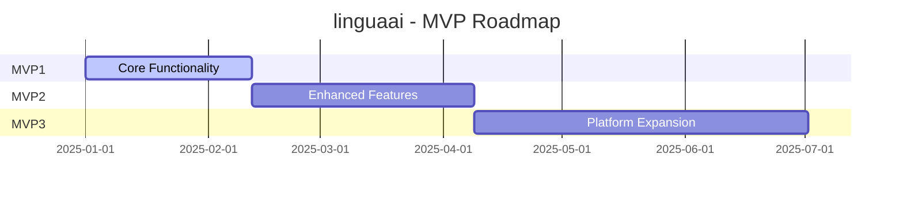
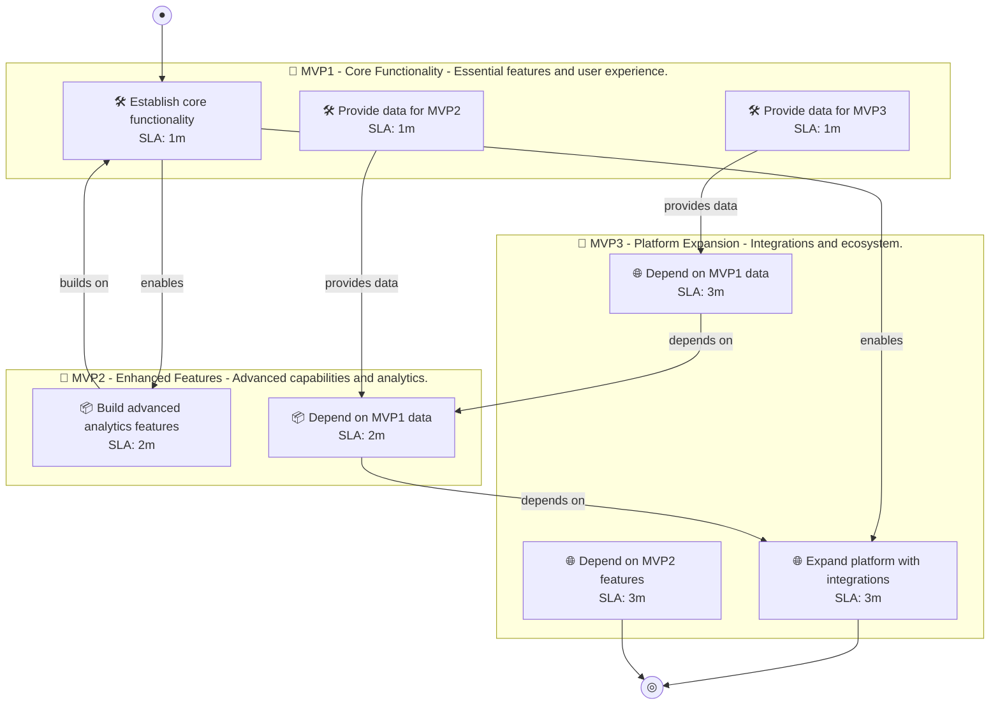

# 📊 Executive Summary: linguaai

> **Domain:** Education | **Generated:** 2025-12-10 13:29:07 | **Expert Grade:** A-

---

## 🎯 Quick Metrics

| Metric | Value |
|--------|-------|
| **Total MVPs** | 3 |
| **Total Timeline** | 26 weeks |
| **Artifacts Generated** | 15 |
| **Specs Generated** | 3 |
| **Average MAS Score** | 90.1 |
| **Expert Grade** | **A-** |
| **Production Ready** | ✅ Yes |
| **Execution Time** | 460.5s |

---

## 📅 Product Roadmap Timeline



---

## 📦 MVP Breakdown

| MVP | Name | Duration | Deliverables | Artifacts | Avg Score | Grade |
|-----|------|----------|--------------|-----------|-----------|-------|
| **MVP1** | Core Functionality | 6 weeks | 5 | 5 | 89.8 | B+ |
| **MVP2** | Enhanced Features | 8 weeks | 5 | 5 | 90.0 | A- |
| **MVP3** | Platform Expansion | 12 weeks | 5 | 5 | 90.5 | A- |

### MVP1: Core Functionality

**Description:** Essential features and user experience. I want to build a language learning platform called LinguaAI that uses AI tutors for conversational practice, adapts lessons to individual learning styles, provides real-time pronunciation feedback, a

**Duration:** 6 weeks

**Key Deliverables:**
- Personalized lesson plans based on user proficiency
- Interactive vocabulary quizzes for retention
- Speech recognition module for pronunciation practice
- User progress tracking dashboard
- Cultural immersion content featuring videos and articles

**Generated Artifacts:**

| Artifact Type | MAS Score | Status |
|---------------|-----------|--------|
| User Journey | 90.2 | ✅ |
| Swimlane | 92.2 | ✅ |
| Decision Tree | 92.5 | ✅ |
| Value Stream | 88.1 | ✅ |
| Business Process | 85.9 | ✅ |


**Spec Location:** `linguaai/linguaai-mvp1`


### MVP2: Enhanced Features

**Description:** Advanced capabilities and analytics. I want to build a language learning platform called LinguaAI that uses AI tutors for conversational practice, adapts lessons to individual learning styles, provides real-time pronunciation feedback, a

**Duration:** 8 weeks

**Key Deliverables:**
- AI-driven feedback system USING speech recognition to enhance pronunciation
- Adaptive learning algorithms BUILDING ON personalized lesson plans
- Conversational AI tutor for real-time practice USING user progress data
- Enhanced engagement metrics for quizzes USING user interaction data
- Contextual cultural tips USING cultural immersion content

**Generated Artifacts:**

| Artifact Type | MAS Score | Status |
|---------------|-----------|--------|
| User Journey | 85.7 | ✅ |
| Swimlane | 92.6 | ✅ |
| Decision Tree | 91.6 | ✅ |
| Value Stream | 89.4 | ✅ |
| Business Process | 90.8 | ✅ |


**Spec Location:** `linguaai/linguaai-mvp2`


### MVP3: Platform Expansion

**Description:** Integrations and ecosystem. I want to build a language learning platform called LinguaAI that uses AI tutors for conversational practice, adapts lessons to individual learning styles, provides real-time pronunciation feedback, a

**Duration:** 12 weeks

**Key Deliverables:**
- AR-enabled cultural experiences ENRICHING immersive content with AI tutor guidance
- Social learning features allowing users to connect USING metrics from conversational AI practice
- Integration with external language resources for broadened vocabulary USING adaptive learning algorithms
- Partnerships with language schools for certified lessons USING user progress insights
- Gamification of learning paths USING engagement metrics from quizzes

**Generated Artifacts:**

| Artifact Type | MAS Score | Status |
|---------------|-----------|--------|
| User Journey | 90.8 | ✅ |
| Swimlane | 93.2 | ✅ |
| Decision Tree | 91.0 | ✅ |
| Value Stream | 87.7 | ✅ |
| Business Process | 90.0 | ✅ |


**Spec Location:** `linguaai/linguaai-mvp3`


---

## 🔗 Cross-MVP Dependencies


| From | To | Type | Criticality | Description |
|------|-----|------|-------------|-------------|
| MVP1 | MVP2 | Data | CRITICAL | Data models and schemas from Core Functionality required by Enhanced Features |
| MVP1 | MVP2 | Feature | HIGH | Core features from Core Functionality enable Enhanced Features capabilities |
| MVP2 | MVP3 | Data | CRITICAL | Data models and schemas from Enhanced Features required by Platform Expansion |
| MVP2 | MVP3 | Feature | HIGH | Core features from Enhanced Features enable Platform Expansion capabilities |





---

## 🎓 Expert Assessment

### Overall Evaluation

| Dimension | Score | Status |
|-----------|-------|--------|
| **Overall Grade** | **A-** | ✅ |
| Semantic Preservation | 90.1% | ✅ |
| Cross-MVP Coherence | 95.0% | ✅ |
| Domain Accuracy | 85.6% | ⚠️ |
| Completeness | 100.0% | ✅ |
| Confidence Level | 0.9 | ✅ |

### Per-MVP Grades

| MVP | Grade | Status |
|-----|-------|--------|
| MVP1 | B+ | ✅ |
| MVP2 | A- | ✅ |
| MVP3 | A- | ✅ |


### ✅ Strengths

- Excellent semantic and structural across all diagrams
- Strong artifact quality with minor improvements possible
- Clear cross-MVP dependency mapping
- Complete artifact coverage for all MVPs


### 📝 Recommendations

1. Focus on improving pragmatic (current: 32.3/100) across all artifacts


---

## 📁 Generated Specification Files

### 1. linguaai-mvp1

```
linguaai/linguaai-mvp1/
├── requirements.md
├── design.md
├── tasks.md
├── knowledge.md
└── glossary.md
```

### 2. linguaai-mvp2

```
linguaai/linguaai-mvp2/
├── requirements.md
├── design.md
├── tasks.md
├── knowledge.md
└── glossary.md
```

### 3. linguaai-mvp3

```
linguaai/linguaai-mvp3/
├── requirements.md
├── design.md
├── tasks.md
├── knowledge.md
└── glossary.md
```

---

## ⚠️ Issues & Warnings


*No errors encountered.*


*No warnings generated.*


---

## 📊 Execution Metrics

| Metric | Value |
|--------|-------|
| Target Duration | 300s |
| Actual Duration | 460.5s |
| Performance | 65.2% of target |
| Artifacts/Minute | 2.0 |

---

*Generated by MAS Premium Roadmap Workflow v1.0 on 2025-12-10 13:29:07*