# Linguaai Mvp1 - Design Document

## Overview

Core Functionality: Essential features and user experience. I want to build a language learning platform called LinguaAI that uses AI tutors for conversational practice, adapts lessons to individual learning styles, provides real-time pronunciation feedback, a

**Generated**: 2025-12-10 13:28:06  
**Diagrams Included**: 5

## Architecture

## Components and Interfaces

### AI Tutor

- **Type**: Component
- **Purpose**: Part of the Linguaai Mvp1 system
### AI tutors

- **Type**: Component
- **Purpose**: Part of the Linguaai Mvp1 system
### Addresses

- **Type**: Component
- **Purpose**: Part of the Linguaai Mvp1 system
### Aligns

- **Type**: Component
- **Purpose**: Part of the Linguaai Mvp1 system
### Cultural Immersion Content

- **Type**: Component
- **Purpose**: Part of the Linguaai Mvp1 system
### Ensures

- **Type**: Component
- **Purpose**: Part of the Linguaai Mvp1 system
### Incorporates

- **Type**: Component
- **Purpose**: Part of the Linguaai Mvp1 system
### Interactive vocabulary quizzes

- **Type**: Component
- **Purpose**: Part of the Linguaai Mvp1 system
### LinguaAI

- **Type**: Component
- **Purpose**: Part of the Linguaai Mvp1 system
### MVP1

- **Type**: Component
- **Purpose**: Part of the Linguaai Mvp1 system

## Cross-Functional Process Flows (Swimlane)

> **Purpose**: Shows how work flows across different roles, departments, or systems. Each lane represents a responsible party, making handoffs and bottlenecks visible. Essential for RACI matrix creation and workflow optimization.

### Swimlane Process 1

```mermaid
graph TB
    %% Start Event
    Start((●))
    Start --> task_1

    subgraph MVP1["🎯 MVP1 - Core functionality (6 weeks)"]
        task_1["👤 Sign up for LinguaAI<br/>SLA: instant"]
        task_2["👤 Complete interactive vocabulary quizzes<br/>SLA: 1d"]
        task_3["👤 Track progress on dashboard<br/>SLA: 1d"]
        task_4["🤖 Create personalized lesson plans<br/>SLA: 1d"]
        task_5["🤖 Provide real-time pronunciation feedback<br/>SLA: instant"]
        task_6["🎤 Enable pronunciation practice<br/>SLA: 1d"]
        task_7["📊 Display user progress<br/>SLA: 1d"]
        task_8["🌍 Provide cultural immersion videos and articles<br/>SLA: 1d"]
    end



    task_1 -->|User interacts with AI Tutor| task_4
    task_4 -->|AI Tutor provides Speech Recognition Module| task_6
    task_6 -->|Speech Recognition Module offers Progress Tracking Dashboard| task_7
    task_7 -->|Progress Tracking Dashboard tracks Cultural Immersion Content| task_8
    task_8 -->|Cultural Immersion Content delivers to User| task_2

    %% End Event
    task_2 --> End((◎))
    task_3 --> End((◎))
    task_5 --> End((◎))

```

**MAS Score**: 92.23333333333333

## Business Process Workflows (BPMN)

> **Purpose**: Represents end-to-end business processes following BPMN 2.0 notation. Shows tasks, gateways (decision points), events, and process flow. Used for process automation and SLA tracking.

### Business Process 1

```mermaid
flowchart TD
    Start(["🎯 User Selects Language and Topic"])

    subgraph mvp1["Core Functionality<br/>📅 6 weeks"]
        task_1["🤖 Engage in Practice Conversations<br/>Owner: AI tutor<br/>SLA: 1h<br/>Automation: Automated"]
        task_2["📋 Customize Personalized Lesson Plans<br/>Owner: User<br/>SLA: 2h<br/>Automation: Manual"]
        task_3["🤖 Receive Pronunciation Feedback<br/>Owner: User<br/>SLA: 0.5h<br/>Automation: Automated"]
        task_4["📋 Experience Augmented Reality Scenarios<br/>Owner: User<br/>SLA: 3h<br/>Automation: Manual"]
        task_5["📋 Maintain Engagement and Motivation<br/>Owner: User<br/>SLA: 1h<br/>Automation: Manual"]
        task_6["🤖 Ensure Learning Accuracy<br/>Owner: User<br/>SLA: 0.5h<br/>Automation: Automated"]
    end


    
    end_success(["✅ User Achieves Learning Goals"])
    
    end_failure(["❌ Rejected"])

    Start -->|User initiates| task_1
    task_1 -->|Conversation completed| task_2
    task_2 -->|Lesson customized| task_3
    task_3 -->|Feedback received| task_4
    task_4 -->|AR experience completed| task_5
    task_5 -->|Engagement maintained| task_6
    task_6 -->|Learning goals achieved| end_success

    style Start fill:#ccffcc
    style end_success fill:#ccffcc
    style end_failure fill:#ffcccc
    style mvp1 fill:#e3f2fd,stroke:#1976d2

```

**MAS Score**: 85.9

## Decision Logic Trees

> **Purpose**: Visualizes decision-making logic with conditions and outcomes. Each node represents a decision point, branches show conditions (yes/no, thresholds), and leaves show final outcomes. Critical for business rules documentation and algorithm design.

### Decision Tree 1

**MAS Score**: 92.46666666666667

## Value Stream Maps (Lean)

> **Purpose**: Shows the flow of value from request to delivery, identifying process time (PT), wait time (WT), and efficiency metrics. Used for identifying bottlenecks, waste elimination, and continuous improvement initiatives.

### Value Stream 1

**MAS Score**: 88.13333333333333

## User Journeys (Experience Maps)

> **Purpose**: Maps the user's emotional journey through the product, from discovery to engagement. Each touchpoint shows satisfaction scores and emotional states, helping identify pain points and opportunities for UX improvement.

### User Journey 1

**MAS Score**: 90.25

## Diagram Summary

This design document includes **5 MAS artifacts** across the following categories:

| Diagram Type | Count | Average MAS Score | Purpose |
|--------------|-------|-------------------|---------|
| User Journey | 1 | 90.2 | UX experience map |
| Swimlane | 1 | 92.2 | Cross-functional workflow |
| Decision Tree | 1 | 92.5 | Decision logic |
| Value Stream | 1 | 88.1 | Lean efficiency |
| Business Process | 1 | 85.9 | BPMN process flow |

---

*Generated by MAS Compiler Spec Generator v1.0.0*