# Linguaai Mvp3 - Design Document

## Overview

Platform Expansion: Integrations and ecosystem. I want to build a language learning platform called LinguaAI that uses AI tutors for conversational practice, adapts lessons to individual learning styles, provides real-time pronunciation feedback, a

**Generated**: 2025-12-10 13:29:07  
**Diagrams Included**: 5

## Architecture

## Components and Interfaces

### AI Tutor

- **Type**: Component
- **Purpose**: Part of the Linguaai Mvp3 system
### AI tutors

- **Type**: Component
- **Purpose**: Part of the Linguaai Mvp3 system
### AR-enabled cultural experiences

- **Type**: Component
- **Purpose**: Part of the Linguaai Mvp3 system
### Adaptive learning algorithms

- **Type**: Component
- **Purpose**: Part of the Linguaai Mvp3 system
### Addresses

- **Type**: Component
- **Purpose**: Part of the Linguaai Mvp3 system
### Aligns

- **Type**: Component
- **Purpose**: Part of the Linguaai Mvp3 system
### Conversational practice

- **Type**: Component
- **Purpose**: Part of the Linguaai Mvp3 system
### Cultural Contexts

- **Type**: Component
- **Purpose**: Part of the Linguaai Mvp3 system
### ENRICHING

- **Type**: Component
- **Purpose**: Part of the Linguaai Mvp3 system
### Engagement Metrics

- **Type**: Component
- **Purpose**: Part of the Linguaai Mvp3 system

## Cross-Functional Process Flows (Swimlane)

> **Purpose**: Shows how work flows across different roles, departments, or systems. Each lane represents a responsible party, making handoffs and bottlenecks visible. Essential for RACI matrix creation and workflow optimization.

### Swimlane Process 1

```mermaid
graph TB
    %% Start Event
    Start((●))
    Start --> task_1

    subgraph MVP3["🎯 MVP3 - Platform Expansion (12 weeks)"]
        task_1["👤 Engage with AI Tutor<br/>SLA: instant"]
        task_2["👤 Utilize Language Resources<br/>SLA: instant"]
        task_3["👤 Enroll in Language Schools<br/>SLA: 1d"]
        task_4["👤 Engage with Gamification Engine<br/>SLA: instant"]
        task_5["🤖 Access Language Resources<br/>SLA: instant"]
        task_6["📚 Provide vocabulary resources<br/>SLA: 1d"]
        task_7["🏫 Provide certified lessons<br/>SLA: 1d"]
        task_8["🎮 Track user progress<br/>SLA: instant"]
    end



    task_1 -->|interacts with| task_5
    task_2 -->|utilizes| task_6
    task_3 -->|enrolls in| task_7
    task_4 -->|engages with| task_8
    task_5 -->|accesses| task_6
    task_7 -->|provides lessons| task_1
    task_8 -->|tracks progress| task_1

    %% End Event
    task_6 --> End((◎))

```

**MAS Score**: 93.2

## Business Process Workflows (BPMN)

> **Purpose**: Represents end-to-end business processes following BPMN 2.0 notation. Shows tasks, gateways (decision points), events, and process flow. Used for process automation and SLA tracking.

### Business Process 1

```mermaid
flowchart TD
    Start(["🎯 Process Start"])

    fallback_id["📋 fallback_name<br/>Owner: Team<br/>Automation: Manual"]


    
    end_success(["✅ Complete"])
    
    end_failure(["❌ Rejected"])

    Start --> fallback_id
    fallback_id --> end_success

    style Start fill:#ccffcc
    style end_success fill:#ccffcc
    style end_failure fill:#ffcccc

```

**MAS Score**: 90.0

## Decision Logic Trees

> **Purpose**: Visualizes decision-making logic with conditions and outcomes. Each node represents a decision point, branches show conditions (yes/no, thresholds), and leaves show final outcomes. Critical for business rules documentation and algorithm design.

### Decision Tree 1

```mermaid
flowchart TD
    %% Title: LinguaAI Platform Expansion Decision Tree
    %% Description: Decision tree for: ## Product: LinguaAI ## Domain: education ## Vision: I want to build a language learning platform...
    
    %% Start Node
    Start(["💰 Start Decision"])


    %% Decision Nodes
    Start --> decision_1
        decision_1{"🟠 Are AR-enabled cultural experiences implemented?<br/>🟠 HIGH<br/>Effort: 1.0w"}
    
        decision_2{"🟠 Are social learning features integrated?<br/>🟠 HIGH<br/>Effort: 1.0w"}
    decision_1 -->|"Yes"| decision_2
    
        decision_3{"🟡 Is integration with external language resources completed?<br/>🟡 MEDIUM<br/>Effort: 1.0w"}
    decision_2 -->|"Yes"| decision_3
    
        decision_4{"🟡 Are partnerships with language schools established?<br/>🟡 MEDIUM<br/>Effort: 1.0w"}
    decision_3 -->|"Yes"| decision_4
    
        decision_5{"🟡 Is gamification of learning paths implemented?<br/>🟡 MEDIUM<br/>Effort: 1.0w"}
    decision_4 -->|"Yes"| decision_5
    
    

    

    

    

    


    %% Outcome Nodes
    outcome_ar_not_implemented["❌ AR-enabled cultural experiences not implemented, focus on development.<br/>Reason: Not specified"]
    outcome_social_learning_not_implemented["❌ Social learning features not implemented, prioritize integration.<br/>Reason: Not specified"]
    outcome_external_resources_not_integrated["❌ External language resources not integrated, enhance vocabulary support.<br/>Reason: Not specified"]
    outcome_partnerships_not_established["❌ Partnerships with language schools not established, seek collaborations.<br/>Reason: Not specified"]
    outcome_gamification_not_implemented["❌ Gamification of learning paths not implemented, focus on engagement metrics.<br/>Reason: Not specified"]
    outcome_success["✅ All key features implemented successfully, proceed to user testing.<br/>"]

    %% Outcome Edge Connections (from leaf decisions to outcomes)
    decision_1 -->|"No"| outcome_ar_not_implemented
    decision_2 -->|"No"| outcome_social_learning_not_implemented
    decision_3 -->|"No"| outcome_external_resources_not_integrated
    decision_4 -->|"No"| outcome_partnerships_not_established
    decision_5 -->|"Yes"| outcome_success
    decision_5 -->|"No"| outcome_gamification_not_implemented

    %% Styling
    style outcome_ar_not_implemented fill:#ffcccc,stroke:#dc3545
    style outcome_social_learning_not_implemented fill:#ffcccc,stroke:#dc3545
    style outcome_external_resources_not_integrated fill:#ffcccc,stroke:#dc3545
    style outcome_partnerships_not_established fill:#ffcccc,stroke:#dc3545
    style outcome_gamification_not_implemented fill:#ffcccc,stroke:#dc3545
    style outcome_success fill:#ccffcc,stroke:#28a745

    %% Priority Legend
    subgraph Legend["📊 Priority Legend"]
        direction TB
        L1["🔴 CRITICAL: Immediate action required"]
        L2["🟠 HIGH: Plan for next sprint"]
        L3["🟡 MEDIUM: Quarterly planning"]
        L4["🟢 LOW: Backlog/nice-to-have"]
    end
    
    style L1 fill:#ffcccc
    style L2 fill:#ffe0cc
    style L3 fill:#ffffcc
    style L4 fill:#ccffcc


```

**MAS Score**: 91.0

## Value Stream Maps (Lean)

> **Purpose**: Shows the flow of value from request to delivery, identifying process time (PT), wait time (WT), and efficiency metrics. Used for identifying bottlenecks, waste elimination, and continuous improvement initiatives.

### Value Stream 1

```mermaid
flowchart LR
    %% Title and styling
    %% Value Stream: LinguaAI Platform Expansion Value Stream
    
    %% ========== PROCESS STEPS ==========
    step_1["📦 AR-enabled cultural experiences<br/>PT: 3 days<br/>WT: 3 days"]
    step_2["📦 Social learning features<br/>PT: 3 days<br/>WT: 3 days"]
    step_3["📦 Integration with external language resources<br/>PT: 3 days<br/>WT: 3 days"]
    step_4["📦 Partnerships with language schools<br/>PT: 3 days<br/>WT: 3 days"]
    step_5["📦 Gamification of learning paths<br/>PT: 3 days<br/>WT: 3 days"]
    
    %% ========== FLOW CONNECTIONS ==========
    step_1 -->|flow| step_2
    step_2 -->|flow| step_3
    step_3 -->|flow| step_4
    step_4 -->|flow| step_5
    
    %% ========== METRICS SUMMARY ==========
    subgraph Metrics["📊 Metrics Summary"]
        direction TB
        LT["⏱️ Lead Time: 43200 minutes (30 days)"]
        PT["⚙️ Process Time: 21600 minutes (15 days)"]
        WT["⏳ Wait Time: 15 days"]
        EFF["📈 Efficiency: 50.0%"]
    end
    
    %% ========== WASTE INDICATORS ==========
    
    %% ========== STYLING ==========
    %% Highlight steps with waste
    style step_1 fill:#e6f3ff,stroke:#0066cc,stroke-width:1px
    style step_2 fill:#e6f3ff,stroke:#0066cc,stroke-width:1px
    style step_3 fill:#e6f3ff,stroke:#0066cc,stroke-width:1px
    style step_4 fill:#e6f3ff,stroke:#0066cc,stroke-width:1px
    style step_5 fill:#e6f3ff,stroke:#0066cc,stroke-width:1px
    
    %% Waste subgraph styling
    
    %% Metrics subgraph styling
    style Metrics fill:#f0fff0,stroke:#00cc00
    style LT fill:#e6ffe6,stroke:#009900
    style PT fill:#e6ffe6,stroke:#009900
    style WT fill:#fff0e6,stroke:#cc6600
    style EFF fill:#e6ffe6,stroke:#009900

```

**MAS Score**: 87.7

## User Journeys (Experience Maps)

> **Purpose**: Maps the user's emotional journey through the product, from discovery to engagement. Each touchpoint shows satisfaction scores and emotional states, helping identify pain points and opportunities for UX improvement.

### User Journey 1

**MAS Score**: 90.85

## Diagram Summary

This design document includes **5 MAS artifacts** across the following categories:

| Diagram Type | Count | Average MAS Score | Purpose |
|--------------|-------|-------------------|---------|
| User Journey | 1 | 90.8 | UX experience map |
| Swimlane | 1 | 93.2 | Cross-functional workflow |
| Decision Tree | 1 | 91.0 | Decision logic |
| Value Stream | 1 | 87.7 | Lean efficiency |
| Business Process | 1 | 90.0 | BPMN process flow |

---

*Generated by MAS Compiler Spec Generator v1.0.0*