# Localplate Mvp2 - Design Document

## Overview

Smart Shopping Experience: AI recommendations and personalization. I want to build a local artisan food delivery platform called LocalPlate that connects consumers directly with local farmers, bakeries, and food artisans, offering subscription boxes and same-day deli

**Generated**: 2025-12-10 13:09:02  
**Diagrams Included**: 5

## Architecture

## Components and Interfaces

### Addresses

- **Type**: Component
- **Purpose**: Part of the Localplate Mvp2 system
### Aligns

- **Type**: Component
- **Purpose**: Part of the Localplate Mvp2 system
### BUILDING

- **Type**: Component
- **Purpose**: Part of the Localplate Mvp2 system
### Bakeries

- **Type**: Component
- **Purpose**: Part of the Localplate Mvp2 system
### Consumers

- **Type**: Component
- **Purpose**: Part of the Localplate Mvp2 system
### Customer engagement analytics

- **Type**: Component
- **Purpose**: Part of the Localplate Mvp2 system
### Deliveries

- **Type**: Component
- **Purpose**: Part of the Localplate Mvp2 system
### Demand forecasting for local vendors

- **Type**: Component
- **Purpose**: Part of the Localplate Mvp2 system
### Dynamic pricing optimization

- **Type**: Component
- **Purpose**: Part of the Localplate Mvp2 system
### Ensures

- **Type**: Component
- **Purpose**: Part of the Localplate Mvp2 system

## Cross-Functional Process Flows (Swimlane)

> **Purpose**: Shows how work flows across different roles, departments, or systems. Each lane represents a responsible party, making handoffs and bottlenecks visible. Essential for RACI matrix creation and workflow optimization.

### Swimlane Process 1

```mermaid
graph TB
    %% Start Event
    Start((●))
    Start --> task_1

    subgraph MVP2["🎯 MVP2 - Advanced features"]
        task_1["👥 Browse Products<br/>SLA: instant"]
        task_2["👥 Add to Cart<br/>SLA: instant"]
        task_3["👥 Checkout<br/>SLA: 1d"]
        task_4["👥 Provide Feedback<br/>SLA: 1d"]
        task_5["🌾 Update Inventory<br/>SLA: 1d"]
        task_6["🌾 Respond to Consumer Queries<br/>SLA: 1d"]
        task_7["🍞 Update Product Offerings<br/>SLA: 1d"]
        task_8["🍞 Manage Orders<br/>SLA: 1d"]
        task_9["🍽️ Create New Recipes<br/>SLA: 1d"]
        task_10["🍽️ Engage with Consumers<br/>SLA: 1d"]
    end



    task_1 -->|Consumer interaction| task_2
    task_2 -->|Consumer interaction| task_3
    task_3 -->|Consumer interaction| task_4
    task_4 -->|Feedback to Farmers| task_5
    task_5 -->|Farmers respond| task_6
    task_7 -->|Bakeries manage| task_8
    task_9 -->|Artisans engage| task_10

    %% End Event
    task_6 --> End((◎))
    task_8 --> End((◎))
    task_10 --> End((◎))

```

**MAS Score**: 90.10000000000001

## Business Process Workflows (BPMN)

> **Purpose**: Represents end-to-end business processes following BPMN 2.0 notation. Shows tasks, gateways (decision points), events, and process flow. Used for process automation and SLA tracking.

### Business Process 1

```mermaid
flowchart TD
    Start(["🎯 User Browses Local Producers"])

    subgraph mvp2["Smart Shopping Experience<br/>📅 8 weeks"]
        task_1["📋 Browse Local Producers<br/>Owner: User<br/>SLA: 1h<br/>Automation: Manual"]
        task_2["📋 Order Local Foods<br/>Owner: User<br/>SLA: 1h<br/>Automation: Manual"]
        task_3["📋 Manage Subscription Boxes<br/>Owner: User<br/>SLA: 1h<br/>Automation: Manual"]
        task_4["📋 Schedule Deliveries<br/>Owner: User<br/>SLA: 1h<br/>Automation: Manual"]
        task_5["📋 Receive and Review Deliveries<br/>Owner: User<br/>SLA: 1h<br/>Automation: Manual"]
        task_6["📋 Share Purchase Experience<br/>Owner: User<br/>SLA: 1h<br/>Automation: Manual"]
    end


    
    end_success(["✅ User Receives and Reviews Delivery"])
    
    end_failure(["❌ Rejected"])

    Start -->|User Browses Local Producers| task_1
    task_1 -->|User Orders Local Foods| task_2
    task_2 -->|User Manages Subscription Boxes| task_3
    task_3 -->|User Schedules Deliveries| task_4
    task_4 -->|User Receives Deliveries| task_5
    task_5 -->|User Shares Experience| task_6
    task_6 -->|Process Complete| end_success

    style Start fill:#ccffcc
    style end_success fill:#ccffcc
    style end_failure fill:#ffcccc
    style mvp2 fill:#e3f2fd,stroke:#1976d2

```

**MAS Score**: 93.2

## Decision Logic Trees

> **Purpose**: Visualizes decision-making logic with conditions and outcomes. Each node represents a decision point, branches show conditions (yes/no, thresholds), and leaves show final outcomes. Critical for business rules documentation and algorithm design.

### Decision Tree 1

```mermaid
flowchart TD
    %% Title: LocalPlate Smart Shopping Experience Decision Tree
    %% Description: Decision tree for: ## Product: LocalPlate ## Domain: ecommerce ## Vision: Build a local artisan food delivery platfor...
    
    %% Start Node
    Start(["💰 Start Decision"])


    %% Decision Nodes
    Start --> decision_1
        decision_1{"🟠 Is the user browsing products?<br/>🟠 HIGH<br/>Effort: 1.0w"}
    
        decision_2{"🟡 Are personalized product recommendations available?<br/>🟡 MEDIUM<br/>Effort: 1.0w"}
    decision_1 -->|"Yes"| decision_2
    
    
        decision_3{"🟡 Is dynamic pricing optimization enabled?<br/>🟡 MEDIUM<br/>Effort: 1.0w"}
    decision_2 -->|"No"| decision_3
    
    
        decision_4{"🟢 Is predictive delivery time estimation available?<br/>🟢 LOW<br/>Effort: 1.0w"}
    decision_3 -->|"No"| decision_4
    
    



    


    %% Outcome Nodes
    outcome_personalized_recommendations["✅ Provide personalized product recommendations to the user<br/>"]
    outcome_dynamic_pricing["✅ Apply dynamic pricing optimization for the user<br/>"]
    outcome_predictive_delivery["✅ Estimate predictive delivery time for the user<br/>"]
    outcome_no_features["❌ No additional features available for the user<br/>Reason: Not specified"]
    outcome_no_engagement["❌ User is not engaged in browsing products<br/>Reason: Not specified"]

    %% Outcome Edge Connections (from leaf decisions to outcomes)
    decision_1 -->|"No"| outcome_no_engagement
    decision_2 -->|"Yes"| outcome_personalized_recommendations
    decision_3 -->|"Yes"| outcome_dynamic_pricing
    decision_4 -->|"Yes"| outcome_predictive_delivery
    decision_4 -->|"No"| outcome_no_features

    %% Styling
    style outcome_personalized_recommendations fill:#ccffcc,stroke:#28a745
    style outcome_dynamic_pricing fill:#ccffcc,stroke:#28a745
    style outcome_predictive_delivery fill:#ccffcc,stroke:#28a745
    style outcome_no_features fill:#ffcccc,stroke:#dc3545
    style outcome_no_engagement fill:#ffcccc,stroke:#dc3545

    %% Priority Legend
    subgraph Legend["📊 Priority Legend"]
        direction TB
        L1["🔴 CRITICAL: Immediate action required"]
        L2["🟠 HIGH: Plan for next sprint"]
        L3["🟡 MEDIUM: Quarterly planning"]
        L4["🟢 LOW: Backlog/nice-to-have"]
    end
    
    style L1 fill:#ffcccc
    style L2 fill:#ffe0cc
    style L3 fill:#ffffcc
    style L4 fill:#ccffcc


```

**MAS Score**: 95.0

## Value Stream Maps (Lean)

> **Purpose**: Shows the flow of value from request to delivery, identifying process time (PT), wait time (WT), and efficiency metrics. Used for identifying bottlenecks, waste elimination, and continuous improvement initiatives.

### Value Stream 1

```mermaid
flowchart LR
    %% Title and styling
    %% Value Stream: LocalPlate Smart Shopping Experience Value Stream
    
    %% ========== PROCESS STEPS ==========
    step_1["📦 Personalized product recommendations<br/>PT: 2 days<br/>WT: 2 days"]
    step_2["📦 Dynamic pricing optimization<br/>PT: 2 days<br/>WT: 2 days"]
    step_3["📦 Predictive delivery time estimation<br/>PT: 2 days<br/>WT: 2 days"]
    step_4["📦 Demand forecasting for local vendors<br/>PT: 2 days<br/>WT: 2 days"]
    step_5["📦 Customer engagement analytics<br/>PT: 2 days<br/>WT: 2 days"]
    
    %% ========== FLOW CONNECTIONS ==========
    step_1 -->|flow| step_2
    step_2 -->|flow| step_3
    step_3 -->|flow| step_4
    step_4 -->|flow| step_5
    
    %% ========== METRICS SUMMARY ==========
    subgraph Metrics["📊 Metrics Summary"]
        direction TB
        LT["⏱️ Lead Time: 28800 minutes (20 days)"]
        PT["⚙️ Process Time: 14400 minutes (10 days)"]
        WT["⏳ Wait Time: 10 days"]
        EFF["📈 Efficiency: 50.0%"]
    end
    
    %% ========== WASTE INDICATORS ==========
    
    %% ========== STYLING ==========
    %% Highlight steps with waste
    style step_1 fill:#e6f3ff,stroke:#0066cc,stroke-width:1px
    style step_2 fill:#e6f3ff,stroke:#0066cc,stroke-width:1px
    style step_3 fill:#e6f3ff,stroke:#0066cc,stroke-width:1px
    style step_4 fill:#e6f3ff,stroke:#0066cc,stroke-width:1px
    style step_5 fill:#e6f3ff,stroke:#0066cc,stroke-width:1px
    
    %% Waste subgraph styling
    
    %% Metrics subgraph styling
    style Metrics fill:#f0fff0,stroke:#00cc00
    style LT fill:#e6ffe6,stroke:#009900
    style PT fill:#e6ffe6,stroke:#009900
    style WT fill:#fff0e6,stroke:#cc6600
    style EFF fill:#e6ffe6,stroke:#009900

```

**MAS Score**: 89.7

## User Journeys (Experience Maps)

> **Purpose**: Maps the user's emotional journey through the product, from discovery to engagement. Each touchpoint shows satisfaction scores and emotional states, helping identify pain points and opportunities for UX improvement.

### User Journey 1

**MAS Score**: 90.55

## Diagram Summary

This design document includes **5 MAS artifacts** across the following categories:

| Diagram Type | Count | Average MAS Score | Purpose |
|--------------|-------|-------------------|---------|
| User Journey | 1 | 90.5 | UX experience map |
| Swimlane | 1 | 90.1 | Cross-functional workflow |
| Decision Tree | 1 | 95.0 | Decision logic |
| Value Stream | 1 | 89.7 | Lean efficiency |
| Business Process | 1 | 93.2 | BPMN process flow |

---

*Generated by MAS Compiler Spec Generator v1.0.0*