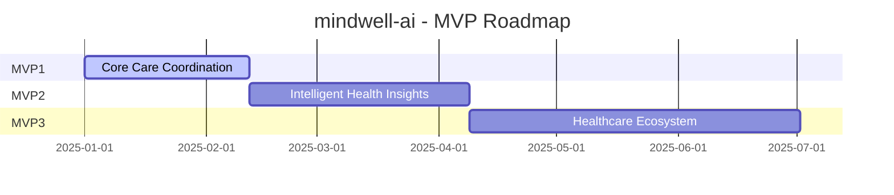
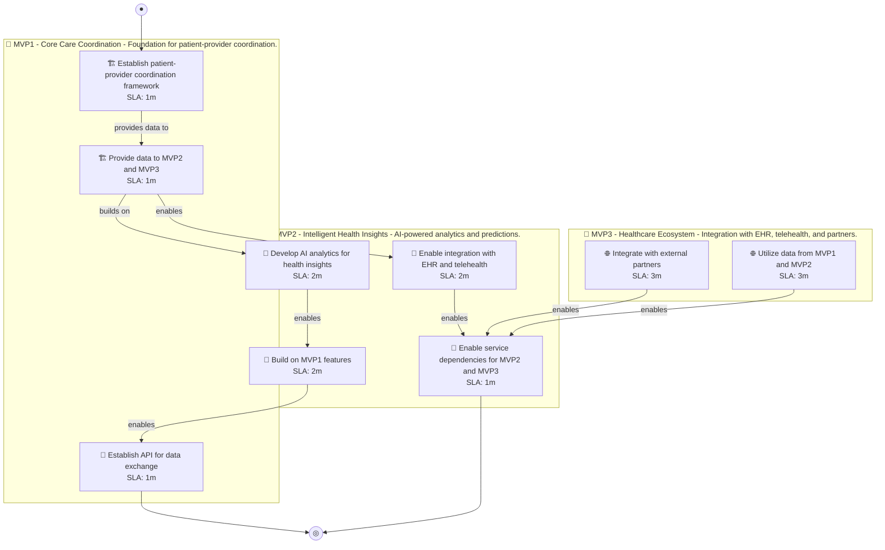

# 📊 Executive Summary: mindwell-ai

> **Domain:** Healthcare | **Generated:** 2025-12-10 12:27:15 | **Expert Grade:** A-

---

## 🎯 Quick Metrics

| Metric | Value |
|--------|-------|
| **Total MVPs** | 3 |
| **Total Timeline** | 26 weeks |
| **Artifacts Generated** | 15 |
| **Specs Generated** | 3 |
| **Average MAS Score** | 91.6 |
| **Expert Grade** | **A-** |
| **Production Ready** | ✅ Yes |
| **Execution Time** | 421.6s |

---

## 📅 Product Roadmap Timeline



---

## 📦 MVP Breakdown

| MVP | Name | Duration | Deliverables | Artifacts | Avg Score | Grade |
|-----|------|----------|--------------|-----------|-----------|-------|
| **MVP1** | Core Care Coordination | 6 weeks | 5 | 5 | 92.4 | A- |
| **MVP2** | Intelligent Health Insights | 8 weeks | 5 | 5 | 91.0 | A- |
| **MVP3** | Healthcare Ecosystem | 12 weeks | 5 | 5 | 91.5 | A- |

### MVP1: Core Care Coordination

**Description:** Foundation for patient-provider coordination. I want to build a mental health therapy platform called MindWell AI that provides personalized cognitive behavioral therapy sessions, mood tracking, and connects users with licensed therapists for vir

**Duration:** 6 weeks

**Key Deliverables:**
- Personalized cognitive behavioral therapy session builder
- Mood tracking system with data visualization
- Therapist matching algorithm based on user preferences
- Virtual consultation scheduling tool
- User profile management with therapy history

**Generated Artifacts:**

| Artifact Type | MAS Score | Status |
|---------------|-----------|--------|
| User Journey | 92.0 | ✅ |
| Swimlane | 91.2 | ✅ |
| Decision Tree | 97.2 | ✅ |
| Value Stream | 91.6 | ✅ |
| Business Process | 89.9 | ✅ |


**Spec Location:** `mindwell-ai/mindwell-ai-mvp1`


### MVP2: Intelligent Health Insights

**Description:** AI-powered analytics and predictions. I want to build a mental health therapy platform called MindWell AI that provides personalized cognitive behavioral therapy sessions, mood tracking, and connects users with licensed therapists for vir

**Duration:** 8 weeks

**Key Deliverables:**
- AI-powered mood analysis USING MVP1 mood tracking data
- Personalized session recommendations BUILDING ON MVP1 session builder
- Predictive analytics for user engagement USING MVP1 usage data
- Voice sentiment analysis during virtual consultations BUILDING ON MVP1 therapist matching
- Chatbot for initial user inquiries USING MVP1 user profile

**Generated Artifacts:**

| Artifact Type | MAS Score | Status |
|---------------|-----------|--------|
| User Journey | 91.8 | ✅ |
| Swimlane | 93.8 | ✅ |
| Decision Tree | 91.9 | ✅ |
| Value Stream | 89.4 | ✅ |
| Business Process | 88.2 | ✅ |


**Spec Location:** `mindwell-ai/mindwell-ai-mvp2`


### MVP3: Healthcare Ecosystem

**Description:** Integration with EHR, telehealth, and partners. I want to build a mental health therapy platform called MindWell AI that provides personalized cognitive behavioral therapy sessions, mood tracking, and connects users with licensed therapists for vir

**Duration:** 12 weeks

**Key Deliverables:**
- Integration with third-party mental health resources ENRICHING MVP2 session recommendations
- Real-time mental health crisis support API USING MVP1+MVP2 user profiles
- Collaboration platform for therapists to share insights USING MVP1+MVP2 consultation data
- Data exports for research purposes ENRICHING MVP2 predictive analytics
- Wellness community forum connecting users and therapists USING MVP1+MVP2 interactions

**Generated Artifacts:**

| Artifact Type | MAS Score | Status |
|---------------|-----------|--------|
| User Journey | 92.0 | ✅ |
| Swimlane | 92.6 | ✅ |
| Decision Tree | 92.8 | ✅ |
| Value Stream | 89.7 | ✅ |
| Business Process | 90.5 | ✅ |


**Spec Location:** `mindwell-ai/mindwell-ai-mvp3`


---

## 🔗 Cross-MVP Dependencies


| From | To | Type | Criticality | Description |
|------|-----|------|-------------|-------------|
| MVP1 | MVP2 | Data | CRITICAL | Data models and schemas from Core Care Coordination required by Intelligent Health Insights |
| MVP1 | MVP2 | Feature | HIGH | Core features from Core Care Coordination enable Intelligent Health Insights capabilities |
| MVP2 | MVP3 | Data | CRITICAL | Data models and schemas from Intelligent Health Insights required by Healthcare Ecosystem |
| MVP2 | MVP3 | Feature | HIGH | Core features from Intelligent Health Insights enable Healthcare Ecosystem capabilities |





---

## 🎓 Expert Assessment

### Overall Evaluation

| Dimension | Score | Status |
|-----------|-------|--------|
| **Overall Grade** | **A-** | ✅ |
| Semantic Preservation | 91.6% | ✅ |
| Cross-MVP Coherence | 95.0% | ✅ |
| Domain Accuracy | 87.1% | ⚠️ |
| Completeness | 100.0% | ✅ |
| Confidence Level | 0.92 | ✅ |

### Per-MVP Grades

| MVP | Grade | Status |
|-----|-------|--------|
| MVP1 | A- | ✅ |
| MVP2 | A- | ✅ |
| MVP3 | A- | ✅ |


### ✅ Strengths

- Excellent semantic and structural across all diagrams
- Strong artifact quality with minor improvements possible
- Clear cross-MVP dependency mapping
- Complete artifact coverage for all MVPs


### 📝 Recommendations

1. Focus on improving pragmatic (current: 46.9/100) across all artifacts


---

## 📁 Generated Specification Files

### 1. mindwell-ai-mvp1

```
mindwell-ai/mindwell-ai-mvp1/
├── requirements.md
├── design.md
├── tasks.md
├── knowledge.md
└── glossary.md
```

### 2. mindwell-ai-mvp2

```
mindwell-ai/mindwell-ai-mvp2/
├── requirements.md
├── design.md
├── tasks.md
├── knowledge.md
└── glossary.md
```

### 3. mindwell-ai-mvp3

```
mindwell-ai/mindwell-ai-mvp3/
├── requirements.md
├── design.md
├── tasks.md
├── knowledge.md
└── glossary.md
```

---

## ⚠️ Issues & Warnings


*No errors encountered.*


*No warnings generated.*


---

## 📊 Execution Metrics

| Metric | Value |
|--------|-------|
| Target Duration | 300s |
| Actual Duration | 421.6s |
| Performance | 71.2% of target |
| Artifacts/Minute | 2.1 |

---

*Generated by MAS Premium Roadmap Workflow v1.0 on 2025-12-10 12:27:15*