# Mindwell Ai Mvp3 - Design Document

## Overview

Healthcare Ecosystem: Integration with EHR, telehealth, and partners. I want to build a mental health therapy platform called MindWell AI that provides personalized cognitive behavioral therapy sessions, mood tracking, and connects users with licensed therapists for vir

**Generated**: 2025-12-10 12:27:15  
**Diagrams Included**: 5

## Architecture

## Components and Interfaces

### Addresses

- **Type**: Component
- **Purpose**: Part of the Mindwell Ai Mvp3 system
### Aligns

- **Type**: Component
- **Purpose**: Part of the Mindwell Ai Mvp3 system
### Data Export

- **Type**: Component
- **Purpose**: Part of the Mindwell Ai Mvp3 system
### ENRICHING

- **Type**: Component
- **Purpose**: Part of the Mindwell Ai Mvp3 system
### Ensures

- **Type**: Component
- **Purpose**: Part of the Mindwell Ai Mvp3 system
### Incorporates

- **Type**: Component
- **Purpose**: Part of the Mindwell Ai Mvp3 system
### Licensed Therapists

- **Type**: Component
- **Purpose**: Part of the Mindwell Ai Mvp3 system
### MVP1

- **Type**: Component
- **Purpose**: Part of the Mindwell Ai Mvp3 system
### MVP2

- **Type**: Component
- **Purpose**: Part of the Mindwell Ai Mvp3 system
### MVP3

- **Type**: Component
- **Purpose**: Part of the Mindwell Ai Mvp3 system

## Cross-Functional Process Flows (Swimlane)

> **Purpose**: Shows how work flows across different roles, departments, or systems. Each lane represents a responsible party, making handoffs and bottlenecks visible. Essential for RACI matrix creation and workflow optimization.

### Swimlane Process 1

```mermaid
graph TB
    %% Start Event
    Start((●))
    Start --> task_1

    subgraph MVP3["🎯 MVP3 - Enterprise integration (12 weeks)"]
        task_1["👤 Request data export for research purposes<br/>SLA: 1d"]
        task_2["👤 Participate in wellness community forum<br/>SLA: instant"]
        task_3["👨‍⚕️ Share insights in wellness community forum<br/>SLA: instant"]
        task_4["👨‍⚕️ Use API for real-time mental health crisis support<br/>SLA: instant"]
        task_5["💬 Connect users and therapists<br/>SLA: instant"]
        task_6["📊 Provide data export for research purposes<br/>SLA: 1d"]
    end



    task_1 -->|User requests| task_6
    task_2 -->|User participates| task_5
    task_3 -->|Therapist shares| task_5
    task_4 -->|Therapist uses API| task_5

    %% End Event
    task_5 --> End((◎))
    task_6 --> End((◎))

```

**MAS Score**: 92.60000000000001

## Business Process Workflows (BPMN)

> **Purpose**: Represents end-to-end business processes following BPMN 2.0 notation. Shows tasks, gateways (decision points), events, and process flow. Used for process automation and SLA tracking.

### Business Process 1

```mermaid
flowchart TD
    Start(["🎯 Process Start"])

    task_1["⚙️ Aligns with the semantic context provided above<br/>Owner: support<br/>Automation: Semi-Auto"]
    task_2["🤖 Addresses the specific requirements of Healthcare Ecosystem<br/>Owner: System<br/>Automation: Automated"]
    task_3["⚙️ Ensures consistency with the product vision and domain<br/>Owner: Persona<br/>Automation: Semi-Auto"]
    task_4["⚙️ Incorporates the job statements and market insights<br/>Owner: User<br/>Automation: Semi-Auto"]
    task_5["⚙️ Reflects the core activities and value stream<br/>Owner: Users<br/>Automation: Semi-Auto"]


    
    end_success(["✅ Complete"])
    
    end_failure(["❌ Rejected"])

    Start --> task_1
    task_1 --> task_2
    task_2 --> task_3
    task_3 --> task_4
    task_4 --> task_5
    task_5 --> end_success

    style Start fill:#ccffcc
    style end_success fill:#ccffcc
    style end_failure fill:#ffcccc

```

**MAS Score**: 90.5

## Decision Logic Trees

> **Purpose**: Visualizes decision-making logic with conditions and outcomes. Each node represents a decision point, branches show conditions (yes/no, thresholds), and leaves show final outcomes. Critical for business rules documentation and algorithm design.

### Decision Tree 1

```mermaid
flowchart TD
    %% Title: MindWell AI Mental Health Therapy Platform Decision Tree
    %% Description: Decision tree for: ## Product: MindWell AI ## Domain: healthcare ## Vision: I want to build a mental health therapy p...
    
    %% Start Node
    Start(["💰 Start Decision"])


    %% Decision Nodes
    Start --> decision_1
        decision_1{"🟠 Integrate with third-party mental health resources for session recommendations?<br/>🟠 HIGH<br/>Effort: 1.0w"}
    
    
        decision_2{"🔴 Implement real-time mental health crisis support API?<br/>🔴 CRITICAL<br/>Effort: 1.0w"}
    decision_1 -->|"No"| decision_2
    
    
        decision_3{"🟡 Create a collaboration platform for therapists?<br/>🟡 MEDIUM<br/>Effort: 1.0w"}
    decision_2 -->|"No"| decision_3
    
    
        decision_4{"🟢 Enable data exports for research purposes?<br/>🟢 LOW<br/>Effort: 1.0w"}
    decision_3 -->|"No"| decision_4
    
    





    %% Outcome Nodes
    outcome_integration["✅ Integrate third-party mental health resources to enhance session recommendations<br/>"]
    outcome_crisis_support["✅ Implement real-time mental health crisis support API for user profiles<br/>"]
    outcome_collaboration["✅ Create a collaboration platform for therapists to share insights<br/>"]
    outcome_data_exports["✅ Enable data exports for research purposes to enhance predictive analytics<br/>"]
    outcome_wellness_forum["✅ Establish a wellness community forum connecting users and therapists<br/>"]

    %% Outcome Edge Connections (from leaf decisions to outcomes)
    decision_1 -->|"Yes"| outcome_integration
    decision_2 -->|"Yes"| outcome_crisis_support
    decision_3 -->|"Yes"| outcome_collaboration
    decision_4 -->|"Yes"| outcome_data_exports
    decision_4 -->|"No"| outcome_wellness_forum

    %% Styling
    style outcome_integration fill:#ccffcc,stroke:#28a745
    style outcome_crisis_support fill:#ccffcc,stroke:#28a745
    style outcome_collaboration fill:#ccffcc,stroke:#28a745
    style outcome_data_exports fill:#ccffcc,stroke:#28a745
    style outcome_wellness_forum fill:#ccffcc,stroke:#28a745

    %% Priority Legend
    subgraph Legend["📊 Priority Legend"]
        direction TB
        L1["🔴 CRITICAL: Immediate action required"]
        L2["🟠 HIGH: Plan for next sprint"]
        L3["🟡 MEDIUM: Quarterly planning"]
        L4["🟢 LOW: Backlog/nice-to-have"]
    end
    
    style L1 fill:#ffcccc
    style L2 fill:#ffe0cc
    style L3 fill:#ffffcc
    style L4 fill:#ccffcc


```

**MAS Score**: 92.80000000000001

## Value Stream Maps (Lean)

> **Purpose**: Shows the flow of value from request to delivery, identifying process time (PT), wait time (WT), and efficiency metrics. Used for identifying bottlenecks, waste elimination, and continuous improvement initiatives.

### Value Stream 1

```mermaid
flowchart LR
    %% Title and styling
    %% Value Stream: MindWell AI Value Stream
    
    %% ========== PROCESS STEPS ==========
    step_1["📦 Integration with third-party mental health resources<br/>PT: 3 days<br/>WT: 3 days"]
    step_2["📦 Real-time mental health crisis support API<br/>PT: 3 days<br/>WT: 3 days"]
    step_3["📦 Collaboration platform for therapists<br/>PT: 3 days<br/>WT: 3 days"]
    step_4["📦 Data exports for research purposes<br/>PT: 3 days<br/>WT: 3 days"]
    step_5["📦 Wellness community forum<br/>PT: 3 days<br/>WT: 3 days"]
    
    %% ========== FLOW CONNECTIONS ==========
    step_1 -->|flow| step_2
    step_2 -->|flow| step_3
    step_3 -->|flow| step_4
    step_4 -->|flow| step_5
    
    %% ========== METRICS SUMMARY ==========
    subgraph Metrics["📊 Metrics Summary"]
        direction TB
        LT["⏱️ Lead Time: 43200 minutes (30 days)"]
        PT["⚙️ Process Time: 21600 minutes (15 days)"]
        WT["⏳ Wait Time: 15 days"]
        EFF["📈 Efficiency: 50.0%"]
    end
    
    %% ========== WASTE INDICATORS ==========
    
    %% ========== STYLING ==========
    %% Highlight steps with waste
    style step_1 fill:#e6f3ff,stroke:#0066cc,stroke-width:1px
    style step_2 fill:#e6f3ff,stroke:#0066cc,stroke-width:1px
    style step_3 fill:#e6f3ff,stroke:#0066cc,stroke-width:1px
    style step_4 fill:#e6f3ff,stroke:#0066cc,stroke-width:1px
    style step_5 fill:#e6f3ff,stroke:#0066cc,stroke-width:1px
    
    %% Waste subgraph styling
    
    %% Metrics subgraph styling
    style Metrics fill:#f0fff0,stroke:#00cc00
    style LT fill:#e6ffe6,stroke:#009900
    style PT fill:#e6ffe6,stroke:#009900
    style WT fill:#fff0e6,stroke:#cc6600
    style EFF fill:#e6ffe6,stroke:#009900

```

**MAS Score**: 89.7

## User Journeys (Experience Maps)

> **Purpose**: Maps the user's emotional journey through the product, from discovery to engagement. Each touchpoint shows satisfaction scores and emotional states, helping identify pain points and opportunities for UX improvement.

### User Journey 1

**MAS Score**: 92.05

## Diagram Summary

This design document includes **5 MAS artifacts** across the following categories:

| Diagram Type | Count | Average MAS Score | Purpose |
|--------------|-------|-------------------|---------|
| User Journey | 1 | 92.0 | UX experience map |
| Swimlane | 1 | 92.6 | Cross-functional workflow |
| Decision Tree | 1 | 92.8 | Decision logic |
| Value Stream | 1 | 89.7 | Lean efficiency |
| Business Process | 1 | 90.5 | BPMN process flow |

---

*Generated by MAS Compiler Spec Generator v1.0.0*