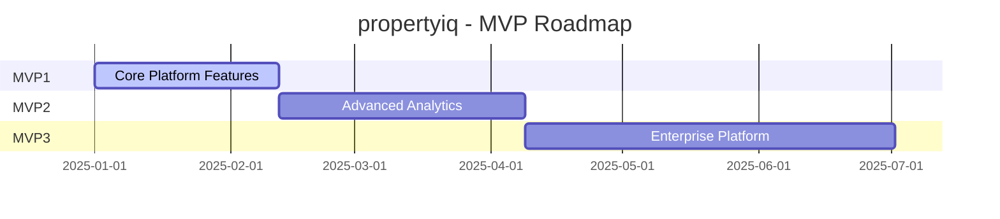
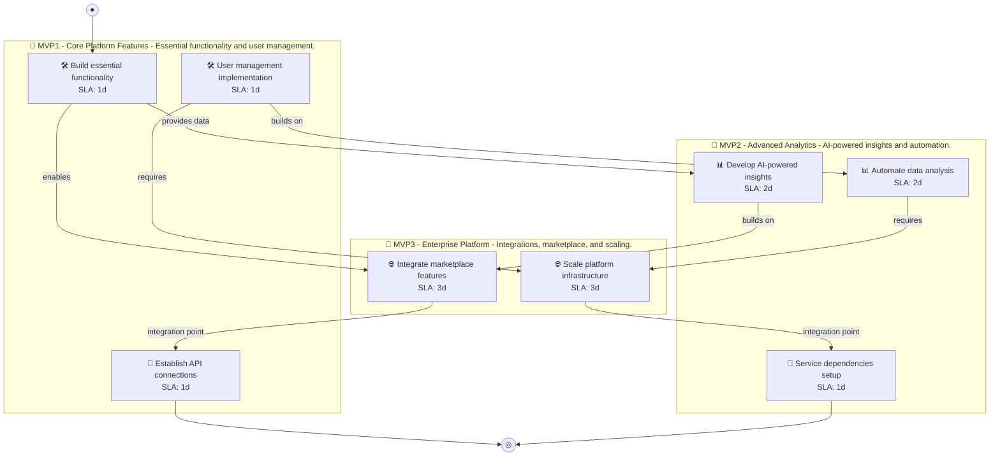

# 📊 Executive Summary: propertyiq

> **Domain:** Saas | **Generated:** 2025-12-10 13:35:08 | **Expert Grade:** A-

---

## 🎯 Quick Metrics

| Metric | Value |
|--------|-------|
| **Total MVPs** | 3 |
| **Total Timeline** | 26 weeks |
| **Artifacts Generated** | 15 |
| **Specs Generated** | 3 |
| **Average MAS Score** | 91.2 |
| **Expert Grade** | **A-** |
| **Production Ready** | ✅ Yes |
| **Execution Time** | 360.4s |

---

## 📅 Product Roadmap Timeline



---

## 📦 MVP Breakdown

| MVP | Name | Duration | Deliverables | Artifacts | Avg Score | Grade |
|-----|------|----------|--------------|-----------|-----------|-------|
| **MVP1** | Core Platform Features | 6 weeks | 5 | 5 | 91.6 | A- |
| **MVP2** | Advanced Analytics | 8 weeks | 5 | 5 | 91.5 | A- |
| **MVP3** | Enterprise Platform | 12 weeks | 5 | 5 | 90.4 | A- |

### MVP1: Core Platform Features

**Description:** Essential functionality and user management. I want to build a property investment analysis platform called PropertyIQ that uses AI to evaluate real estate opportunities, predicts neighborhood growth patterns, calculates ROI projections, and pro

**Duration:** 6 weeks

**Key Deliverables:**
- Advanced property search system
- ROI projection calculator
- Neighborhood growth trend analysis
- Automated due diligence report generator
- User dashboard for investment tracking

**Generated Artifacts:**

| Artifact Type | MAS Score | Status |
|---------------|-----------|--------|
| User Journey | 91.5 | ✅ |
| Swimlane | 93.5 | ✅ |
| Decision Tree | 94.1 | ✅ |
| Value Stream | 90.3 | ✅ |
| Business Process | 88.8 | ✅ |


**Spec Location:** `propertyiq/propertyiq-mvp1`


### MVP2: Advanced Analytics

**Description:** AI-powered insights and automation. I want to build a property investment analysis platform called PropertyIQ that uses AI to evaluate real estate opportunities, predicts neighborhood growth patterns, calculates ROI projections, and pro

**Duration:** 8 weeks

**Key Deliverables:**
- AI-driven neighborhood growth prediction USING MVP1 neighborhood growth trend analysis
- Machine learning algorithm for dynamic ROI adjustments USING MVP1 ROI projection calculator
- Predictive analytics for investment opportunities BUILDING ON MVP1 property search system
- Automated risk assessment reports BUILDING ON MVP1 automated due diligence report generator
- Enhanced user insights using historical data trends BUILDING ON MVP1 user dashboard

**Generated Artifacts:**

| Artifact Type | MAS Score | Status |
|---------------|-----------|--------|
| User Journey | 91.5 | ✅ |
| Swimlane | 93.8 | ✅ |
| Decision Tree | 93.4 | ✅ |
| Value Stream | 90.3 | ✅ |
| Business Process | 88.8 | ✅ |


**Spec Location:** `propertyiq/propertyiq-mvp2`


### MVP3: Enterprise Platform

**Description:** Integrations, marketplace, and scaling. I want to build a property investment analysis platform called PropertyIQ that uses AI to evaluate real estate opportunities, predicts neighborhood growth patterns, calculates ROI projections, and pro

**Duration:** 12 weeks

**Key Deliverables:**
- API integration with MLS systems ENRICHING MVP2 predictive analytics
- Partnerships with mortgage lenders for real-time financing options USING MVP1+MVP2 ROI projections and neighborhood data
- Social media sentiment analysis for property evaluations USING MVP1+MVP2 market insights
- Automated reporting tools for realtors USING MVP1+MVP2 automated due diligence reports
- Geospatial visualization tools for properties USING MVP1+MVP2 neighborhood growth prediction

**Generated Artifacts:**

| Artifact Type | MAS Score | Status |
|---------------|-----------|--------|
| User Journey | 91.5 | ✅ |
| Swimlane | 90.6 | ✅ |
| Decision Tree | 91.9 | ✅ |
| Value Stream | 89.4 | ✅ |
| Business Process | 88.8 | ✅ |


**Spec Location:** `propertyiq/propertyiq-mvp3`


---

## 🔗 Cross-MVP Dependencies


| From | To | Type | Criticality | Description |
|------|-----|------|-------------|-------------|
| MVP1 | MVP2 | Data | CRITICAL | Data models and schemas from Core Platform Features required by Advanced Analytics |
| MVP1 | MVP2 | Feature | HIGH | Core features from Core Platform Features enable Advanced Analytics capabilities |
| MVP2 | MVP3 | Data | CRITICAL | Data models and schemas from Advanced Analytics required by Enterprise Platform |
| MVP2 | MVP3 | Feature | HIGH | Core features from Advanced Analytics enable Enterprise Platform capabilities |





---

## 🎓 Expert Assessment

### Overall Evaluation

| Dimension | Score | Status |
|-----------|-------|--------|
| **Overall Grade** | **A-** | ✅ |
| Semantic Preservation | 91.2% | ✅ |
| Cross-MVP Coherence | 95.0% | ✅ |
| Domain Accuracy | 86.6% | ⚠️ |
| Completeness | 100.0% | ✅ |
| Confidence Level | 0.91 | ✅ |

### Per-MVP Grades

| MVP | Grade | Status |
|-----|-------|--------|
| MVP1 | A- | ✅ |
| MVP2 | A- | ✅ |
| MVP3 | A- | ✅ |


### ✅ Strengths

- Excellent semantic and structural across all diagrams
- Strong artifact quality with minor improvements possible
- Clear cross-MVP dependency mapping
- Complete artifact coverage for all MVPs


### 📝 Recommendations

1. Focus on improving pragmatic (current: 41.9/100) across all artifacts


---

## 📁 Generated Specification Files

### 1. propertyiq-mvp1

```
propertyiq/propertyiq-mvp1/
├── requirements.md
├── design.md
├── tasks.md
├── knowledge.md
└── glossary.md
```

### 2. propertyiq-mvp2

```
propertyiq/propertyiq-mvp2/
├── requirements.md
├── design.md
├── tasks.md
├── knowledge.md
└── glossary.md
```

### 3. propertyiq-mvp3

```
propertyiq/propertyiq-mvp3/
├── requirements.md
├── design.md
├── tasks.md
├── knowledge.md
└── glossary.md
```

---

## ⚠️ Issues & Warnings


*No errors encountered.*


*No warnings generated.*


---

## 📊 Execution Metrics

| Metric | Value |
|--------|-------|
| Target Duration | 300s |
| Actual Duration | 360.4s |
| Performance | 83.2% of target |
| Artifacts/Minute | 2.5 |

---

*Generated by MAS Premium Roadmap Workflow v1.0 on 2025-12-10 13:35:08*