# 📊 Executive Summary: teamflow

> **Domain:** Saas | **Generated:** 2025-12-10 13:15:45 | **Expert Grade:** A-

---

## 🎯 Quick Metrics

| Metric | Value |
|--------|-------|
| **Total MVPs** | 3 |
| **Total Timeline** | 26 weeks |
| **Artifacts Generated** | 15 |
| **Specs Generated** | 3 |
| **Average MAS Score** | 90.9 |
| **Expert Grade** | **A-** |
| **Production Ready** | ✅ Yes |
| **Execution Time** | 364.6s |

---

## 📅 Product Roadmap Timeline


---

## 📦 MVP Breakdown

| MVP | Name | Duration | Deliverables | Artifacts | Avg Score | Grade |
|-----|------|----------|--------------|-----------|-----------|-------|
| **MVP1** | Core Platform Features | 6 weeks | 5 | 5 | 91.8 | A- |
| **MVP2** | Advanced Analytics | 8 weeks | 5 | 5 | 91.1 | A- |
| **MVP3** | Enterprise Platform | 12 weeks | 5 | 5 | 89.9 | B+ |

### MVP1: Core Platform Features

**Description:** Essential functionality and user management. I want to build a remote team collaboration platform called TeamFlow that combines async video messaging, AI-powered meeting summaries, project tracking, and virtual office spaces to help distributed 

**Duration:** 6 weeks

**Key Deliverables:**
- Async video messaging system
- Project tracking dashboard
- Virtual office space creation
- User collaboration tools for document sharing
- Team communication channels

**Generated Artifacts:**

| Artifact Type | MAS Score | Status |
|---------------|-----------|--------|
| User Journey | 91.8 | ✅ |
| Swimlane | 92.3 | ✅ |
| Decision Tree | 95.0 | ✅ |
| Value Stream | 90.9 | ✅ |
| Business Process | 89.3 | ✅ |


**Spec Location:** `teamflow/teamflow-mvp1`


### MVP2: Advanced Analytics

**Description:** AI-powered insights and automation. I want to build a remote team collaboration platform called TeamFlow that combines async video messaging, AI-powered meeting summaries, project tracking, and virtual office spaces to help distributed 

**Duration:** 8 weeks

**Key Deliverables:**
- AI-powered meeting summaries USING MVP1 async video messaging data
- Smart task assignment recommendations BUILDING ON MVP1 project tracking
- Sentiment analysis on communication channels USING MVP1 user collaboration tools
- Automated reminders for project deadlines USING MVP1 project tracking
- Enhanced analytics on team productivity BUILDING ON MVP1 tracking dashboard

**Generated Artifacts:**

| Artifact Type | MAS Score | Status |
|---------------|-----------|--------|
| User Journey | 91.8 | ✅ |
| Swimlane | 88.2 | ✅ |
| Decision Tree | 93.7 | ✅ |
| Value Stream | 90.3 | ✅ |
| Business Process | 91.5 | ✅ |


**Spec Location:** `teamflow/teamflow-mvp2`


### MVP3: Enterprise Platform

**Description:** Integrations, marketplace, and scaling. I want to build a remote team collaboration platform called TeamFlow that combines async video messaging, AI-powered meeting summaries, project tracking, and virtual office spaces to help distributed 

**Duration:** 12 weeks

**Key Deliverables:**
- Integration with third-party tools for enhanced project tracking USING MVP1+MVP2 project insights
- Virtual office networking features ENRICHING MVP2 meeting summaries
- API access for external applications to pull team communication data USING MVP1+MVP2
- Customizable workspace configurations USING MVP1 virtual office spaces and MVP2 analytics
- Real-time collaboration tools ENRICHING MVP1 communication channels with MVP2 sentiment analysis

**Generated Artifacts:**

| Artifact Type | MAS Score | Status |
|---------------|-----------|--------|
| User Journey | 91.8 | ✅ |
| Swimlane | 86.8 | ✅ |
| Decision Tree | 92.2 | ✅ |
| Value Stream | 87.9 | ✅ |
| Business Process | 90.8 | ✅ |


**Spec Location:** `teamflow/teamflow-mvp3`


---

## 🔗 Cross-MVP Dependencies


| From | To | Type | Criticality | Description |
|------|-----|------|-------------|-------------|
| MVP1 | MVP2 | Data | CRITICAL | Data models and schemas from Core Platform Features required by Advanced Analytics |
| MVP1 | MVP2 | Feature | HIGH | Core features from Core Platform Features enable Advanced Analytics capabilities |
| MVP2 | MVP3 | Data | CRITICAL | Data models and schemas from Advanced Analytics required by Enterprise Platform |
| MVP2 | MVP3 | Feature | HIGH | Core features from Advanced Analytics enable Enterprise Platform capabilities |

```mermaid
graph TB
    %% Start Event
    Start((●))
    Start --> task_1

    subgraph MVP1["🎯 MVP1 - Core Platform Features - Essential functionality and user management."]
        task_1["🛠️ Build core platform features<br/>SLA: 1d"]
        task_2["🛠️ Enable data flow to MVP2 and MVP3<br/>SLA: 1d"]
        task_7["🔗 Establish API endpoints<br/>SLA: 1d"]
    end

    subgraph MVP2["🎯 MVP2 - Advanced Analytics - AI-powered insights and automation."]
        task_3["📊 Develop AI-powered insights<br/>SLA: 2d"]
        task_4["📊 Integrate with MVP1 data<br/>SLA: 1d"]
        task_8["🔗 Service dependencies for MVP2 and MVP3<br/>SLA: 1d"]
    end

    subgraph MVP3["🎯 MVP3 - Enterprise Platform - Integrations, marketplace, and scaling."]
        task_5["🌐 Build integrations and marketplace<br/>SLA: 3d"]
        task_6["🌐 Integrate with MVP1 and MVP2<br/>SLA: 2d"]
    end



    task_1 -->|enables| task_2
    task_2 -->|provides data to| task_4
    task_2 -->|provides data to| task_6
    task_3 -->|builds on| task_1
    task_4 -->|depends on| task_2
    task_5 -->|integrates with| task_7
    task_6 -->|integrates with| task_8

    %% End Event
    task_7 --> End((◎))
    task_8 --> End((◎))

```





---

## 🎓 Expert Assessment

### Overall Evaluation

| Dimension | Score | Status |
|-----------|-------|--------|
| **Overall Grade** | **A-** | ✅ |
| Semantic Preservation | 90.9% | ✅ |
| Cross-MVP Coherence | 95.0% | ✅ |
| Domain Accuracy | 86.4% | ⚠️ |
| Completeness | 100.0% | ✅ |
| Confidence Level | 0.91 | ✅ |

### Per-MVP Grades

| MVP | Grade | Status |
|-----|-------|--------|
| MVP1 | A- | ✅ |
| MVP2 | A- | ✅ |
| MVP3 | B+ | ✅ |


### ✅ Strengths

- Excellent semantic and structural across all diagrams
- Strong artifact quality with minor improvements possible
- Clear cross-MVP dependency mapping
- Complete artifact coverage for all MVPs


### 📝 Recommendations

1. Focus on improving pragmatic (current: 45.3/100) across all artifacts


---

## 📁 Generated Specification Files

### 1. teamflow-mvp1

```
teamflow/teamflow-mvp1/
├── requirements.md
├── design.md
├── tasks.md
├── knowledge.md
└── glossary.md
```

### 2. teamflow-mvp2

```
teamflow/teamflow-mvp2/
├── requirements.md
├── design.md
├── tasks.md
├── knowledge.md
└── glossary.md
```

### 3. teamflow-mvp3

```
teamflow/teamflow-mvp3/
├── requirements.md
├── design.md
├── tasks.md
├── knowledge.md
└── glossary.md
```

---

## ⚠️ Issues & Warnings


*No errors encountered.*


*No warnings generated.*


---

## 📊 Execution Metrics

| Metric | Value |
|--------|-------|
| Target Duration | 300s |
| Actual Duration | 364.6s |
| Performance | 82.3% of target |
| Artifacts/Minute | 2.5 |

---

*Generated by MAS Premium Roadmap Workflow v1.0 on 2025-12-10 13:15:45*