# Teamflow Mvp1 - Design Document

## Overview

Core Platform Features: Essential functionality and user management. I want to build a remote team collaboration platform called TeamFlow that combines async video messaging, AI-powered meeting summaries, project tracking, and virtual office spaces to help distributed 

**Generated**: 2025-12-10 13:14:36  
**Diagrams Included**: 5

## Architecture

## Components and Interfaces

### AI

- **Type**: Component
- **Purpose**: Part of the Teamflow Mvp1 system
### Addresses

- **Type**: Component
- **Purpose**: Part of the Teamflow Mvp1 system
### Aligns

- **Type**: Component
- **Purpose**: Part of the Teamflow Mvp1 system
### Async video messaging system

- **Type**: Component
- **Purpose**: Part of the Teamflow Mvp1 system
### Ensures

- **Type**: Component
- **Purpose**: Part of the Teamflow Mvp1 system
### Incorporates

- **Type**: Component
- **Purpose**: Part of the Teamflow Mvp1 system
### MVP1

- **Type**: Component
- **Purpose**: Part of the Teamflow Mvp1 system
### Reflects

- **Type**: Component
- **Purpose**: Part of the Teamflow Mvp1 system
### Team communication channels

- **Type**: Component
- **Purpose**: Part of the Teamflow Mvp1 system
### TeamFlow

- **Type**: Component
- **Purpose**: Part of the Teamflow Mvp1 system

## Cross-Functional Process Flows (Swimlane)

> **Purpose**: Shows how work flows across different roles, departments, or systems. Each lane represents a responsible party, making handoffs and bottlenecks visible. Essential for RACI matrix creation and workflow optimization.

### Swimlane Process 1

```mermaid
graph TB
    %% Start Event
    Start((●))
    Start --> task_1

    subgraph MVP1["🎯 MVP1 - Core functionality"]
        task_1["👤 Use Async Video Messaging System<br/>SLA: instant"]
        task_2["👤 Access Project Tracking Dashboard<br/>SLA: instant"]
        task_3["👤 Create Virtual Office Space<br/>SLA: instant"]
        task_4["👤 Utilize User Collaboration Tools<br/>SLA: instant"]
        task_5["👤 Engage in Team Communication Channels<br/>SLA: instant"]
        task_6["📹 Provide video messaging capabilities<br/>SLA: 1d"]
        task_7["📊 Display project status and updates<br/>SLA: 1d"]
        task_8["🏢 Set up virtual office environments<br/>SLA: 1d"]
        task_9["📝 Enable document sharing features<br/>SLA: 1d"]
        task_10["💬 Facilitate team discussions<br/>SLA: 1d"]
    end



    task_1 -->|uses| task_6
    task_2 -->|accesses| task_7
    task_3 -->|creates| task_8
    task_4 -->|utilizes| task_9
    task_5 -->|engages| task_10

    %% End Event
    task_6 --> End((◎))
    task_7 --> End((◎))
    task_8 --> End((◎))
    task_9 --> End((◎))
    task_10 --> End((◎))

```

**MAS Score**: 92.30000000000001

## Business Process Workflows (BPMN)

> **Purpose**: Represents end-to-end business processes following BPMN 2.0 notation. Shows tasks, gateways (decision points), events, and process flow. Used for process automation and SLA tracking.

### Business Process 1

```mermaid
flowchart TD
    Start(["🎯 User Sends Video Message"])

    subgraph mvp1["MVP1: Core Platform Features<br/>📅 6 weeks"]
        task_1["📋 Facilitate Asynchronous Video Communication<br/>Owner: User<br/>SLA: 1d<br/>Automation: Manual"]
        task_2["🤖 Generate AI Meeting Summaries<br/>Owner: AI<br/>SLA: 1h<br/>Automation: Automated"]
        task_3["📋 Manage Project Progress<br/>Owner: User<br/>SLA: 2d<br/>Automation: Manual"]
        task_4["📋 Create Virtual Office Environment<br/>Owner: User<br/>SLA: 3d<br/>Automation: Manual"]
        task_5["📋 Visualize Project Plans<br/>Owner: User<br/>SLA: 1d<br/>Automation: Manual"]
        task_6["📋 Share Real-Time Updates<br/>Owner: User<br/>SLA: 12h<br/>Automation: Manual"]
    end


    
    end_success(["✅ Project Progress Tracked"])
    
    end_failure(["❌ Rejected"])

    Start -->|User initiates communication| task_1
    task_1 -->|Video message sent| task_2
    task_2 -->|Summary generated| task_3
    task_3 -->|Project management initiated| task_4
    task_4 -->|Virtual office created| task_5
    task_5 -->|Project plans visualized| task_6
    task_6 -->|Updates shared| end_success

    style Start fill:#ccffcc
    style end_success fill:#ccffcc
    style end_failure fill:#ffcccc
    style mvp1 fill:#e3f2fd,stroke:#1976d2

```

**MAS Score**: 89.3

## Decision Logic Trees

> **Purpose**: Visualizes decision-making logic with conditions and outcomes. Each node represents a decision point, branches show conditions (yes/no, thresholds), and leaves show final outcomes. Critical for business rules documentation and algorithm design.

### Decision Tree 1

```mermaid
flowchart TD
    %% Title: TeamFlow Core Platform Features Decision Tree
    %% Description: Decision tree for: ## Product: TeamFlow ## Domain: saas ## Vision: I want to build a remote team collaboration platfo...
    
    %% Start Node
    Start(["💰 Start Decision"])


    %% Decision Nodes
    Start --> decision_1
        decision_1{"🔴 Is async video messaging system implemented?<br/>🔴 CRITICAL<br/>Effort: 1.0w"}
    
        decision_2{"🟠 Is project tracking dashboard implemented?<br/>🟠 HIGH<br/>Effort: 1.0w"}
    decision_1 -->|"Yes"| decision_2
    
        decision_3{"🟡 Is virtual office space creation implemented?<br/>🟡 MEDIUM<br/>Effort: 1.0w"}
    decision_2 -->|"Yes"| decision_3
    
        decision_4{"🟡 Are user collaboration tools for document sharing implemented?<br/>🟡 MEDIUM<br/>Effort: 1.0w"}
    decision_3 -->|"Yes"| decision_4
    
        decision_5{"🟡 Are team communication channels implemented?<br/>🟡 MEDIUM<br/>Effort: 1.0w"}
    decision_4 -->|"Yes"| decision_5
    
    

    

    

    

    


    %% Outcome Nodes
    outcome_video_messaging_not_implemented["❌ Async video messaging system is not implemented yet.<br/>Reason: Not specified"]
    outcome_project_tracking_not_implemented["❌ Project tracking dashboard is not implemented yet.<br/>Reason: Not specified"]
    outcome_virtual_office_not_implemented["❌ Virtual office space creation is not implemented yet.<br/>Reason: Not specified"]
    outcome_collaboration_tools_not_implemented["❌ User collaboration tools for document sharing are not implemented yet.<br/>Reason: Not specified"]
    outcome_communication_channels_not_implemented["❌ Team communication channels are not implemented yet.<br/>Reason: Not specified"]
    outcome_success["✅ All core platform features are successfully implemented.<br/>"]

    %% Outcome Edge Connections (from leaf decisions to outcomes)
    decision_1 -->|"No"| outcome_video_messaging_not_implemented
    decision_2 -->|"No"| outcome_project_tracking_not_implemented
    decision_3 -->|"No"| outcome_virtual_office_not_implemented
    decision_4 -->|"No"| outcome_collaboration_tools_not_implemented
    decision_5 -->|"Yes"| outcome_success
    decision_5 -->|"No"| outcome_communication_channels_not_implemented

    %% Styling
    style outcome_video_messaging_not_implemented fill:#ffcccc,stroke:#dc3545
    style outcome_project_tracking_not_implemented fill:#ffcccc,stroke:#dc3545
    style outcome_virtual_office_not_implemented fill:#ffcccc,stroke:#dc3545
    style outcome_collaboration_tools_not_implemented fill:#ffcccc,stroke:#dc3545
    style outcome_communication_channels_not_implemented fill:#ffcccc,stroke:#dc3545
    style outcome_success fill:#ccffcc,stroke:#28a745

    %% Priority Legend
    subgraph Legend["📊 Priority Legend"]
        direction TB
        L1["🔴 CRITICAL: Immediate action required"]
        L2["🟠 HIGH: Plan for next sprint"]
        L3["🟡 MEDIUM: Quarterly planning"]
        L4["🟢 LOW: Backlog/nice-to-have"]
    end
    
    style L1 fill:#ffcccc
    style L2 fill:#ffe0cc
    style L3 fill:#ffffcc
    style L4 fill:#ccffcc


```

**MAS Score**: 95.0

## Value Stream Maps (Lean)

> **Purpose**: Shows the flow of value from request to delivery, identifying process time (PT), wait time (WT), and efficiency metrics. Used for identifying bottlenecks, waste elimination, and continuous improvement initiatives.

### Value Stream 1

**MAS Score**: 90.9

## User Journeys (Experience Maps)

> **Purpose**: Maps the user's emotional journey through the product, from discovery to engagement. Each touchpoint shows satisfaction scores and emotional states, helping identify pain points and opportunities for UX improvement.

### User Journey 1

**MAS Score**: 91.75

## Diagram Summary

This design document includes **5 MAS artifacts** across the following categories:

| Diagram Type | Count | Average MAS Score | Purpose |
|--------------|-------|-------------------|---------|
| User Journey | 1 | 91.8 | UX experience map |
| Swimlane | 1 | 92.3 | Cross-functional workflow |
| Decision Tree | 1 | 95.0 | Decision logic |
| Value Stream | 1 | 90.9 | Lean efficiency |
| Business Process | 1 | 89.3 | BPMN process flow |

---

*Generated by MAS Compiler Spec Generator v1.0.0*