# 📊 Executive Summary: wealthpilot

> **Domain:** Finance | **Generated:** 2025-12-10 12:47:38 | **Expert Grade:** A-

---

## 🎯 Quick Metrics

| Metric | Value |
|--------|-------|
| **Total MVPs** | 3 |
| **Total Timeline** | 26 weeks |
| **Artifacts Generated** | 15 |
| **Specs Generated** | 3 |
| **Average MAS Score** | 91.5 |
| **Expert Grade** | **A-** |
| **Production Ready** | ✅ Yes |
| **Execution Time** | 449.5s |

---

## 📅 Product Roadmap Timeline


---

## 📦 MVP Breakdown

| MVP | Name | Duration | Deliverables | Artifacts | Avg Score | Grade |
|-----|------|----------|--------------|-----------|-----------|-------|
| **MVP1** | Core Financial Management | 6 weeks | 5 | 5 | 91.6 | A- |
| **MVP2** | Smart Financial Analytics | 8 weeks | 5 | 5 | 91.7 | A- |
| **MVP3** | Financial Ecosystem | 12 weeks | 5 | 5 | 91.3 | A- |

### MVP1: Core Financial Management

**Description:** Basic accounts, transactions, and reporting. I want to build a personal investment platform called WealthPilot that uses AI to analyze market trends, provides automated portfolio rebalancing, and offers personalized investment recommendations ba

**Duration:** 6 weeks

**Key Deliverables:**
- Comprehensive asset search tool
- User-friendly investment goal setup
- Risk tolerance assessment questionnaire
- Dynamic portfolio tracking dashboard
- Market performance visualization

**Generated Artifacts:**

| Artifact Type | MAS Score | Status |
|---------------|-----------|--------|
| User Journey | 90.5 | ✅ |
| Swimlane | 92.6 | ✅ |
| Decision Tree | 94.9 | ✅ |
| Value Stream | 87.5 | ✅ |
| Business Process | 92.2 | ✅ |


**Spec Location:** `wealthpilot/wealthpilot-mvp1`


### MVP2: Smart Financial Analytics

**Description:** AI-powered insights and forecasting. I want to build a personal investment platform called WealthPilot that uses AI to analyze market trends, provides automated portfolio rebalancing, and offers personalized investment recommendations ba

**Duration:** 8 weeks

**Key Deliverables:**
- AI-driven market trend analysis USING MVP1 market performance visualization
- Automated investment recommendation engine BUILDING ON MVP1 goal setup
- Predictive portfolio rebalancing algorithms USING MVP1 dynamic portfolio tracking data
- Sentiment analysis insights USING MVP1 asset search tool data
- Risk-adjusted return forecasting USING MVP1 risk tolerance assessment results

**Generated Artifacts:**

| Artifact Type | MAS Score | Status |
|---------------|-----------|--------|
| User Journey | 90.5 | ✅ |
| Swimlane | 91.8 | ✅ |
| Decision Tree | 95.5 | ✅ |
| Value Stream | 88.1 | ✅ |
| Business Process | 92.2 | ✅ |


**Spec Location:** `wealthpilot/wealthpilot-mvp2`


### MVP3: Financial Ecosystem

**Description:** Banking integrations and marketplace. I want to build a personal investment platform called WealthPilot that uses AI to analyze market trends, provides automated portfolio rebalancing, and offers personalized investment recommendations ba

**Duration:** 12 weeks

**Key Deliverables:**
- API integrations with brokerage platforms USING MVP1+MVP2 automated investment recommendations
- Real-time news sentiment analysis ENRICHING MVP2 market trend analysis
- Collaboration tools for financial advisors BUILDING ON MVP1 dynamic portfolio tracking
- Third-party investment strategy sharing USING MVP1+MVP2 portfolio tracking data
- Integration with tax optimization tools ENRICHING MVP2 predictions

**Generated Artifacts:**

| Artifact Type | MAS Score | Status |
|---------------|-----------|--------|
| User Journey | 90.5 | ✅ |
| Swimlane | 91.9 | ✅ |
| Decision Tree | 94.3 | ✅ |
| Value Stream | 88.4 | ✅ |
| Business Process | 91.1 | ✅ |


**Spec Location:** `wealthpilot/wealthpilot-mvp3`


---

## 🔗 Cross-MVP Dependencies


| From | To | Type | Criticality | Description |
|------|-----|------|-------------|-------------|
| MVP1 | MVP2 | Data | CRITICAL | Data models and schemas from Core Financial Management required by Smart Financial Analytics |
| MVP1 | MVP2 | Feature | HIGH | Core features from Core Financial Management enable Smart Financial Analytics capabilities |
| MVP2 | MVP3 | Data | CRITICAL | Data models and schemas from Smart Financial Analytics required by Financial Ecosystem |
| MVP2 | MVP3 | Feature | HIGH | Core features from Smart Financial Analytics enable Financial Ecosystem capabilities |

```mermaid
graph TB
    %% Start Event
    Start((●))
    Start --> task_1

    subgraph MVP1["🎯 MVP1 - Core Financial Management - Basic accounts, transactions, and reporting."]
        task_1["🏗️ Build basic accounts functionality<br/>SLA: 1d"]
        task_2["🏗️ Implement transaction processing<br/>SLA: 2d"]
        task_3["🏗️ Create reporting features<br/>SLA: 1d"]
        task_8["🔗 Enable API connections<br/>SLA: 2d"]
    end

    subgraph MVP2["🎯 MVP2 - Smart Financial Analytics - AI-powered insights and forecasting."]
        task_4["🧠 Develop AI-powered insights<br/>SLA: 3d"]
        task_5["🧠 Forecast financial trends<br/>SLA: 2d"]
        task_9["🔗 Integrate with external services<br/>SLA: 3d"]
    end

    subgraph MVP3["🎯 MVP3 - Financial Ecosystem - Banking integrations and marketplace."]
        task_6["🌐 Integrate banking services<br/>SLA: 4d"]
        task_7["🌐 Build marketplace features<br/>SLA: 3d"]
        task_10["🔗 Support integration with banking APIs<br/>SLA: 3d"]
    end



    task_1 -->|provides data to| task_4
    task_2 -->|provides data to| task_4
    task_3 -->|builds on| task_5
    task_4 -->|enables| task_6
    task_1 -->|enables| task_8
    task_4 -->|integrates with| task_9
    task_6 -->|integrates with| task_10

    %% End Event
    task_5 --> End((◎))
    task_7 --> End((◎))
    task_8 --> End((◎))
    task_9 --> End((◎))
    task_10 --> End((◎))

```





---

## 🎓 Expert Assessment

### Overall Evaluation

| Dimension | Score | Status |
|-----------|-------|--------|
| **Overall Grade** | **A-** | ✅ |
| Semantic Preservation | 91.5% | ✅ |
| Cross-MVP Coherence | 95.0% | ✅ |
| Domain Accuracy | 86.9% | ⚠️ |
| Completeness | 100.0% | ✅ |
| Confidence Level | 0.91 | ✅ |

### Per-MVP Grades

| MVP | Grade | Status |
|-----|-------|--------|
| MVP1 | A- | ✅ |
| MVP2 | A- | ✅ |
| MVP3 | A- | ✅ |


### ✅ Strengths

- Excellent semantic and structural across all diagrams
- Strong artifact quality with minor improvements possible
- Clear cross-MVP dependency mapping
- Complete artifact coverage for all MVPs


### 📝 Recommendations

1. Focus on improving pragmatic (current: 35.5/100) across all artifacts


---

## 📁 Generated Specification Files

### 1. wealthpilot-mvp1

```
wealthpilot/wealthpilot-mvp1/
├── requirements.md
├── design.md
├── tasks.md
├── knowledge.md
└── glossary.md
```

### 2. wealthpilot-mvp2

```
wealthpilot/wealthpilot-mvp2/
├── requirements.md
├── design.md
├── tasks.md
├── knowledge.md
└── glossary.md
```

### 3. wealthpilot-mvp3

```
wealthpilot/wealthpilot-mvp3/
├── requirements.md
├── design.md
├── tasks.md
├── knowledge.md
└── glossary.md
```

---

## ⚠️ Issues & Warnings


*No errors encountered.*


*No warnings generated.*


---

## 📊 Execution Metrics

| Metric | Value |
|--------|-------|
| Target Duration | 300s |
| Actual Duration | 449.5s |
| Performance | 66.7% of target |
| Artifacts/Minute | 2.0 |

---

*Generated by MAS Premium Roadmap Workflow v1.0 on 2025-12-10 12:47:38*